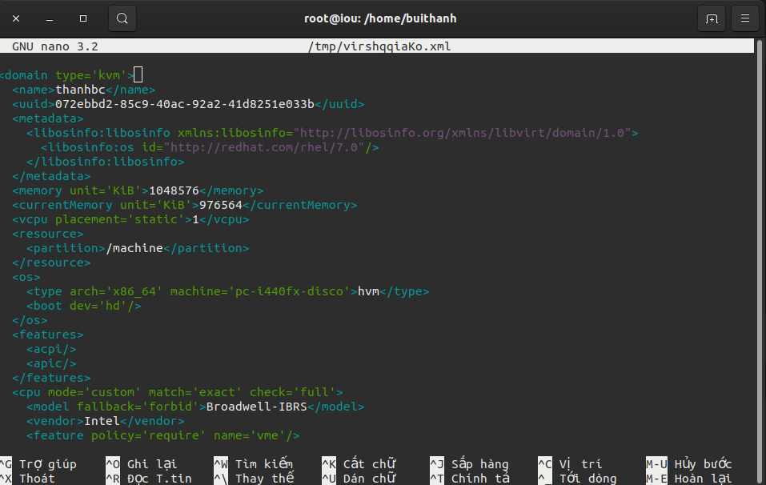
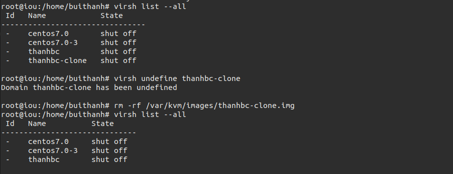
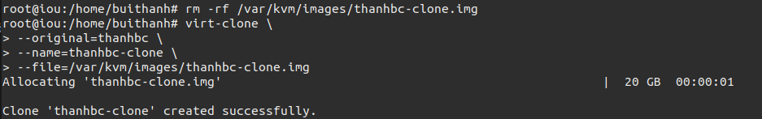
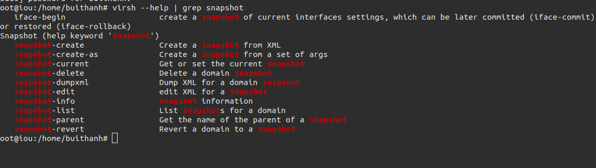
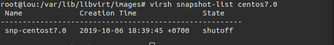
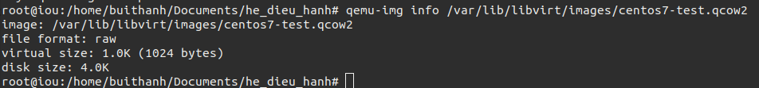
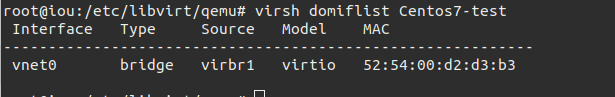

# Hướng dẫn sử dụng vish và virt-install.

[1. Virsh là gì?](#1)

[2. Một số lệnh virsh cơ bản.](#2)

[3 Các câu lệnh Snapshot](#3)

[4. Một số lệnh xem các thông số của VM](#4)

[5. Sử dụng virt-install](#5)

---

<a name="1"></a>
## 1. Virsh là gì.
Libvirt là một bộ các phần mềm mà cung cấp các cách thuận tiện để quản lý máy ảo và các chức năng của ảo hóa. Những phần mềm này bao gồm một thư viện API daemon (libvirtd) và các gói tiện tích giao diện dòng lệnh (virsh).


Virsh là một tools kiểm soát và thực hiện hành động với các máy ảo.

<a name="2"></a>
## 2. Một số lệnh virsh cơ bản.
### 2.1 Hiện tất cả máy ảo đã được cài đặt.
virsh list --all

```
root@iou:/etc/libvirt/qemu# virsh --all
error: unsupported option '--all'. See --help.
root@iou:/etc/libvirt/qemu# virsh list --all
 Id   Name          State
------------------------------
 3    thanhbc       running
 -    centos7.0     shut off
 -    centos7.0-3   shut off
```
### 2.2 Khởi động máy ảo.
virsh start <ten may ao>

```
root@iou:/etc/libvirt/qemu# virsh start thanhbc
Domain thanhbc started
```

### 2.3 Hiện thị các máy ảo đang hoạt động.
virsh list 
```
root@iou:/etc/libvirt/qemu# virsh list
 Id   Name      State
-------------------------
 3    thanhbc   running
```
### 2.4 Tắt 1 máy ảo.
virsh shutdown <ten may ao>
```
root@iou:/etc/libvirt/qemu# virsh shutdown thanhbc
Domain thanhbc is being shutdown
```
### 2.5 Xem thông tin 1 máy ảo
virsh dominfo <ten may ao>
```
root@iou:/etc/libvirt/qemu# virsh dominfo thanhbc
Id:             4
Name:           thanhbc
UUID:           072ebbd2-85c9-40ac-92a2-41d8251e033b
OS Type:        hvm
State:          running
CPU(s):         1
CPU time:       18,2s
Max memory:     2097152 KiB
Used memory:    2097152 KiB
Persistent:     yes
Autostart:      disable
Managed save:   no
Security model: apparmor
Security DOI:   0
Security label: libvirt-072ebbd2-85c9-40ac-92a2-41d8251e033b (enforcing)
```
### 2.6 Chỉnh sưả thông số  của máy ảo

```
virsh edit <ten may ao>
```



Ta co thể chỉnh sửa thông số cpu, ram, network.

Sau khi chỉnh sửa ta phải sử dụng lệnh virsh define để các thay đổi được cập nhật.
```
virsh define <tên máy ảo>
```
### 2.7 Xóa một máy ảo.
```
virsh destroy <tên máy ảo>
virsh undefine <tên may ao>
```
sau đó xóa file images của máy ảo. Trên đây t lưu file ở 1 chỗ khác mặc định .
```
rm -rf /var/kvm/images/thanhbc-clone.img
```



### 2.8 Clone 1 máy ảo mới
```
virt-clone \
> --original=thanhbc \
> --name=thanhbc-clone \
> --file=/var/kvm/images/thanhbc-clone.img
```


<a name="3"></a>
## 3 Các câu lệnh Snapshot

### 3.1 Xem các option trong snapshot.

Ta sử dụng câu lệnh để xem các option.
```
virsh --help | grep snapshot
```



### 3.2 Tạo mới một snapshot
```
virsh snapshot-create-as --domain centos7.0 --name snp-centos7.0 --decription "ban snapshot"
```
```
root@iou:/var/lib/libvirt/images# virsh snapshot-create-as --domain centos7.0  --name snp-centost7.0  --description "bản snapshot"
Domain snapshot snp-centost7.0 created
```

### 3.3 Kiểm tra xem đã tạo thành công chưa.
```
virsh snapshot-list centos7.0
```


<a name="4"></a>
## 4. Một số lệnh xem các thông số của VM.

### 4.1 Xem thông tin về file disk của VM.
Câu lệnh xem thông tin về file disk của VM.
```
qemu-img info /var/lib/libvirt/images/centos7-test.qcow2
```



### 4.2 Xem thông tin cơ bản của VM.

Câu lệnh xem thông tin cơ bản của VM.
```
virsh dominfo centos7-test
```


### 4.3 Kiểm tra các cổng của 1 VM.

Câu lệnh kiểm tra các cổng của 1 VM.
```
virsh domiflist Centos7-test
```



<a name="5"></a>
## 5. Sử dụng virt-install.

### 5.1 Khởi tạo một máy ảo mới 

#### 5.1.1 Tạo VM bằng file **iso**.

Ta sử dụng câu lệnh có các option cơ bản.
```
root@iou:/home/buithanh/Documents/he_dieu_hanh# virt-install \
--name=Centos7-test \
--vcpus=1 \
--memory=1024 \
--cdrom=centos7-64.iso \
--disk=/var/lib/libvirt/images/centos7-test.qcow2,size=10 \
--os-variant=rhel7 \
--network bridge=virbr1
```
Trong đó:

- --name đặt tên cho máy ảo 
- --vcpus là tổng số CPU tạo cho máy ảo
- --memory chỉ ra dung lượng RAM cho máy ảo (tính bằng MB)
- --cdrom chỉ ra đường dẫn đến file ISO. Nếu muốn boot bằng cách khác ta dùng option --locaion sau đó chỉ ra đường dẫn đến file (có thể là đường dẫn trên internet).
- --disk chỉ ra vị trí lưu disk của máy ảo. size chỉ ra dung lượng disk của máy ảo(tính bằng GB)
- --os-variant chỉ ra kiểu của HĐH của máy ảo đang tạo. Option này có thể chỉ ra hoặc không nhưng nên sử dụng nó vì nó sẽ cải thiện hiệu năng của máy ảo. Nếu bạn không biết HĐH hành của mình thuộc loại nào bạn có thể tìm kiếm thông tin bằng cách dùng lệnh osinfo-query os
- --network chỉ ra cách kết nối mạng của máy ảo. Trên đây là một số option cơ bản để tạo máy ảo. Bạn có thể tìm hiểu thêm bằng cách sử dụng lệnh virt-install --help


## 6. Thêm ổ đĩa vào máy ảo.


