# Tìm hiểu linux bridge trong kvm.
Mục Lục.

[1. Linux bridge là gì ?](#1)

[2. Cấu trúc của Linux bridge.](#2)

[3. Cách hoạt động.](#3)

[4. Các tính năng.](#4)

[5. Mô hình lab.](#5)

[6. Host only](#6)

---

<a name="1"></a>
## 1. Linux bridge là gì ?

Linux bridge cung cấp môi trường ảo hóa phần network trong kvm. Sử dụng để kết nối máy ảo và máy tính thật ra ngoài internet thông qua switch ảo này. Linux bridge thường sử dụng kết hợp với hệ thống ảo hóa KVM-QEMU.


Linux Bridge thật ra chính là một switch ảo và được sử dụng với ảo hóa KVM/QEMU. Nó là 1 module trong nhân kernel. Sử dụng câu lệnh brctl để quản lý.

<a name="2"></a>
## 2. Cấu trúc của Linux bridge.

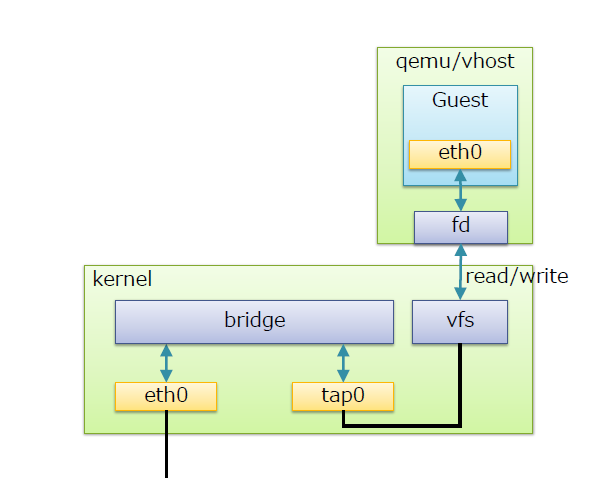

Tap interface.
- tap interface là một khái niệm về phần mềm được sử dụng để nói với Linux bridge là chuyến tiếp frame Ethernet vào nó. Hay nói cách khác, máy ảo kết nối tới tap interface sẽ có thể nhận được các khung frame Ethernet thô. Và do đó, máy ảo VM có thể tiếp tục được mô phỏng như là một máy vật lý ở trong mạng.

vfs ( virtual file system): tạo 1 phân vùng để nhận gói tin forward data từ máy ảo  thông qua forward database.

fd (forward database): là cổng giao tiếp chuyển tiếp dữ liệu giữa máy ảo với bridge. 

Bridge: có chức năng giống với swtich layer 2.

Port: có chức năng tương đương với port của switch thật.

<a name="3"></a>
## 3. Cách hoạt động.


Khi có 1 gói tin từ máy ảo muốn đi ra mạng internet thì

Bước 1: Gói tin tư máy ảo đi ra cổng eth0 của máy ảo đó.

bước 2: Gói tin từ cổng eth0 đi đến forward database.

Bước 3: Từ forward database gửi gói tin đến vùng vfs

Bước 4: Kernel lấy gói tin từ vùng vfs chuyển đến bridge qua các tap interface.

Bước 5: Từ Bridge gửi gói tin qua eth0 của máy thật và đi ra ngoài internet.

<a name="4"></a>
## 4. Các tính năng.
STP: Spanning tree protocol: giao thức chống vòng lặp gói tin trong mạng.

VLAN: Virtual LAN: các mạng LAN ảo, có thể cô lập các vùng trong LAN.

FDB: forward database: chuyển tiếp gói tin theo database nâng cao hiệu suật sử dụng của switch.

<a name="5"></a>
## 5. Mô hình lab.

Mô hình.

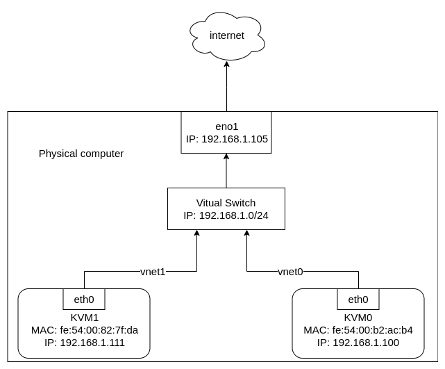

Kiểm tra bridge 
```
brctl show
```

Tạo linux bridge bằng lệnh:
```
brctl addbr thanhbc
```
gắn bridge vào card mạng eno1 để đi ra ngoài internet.

```
brctl addif thanhbc eno1
```

cấu hình dhcp cho bridge để tự động có địa chỉa IP.
```
dhclient thanhbc
```
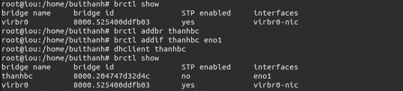


Kiểm tra địa chỉ IP trên 2 máy áo KVM1 và KVM2.
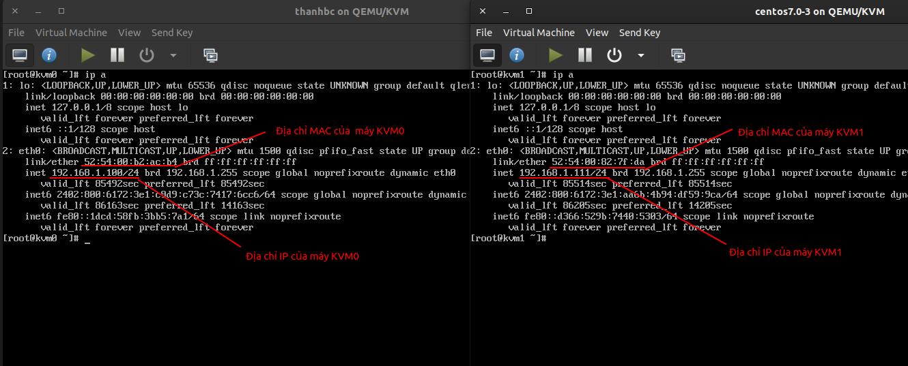


Khi ta bật 2 máy ảo lên kiểm tra thì thấy nó sẽ tự tạo nên 2 interface mới là vnet1 và vnet2.
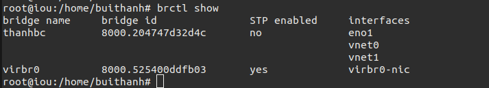

Kiểm tra  trên máy vật lý bằng câu lệnh **ip a**:

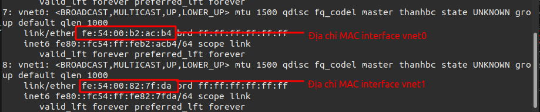

Ta thấy trên interface vnet1 có địa chỉ MAC là **fe:54:00:82:7f:da**
giống với địa chỉ MAC trên máy KVM1 **fe:54:00:82:7f:da**. Vậy máy ảo sử dụng tap có tên là vnet1 để kết nối với linux bridge.

Ta thầy điều tương tự với interface vnet0.

Tiến hành kiểm tra đường đi của mạng bằng cách bắt các gói tin trên các điểm: eno1, thanhbc, vnet1, vnet0. Bằng phần mềm wireshark.

Thực hiện trên máy ảo KVM1 ping đến internet
```
ping 8.8.8.8 -c 1
```
Thực hiện bắt gói tin trên máy vật lý bằng wireshark.

Bắt gói tin trên điểm vnet1.
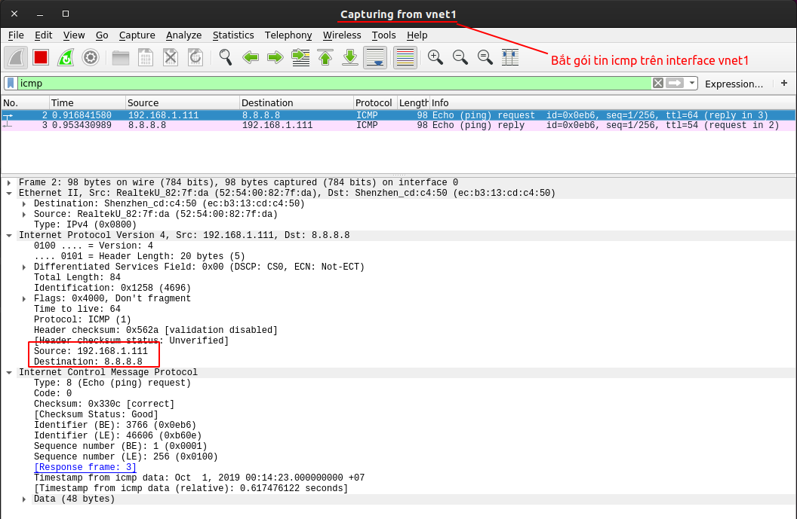
Ta bắt được 2 gói tin là request va reply từ địa chỉ máy ảo 192.168.1.111 đến địa chỉ 8.8.8.8. Vậy máy ảo KVM1 sử dụng interface vnet1 để đi đến bridge.

Băt gói tin trên điểm vnet0.
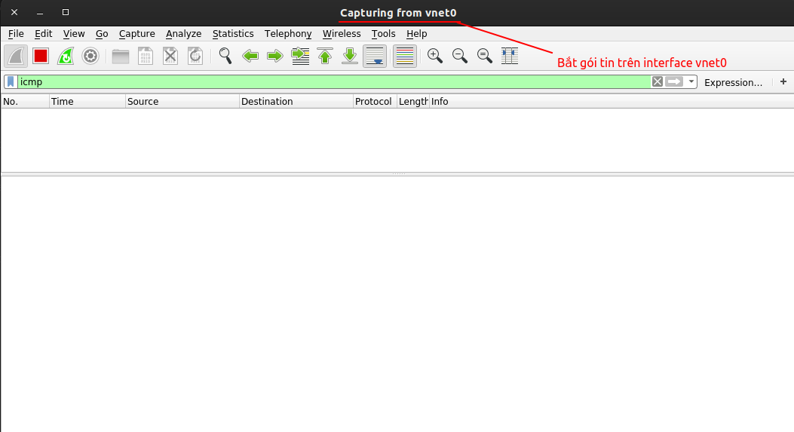
Ta không bắt được gói tin nào. Vậy máy ảo KVM1 không sử dụng vnet1 để đi đến bridge.

Bắt gói tin trên điểm thanhbc.
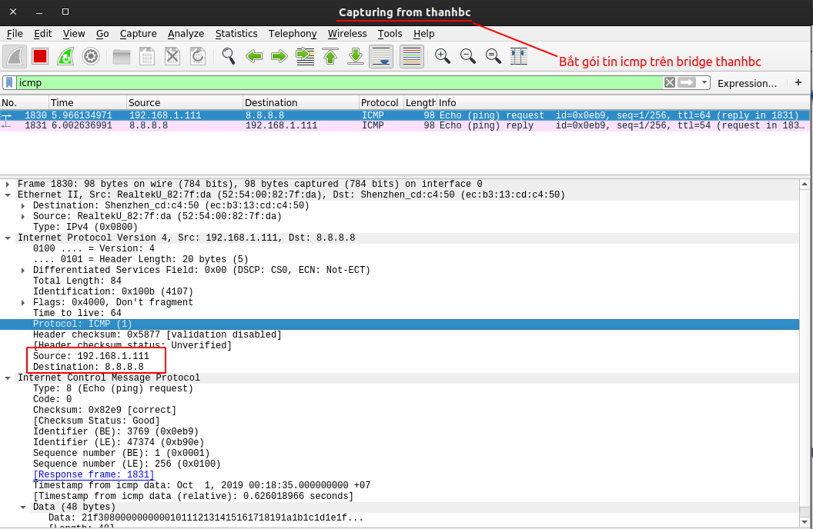
Ta bắt được 2 gói tin request và reply từ địa chỉ máy ảo 192.168.1.111 đến địa chỉ 8.8.8.8. Vậy máy ảo KVM1 có đi qua bridge thanhbc.

Bắt gói tin trên điểm eno1.
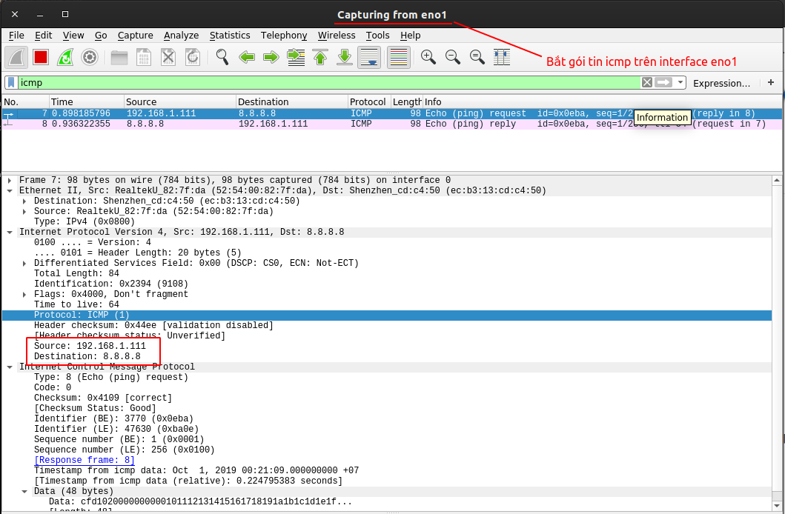
Ta bắt được 2 gói tin request và reply từ địa chỉ máy ảo 192.168.1.111 đến địa chỉ 8.8.8.8. Vậy máy ảo KVM1 có đi qua interface eno1 để ra ngoài internet.

Vậy kết luân lại gói tin sẽ đi từ máy ảo KVM1 qua interface vnet1 đến bridge thanhbc  rồi đi tiếp qua đường uplink đên interface eno1 của máy vật lý rôif đi đến internet.


<a name="6"></a>
## 6. Host-only trong KVM
Cấu trúc và cách hoat động tương tự như Linux bridge nhưng không có đường uplink kết nối ra interface của máy vật lý. Mô hình này tạo thành một mạng LAN.

Việc cấu hình và tạo mạng isolate sẽ tự tạo thêm bridge ảo mới cho mạng. không cần tạo trước như mạng bridge network.

Các máy ảo kết nối tới switch ảo có thể liên lạc với nhau và với host, nhưng lưu lượng của chúng sẽ không được đi ra ngoài host – cũng như không thể nhận các kết nối từ bên ngoài vào.

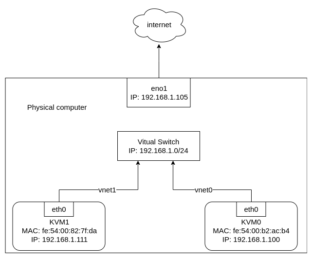