# Tìm hiểu NAT và Host-only trong kvm.

Mục Lục.

[1. Cơ chế NAT trong linux bridge.](#1)

[2. Cách hoạt động NAT.](#2)

- [2.1 Mô hình](#2.1)

---
<a name="1"></a>
## 1. Cơ chế NAT trong linux bridge.
Máy vậy lý sẽ tạo ra một virtual router được vận hành dưới chế độ NAT.

Sử dụng các rule trong  bảng NAT của máy tính vật lý đề định tuyến cho các máy ảo.

Điều này có nghĩa là bất kì máy ảo nào được kết nối tới nó, sử sử dụng địa chỉ IP của máy host để liên lạc ra bên ngoài. Các máy ở mạng ngoài không thể liên lạc với máy guest ở bên trong khi router ảo hoạt dộng trong chế độ NAT.

Chế độ NAT network coi libvirt server như là một router, các lưu lượng của máy ảo xuất hiện từ địa chỉ của server để ra ngoài.

Hạn chế: Virtual network mặc định hoạt động ở chế độ NAT-baased. Không may, nó thường tự động thêm các rule iptable cho dù bạn có muốn hay không.

<a name="2"></a>
### 2. Cách hoạt động NAT.
Trên phần mềm Virtual Machine Manager tiến hành tạo dải mạng NAT để sử dụng.
mở phần mềm chọn theo đường dẫn **Edit/ Connection Details** sẽ hiển thị ra của sổ.
Đặt tên cho mạng ảo.
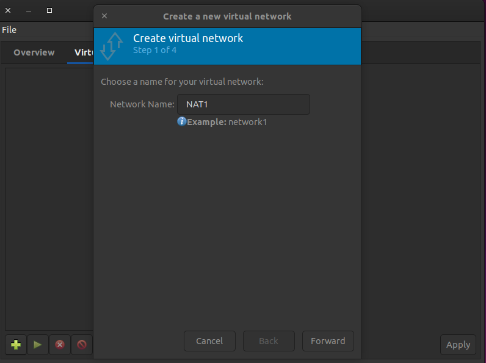

Thiết lập dải địa chỉ sử dụng.
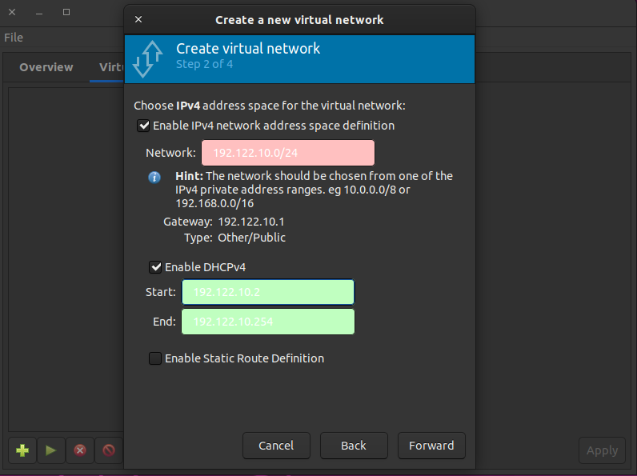


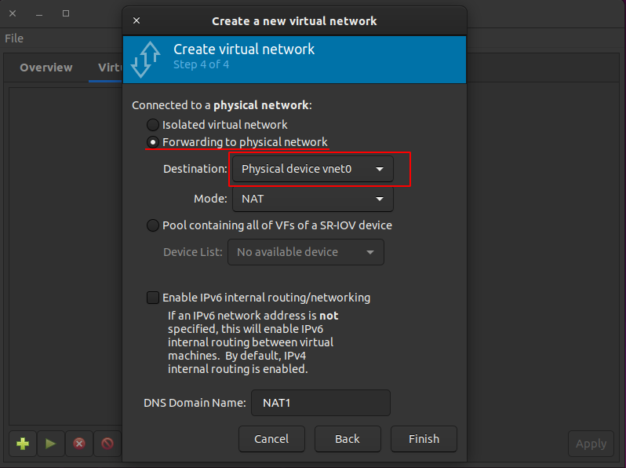

Kiểm tra các đia chỉ trên máy vật lý bằng lệnh **ip a**.
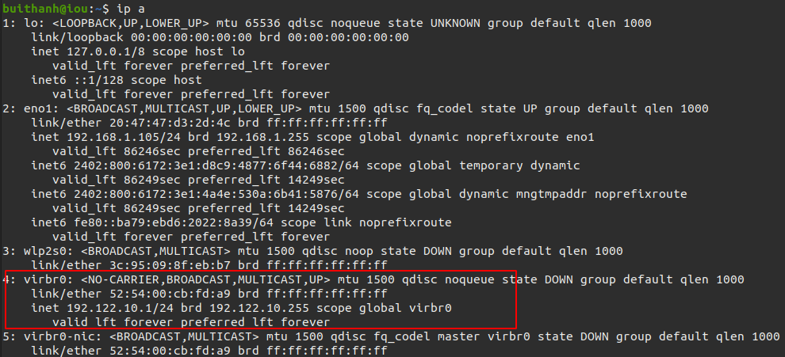
Ta thấy có xuất hiện 1 interface là **virbr0** đây tương tự là như tạo ra một virtual route.

<a name="2.1"></a>
### 2.1 Mô hình.

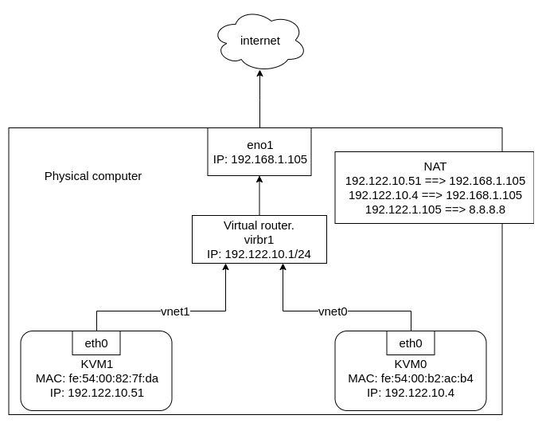

Khởi động 2 máy ảo có sử dụng NAT1 và kiểm tra địa chỉ IP và MAC trên 2 máy ảo KVM0 và KVM1.
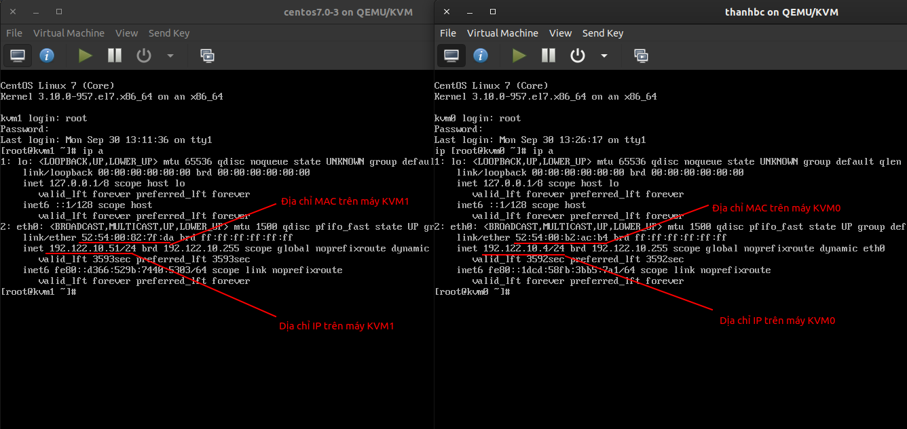

Sau Khi khơi động máy ảo ta kiểm tra các interface trên máy vật lý bằng lệnh **ip a**.
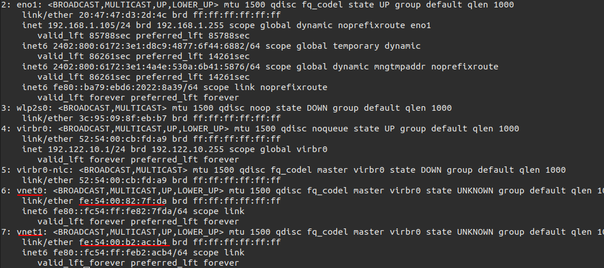
Ta thấy máy vậy lý sinh thêm 2 interface mới là vnet0 và vnet1.

Ta so sánh địa chỉ MAC của vnet0 và địa chỉ MAC của máy ảo KVM1 thấy giống nhau vậy chúng sử dụng chung giao diện.

Kiểm tra đường đi của gói tin từ máy ảo KVM1 ra mạng internet ta sử dụng wireshark để bắt gói tin trên các điểm eno1, virbr0, vnet1, vnet0.

Trên máy ảo KVM1 thực hiện lệnh
```
ping 8.8.8.8 -c 1
```

Bắt gói tin icmp trên interface vnet1.
Ta không bắt được gói tin nào. Vậy máy ảo KVM1 không đi qua interface vnet1.

Bắt gói tin icmp trên interface vnet0.
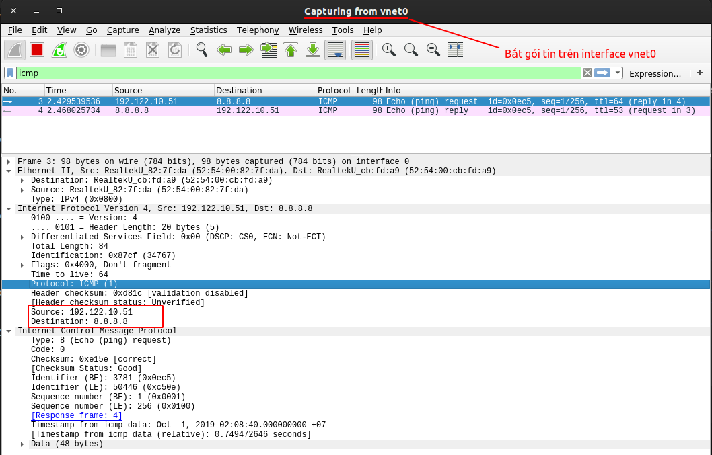
Ta bắt được 2 gói tin request và reply từ địa chỉ máy ảo 192.122.10.51 đến địa chỉ 8.8.8.8. Vậy máy ảo KVM1 có đi qua interface vnet0.

Bắt gói tin trên interface virbr0.
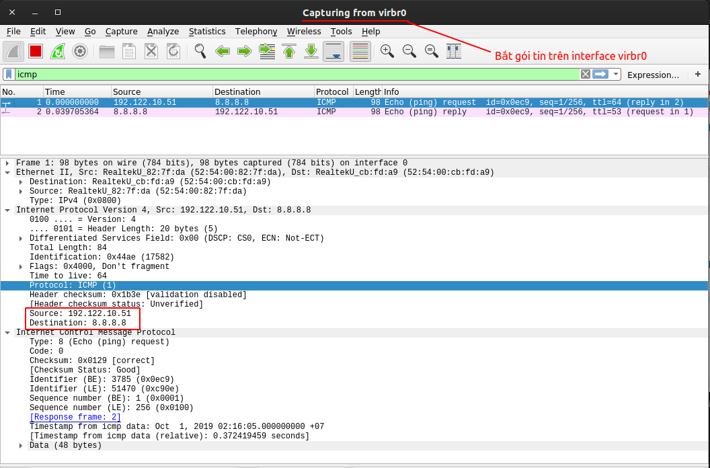
Ta bắt được 2 gói tin request và reply từ địa chỉ máy ảo 192.122.10.51 đến địa chỉ 8.8.8.8. Vậy máy ảo KVM1 có đi qua virbr0.

Bắt gói tin icmp trên interface eno1.
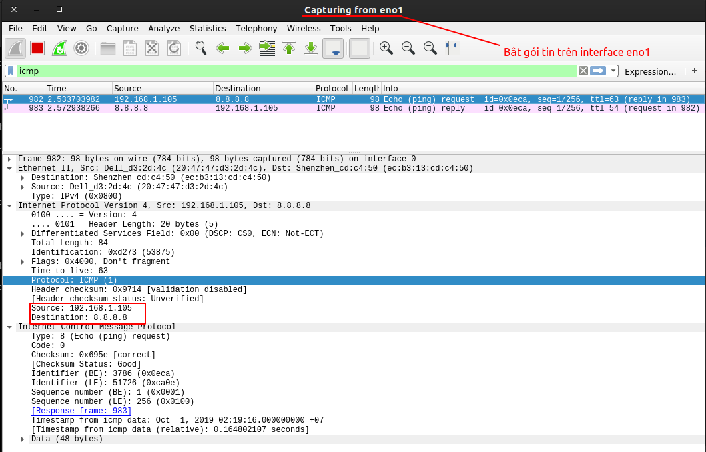
Ta thây có địa chỉ nguồn đã thay đổi từ 192.122.10.51 thành 192.168.1.105. Vậy tại đây máy vật lý đã sử dụng các bảng và chain trong iptables để chuyển đổi địa chỉ tư máy ảo sang máy vật lý rồi mới đi ra internet.

Vậy đường đi từ máy ảo KVM1 đi qua interface vnet0 đến virbr0  rối được gửi tiếp đến interface eno1 qua quá trình chuyển đổi địa chỉ rối mới đi ra internet.


Qua trình chuyển đổi địa chỉ được hiểu bằng hình sau.
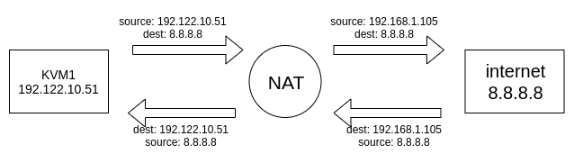

Xem các chain trong iptable trên máy tính vậy lý.
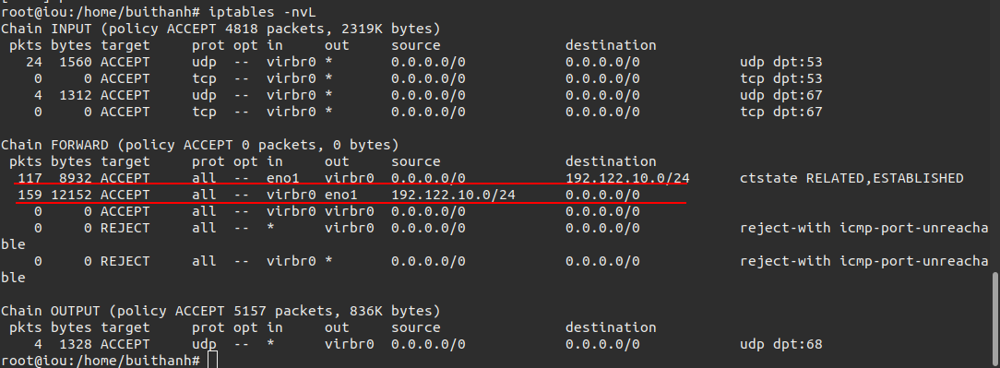
Ta thấy trong chain INPUT thì các rule cho mọi kết nối từ virbr0 đi vào qua các port udp và tcp là 53 và 67. Chain FORWARD thì các rule chuyển tiếp các gói tin từ inteface eno1 và virbr0 và ngược lại. Đây là quá trình chuyển đổi địa chỉ như ta nói ở trên.

Sau khi xóa 2 rule đầu của chain FORWARD.
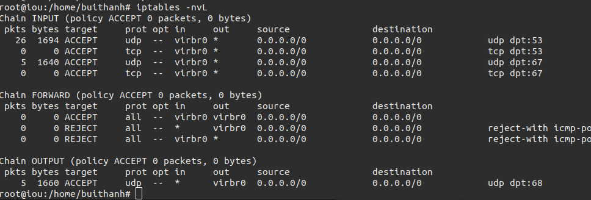

Kiểm tra ping từ máy tính KVM1 đên internet.
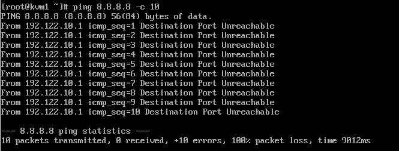

Ta thấy là không ping được.

Khi ta xóa bỏ các rule này thì các máy ảo sẽ không kết nối được với internet nữa.


