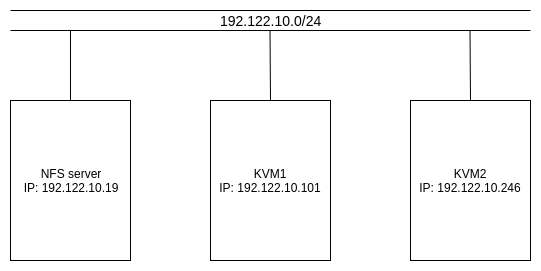

# Tìm hiểu và sử dụng migration trong KVM.

Mục Lục.

[1.Migration là gì.](#1)

[2.Offlive migrate.](#2)

[3.Live migrate.](#3)

[4.Cài đặt và sử dụng live migrate.](#4)

- [4.1 Mô hình và IP planning.](#4.1)

- [4.2 Cài đặt trên NFS.](#4.2)

- [4.3 Cài đặt KVM1 và KVM2.](#4.3)

[5.Tài liệu tham khảo.](#5)


--- 

<a name ="1"></a>
## 1.Migration là gì.
Migration cung cấp khả năng di chuyển các máy ảo đang chạy giữa các host vật lý.
Migration được tạo ra để làm nhiệm vụ bảo trì  và nâng cấp hệ thống.

- Cân bằng tải: Di chuyển VMs tới các host khác kh phát hiện host đang chạy có dấu hiệu quá tải.
- Bảo trì, nâng cấp hệ thống: Di chuyển các VMs ra khỏi host trước khi tắt nó đi.
- Khôi phục lại máy ảo khi host gặp lỗi: Restart máy ảo trên một host khác.

Migrate có 2 loại cơ chế là là offlive migrate và live migrate.

<a name ="2"></a>
## 2.Offlive migrate.
Cơ chế Offline Migrate: là cơ chế cần phải tắt guest đi thực hiện việc di chuyển image và file xml của guest sang một host khác 

<a name ="3"></a>
## 3.Live migrate.
Live migration cung cấp khả năng di chuyển các máy ảo đang chạy giữa các host vật lý mà không làm gián đoạn dịch vụ. Khả năng live migration là trong suốt với người dùng, các máy ảo vẫn duy trì trạng thái bật, kết nối mạng vẫn đảm bảo và các ứng dụng của người dùng vẫn tiếp tục duy trì trong khi máy ảo được đưa sang một host vật lý mới.

<a name ="4"></a>
## 4.Cài đặt và sử dụng live migrate.

<a name ="4.1"></a>
### 4.1 Mô hình và IP planning.

#### Mô hình.


#### IP planning.
|  Tên máy ảo  | Hệ điều hành    |IP address | Subnet mask |Default gateway|
|------|------|-------|-----|-------|
|VM1| Centos7|192.122.10.101| /24| 192.122.10.1|
|VM2| Centos7| 192.122.10.246| /24| 192.122.10.1|
| NFS | Centos7| 192.122.10.19| /24| 192.122.10.1|


<a name ="4.2"></a>
### 4.2 Cài đặt trên NFS.

Cài đặt NFS-server cho  máy NFS.

 ```
yum install nfs-utils -y
 ```
Tạo thư mục chia sẻ file.
```
mkdir -p /home/haha
```

Sửa file /etc/exports để tạo mountpoint export.
```
echo "/home/haha 192.122.10.101/24 (rw,sync,no_root_squash)" >> /etc/exports
echo "/home/haha 192.122.10.246/24 (rw,sync,no_root_squash)" >> /etc/exports
```
Khởi động NFS server.
```
systemctl start rpcbind nfs-server
```

Khởi động NFS cùng server khi bật máy.
```
systemctl enable rpcbind nfs-server
```

Tiếp đến ta cấu hình firewall để NFS client được phép truy cập và live migrate thông qua.

```
firewall-cmd --permanent --add-service=nfs
firewall-cmd --permanent --add-service=mountd
firewall-cmd --permanent --add-service=rpc-bind
firewall-cmd --permanent --add-port=16509/tcp
firewall-cmd --permanent --add-port=49152/tcp
firewall-cmd --permanent --add-port=2049/tcp
firewall-cmd --permanent --add-port=2049/udp
firewall-cmd --reload
```

Kiểm tra mountpoint trên server. 
```
showmount -e localhost
```
<a name ="4.3"></a>
### 4.3 Cài đặt KVM1 và KVM2.

#### Cài đặt NFS.
```
yum install nfs-utils -y
```
Mount với thư mục share trên NFS server.
```
mount 192.122.10.19:/home/haha  /home/haha
```

#### Cài đặt trên KVM

Thực hiện cài đặt KVM trên cả 2 máy KVM host.

Khi cài đặt VM ta cần lưu file disk của VM vào thư mục đã mount với thư mục được share của NFS server. Lưu ý file disk phải để ở định dang raw hoặc img nếu đê định dạng qcow khi migrate sẽ bị lỗi.

Chuyển đổi từ qcow2 sang raw ta dùng lệnh.
```
qemu-img convert centos7-migrate.qcow2 migrate.raw
```


 Khi cài máy ảo xong ta cần sửa thông tin trong file xml của VM bằng cách dùng lệnh.
```
virsh edit tên-VM
```


Cập nhật lại thay đổi vừa sửa ta sử dụng lệnh.
```
virsh define centos7-migrate
```

Cấu hình cho phép giao thức TCP trong dịch vụ libvirt.

Sửa file **/etc/libvirt/libvirtd.conf**.
```
listen_tls = 0  
listen_tcp = 1
tcp_port = "16509"
listen_addr = "0.0.0.0"
auth_tcp = "none"
mdns_adv = 0
```
Giải thích :
- listen_tls: tắt TLS, mặc định được mở.
- listen_tcp: bật chức năng kiểm duyệt TCP
- tcp_port: cấu hình cổng TCP, mặc định là 16509
- auth_tcp: bật hoặc tắt việc kiểm duyệt bằng mật khẩu

Khởi động lại dịch vụ libvirtd:
```
systemctl restart libvirtd 
```
#### Tiến hành live migrate.

Kiểm tra VM trên KVM1 và KVM2.

```
[root@vm1 home]# virsh list --all
 Id    Name                           State
----------------------------------------------------

```

```
[root@vm2 haha]# virsh list --all
 Id    Name                           State
----------------------------------------------------
 4     centos7-migrate                running
```

Migrate dùng câu lệnh virsh

Thực hiện câu lênh trên VM2 ( chứa centos7-migrate đang chạy )
```
virsh migrate --live <tên guest muốn migrate> qemu+ssh://<hostnam của đích chuyển đến>/system
```
Chuyển VM centos7-migrate từ KVM2 sang KVM1.
```
[root@vm2 haha]# virsh migrate --live centos7-migrate qemu+tcp://192.168.90.11/system --persistent
```
Khi đó quan sát trên virt-manager sẽ thấy VM: centos7-migratem  trên VM2 sẽ di chuyển sang VM1 mà vẫn đang ở trạng thái hoạt động.

```
[root@vm1 haha]# virsh list --all
 Id    Name                           State
----------------------------------------------------
 4     centos7-migrate                running
```
Ngoài tùy chọn --live. Còn thêm một số các tùy chọn khác như:

- --live : tùy chọn chuyển trực tiếp guest khi đang chạy mà không làm tắt guest ( nếu không có tùy chọn này thì guest sẽ khởi động lại )

- --persistent : tùy chọn chuyển máy ảo sang host mới mà khi tắt guest đó, guest sẽ không bị mất

- --undefinesource : tùy chọn này sẽ xóa guest ở nguồn đi

- --suspend : tùy chọn sẽ tạm dừng máy ảo khi chuyển sang máy host mới

- --unsafe : chuyển máy ngay cả trong chế độ không an toàn

Ngoài những tùy chọn trên có 3 tùy chọn rất đặc biệt, cũng có thể nói là tính năng nâng cao hơn đối với việc Migrate

- --direct : Sử dụng migrate trực tiếp host mà không cần 2 host đó phải sử dụng chung thư mục

- --p2p : Sử dụng cho việc Migrate peer-to-peer

- --tunnelled : Sử dụng cơ chế tunnel để migrate các guest

Để hiểu thêm cơ chế migrate đối với 3 tùy chọn này. Bạn có thể tham khảo tại [link](https://libvirt.org/migration.html#flow)

<a name ="5"></a>
### 5.Tài liệu tham khảo.
1. https://www.server-world.info/en/note?os=CentOS_7&p=kvm&f=8
2. https://blog.cloud365.vn/linux/live-migration-KVM/
3. https://github.com/hocchudong/KVM-QEMU/blob/master/README.md
4. https://libvirt.org/migration.html#flow

