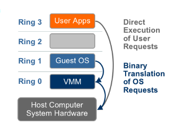

# Tìm hiểu cấu trúc x86, Virtualization và hypervisor.

## 1. Virtualization là gì?

Ảo hóa là một khái niệm vô cùng rộng lớn trong thức tế nó là một cái gì đó không có thật. Trong ngành khoa học máy tính thì ảo hóa là sử dụng một môi trường phần cứng không có thật. Công nghệ ảo hóa trên phần cứng được chạy trên 1 phần mềm ảo hóa gọi là hypervisor.

Nói một cách đơn giản, ảo hóa là quá trình ảo hóa một cái gì đó như phần cứng,
network, storage, application, ....

Một số ưu điểm của ảo hóa:
- Hợp nhất máy chủ.
- Cách ly dịch vụ.
- Cung cấp máy chủ nhanh hơn.
- Phục hồi thảm họa.
- Cân bằng tải động.
- Môi trường thử nghiệm và phát triển nhanh hơn.
- Cải thiện độ tin cậy và bảo mật hệ thống.
- Độc lập hệ điều hành hoặc nhà cung cấp phần cứng.

Sau đây là sơ đồ cây thể hiện rõ các thành phần trong ảo hóa.

Hiện nay có rất nhiều kiểu ảo hóa như KVM, Xen, QEMU, Virtualbox,..
Nhưng trong bài nay tôi đề cập đến KVM vì tính mở, linh hoạt và có hiệu suất tốt nhất.
KVM được phát triển, sử dụng trên kiến trúc xủ lý x86. Vậy cấu trúc x86 là gì.

### 1.1 Kiến trúc x86 

Intel đưa ra kiến trúc x86 đây là kiến trúc tập lệnh sử dụng vi sử lý 8086. thế hệ này chỉ hỗ trợ 2^32 = 4G RAM. Sau này được phát triển lên X86-64 sử dụng 64 bit.
 
trong kiến trúc X86 có 1 có chế hoạt động là **Ring**. Đây là cơ chế bảo vệ dữ liệu và chức năng 1 một chương trình tránh khả năng nguy có bị lỗi hoặc truy cập trái phép bởi các chương trình khác.

Số lượng Ring đươc tùy thuộc vào kiên trúc của CPU và hệ điều hành chạy trên nên kiến trúc đó thông thường là từ 4- 6 ring.

Các chương trình tại Ring 0 có đặc quyền cao nhất, có thể tương tác với CPU, bộ nhớ và các thiết bị phần cứng. Ring có số càng cao thì đặc quyền càng thấp. Có thể coi từ Ring 0 đến Ring 3 tương ứng như sau:
Ring 0 : Tài nguyên vật lý
Ring 1 : Các phần mềm ảo hóa
Ring 2 : Máy ảo
Ring 3 : Hệ điều hành

Hầu hết các hệ điều hành chỉ chạy 2 Ring. VD : Window chỉ sử dụng 2 mức là Ring 0 và Ring 3.

Trong kiến trúc x86 và cơ chê hoạt động của Ring có 2 chế độ làm việc chính là:
- User mode.

    Đây là chế đọ của người dùng. Thường chạy từ các ring 3 đên các ring có số lớn hơn.

- kernel mode.
    Đây là chế độ kernel. Được chạy trên ring 0 và có đặc quyền cao nhất có thể truy cập trực tiếp đên phần cứng.

## 2. Các loại ảo hóa. 
Ảo hóa được chia làm 2 loại chính là:
- full virtualization.
- Para virtualization.
### 2.1 Full virtualization.

Loại ảo hóa này vẫn dựa trên cơ chế hoạt động của ring và kiến trúc x86.
ring