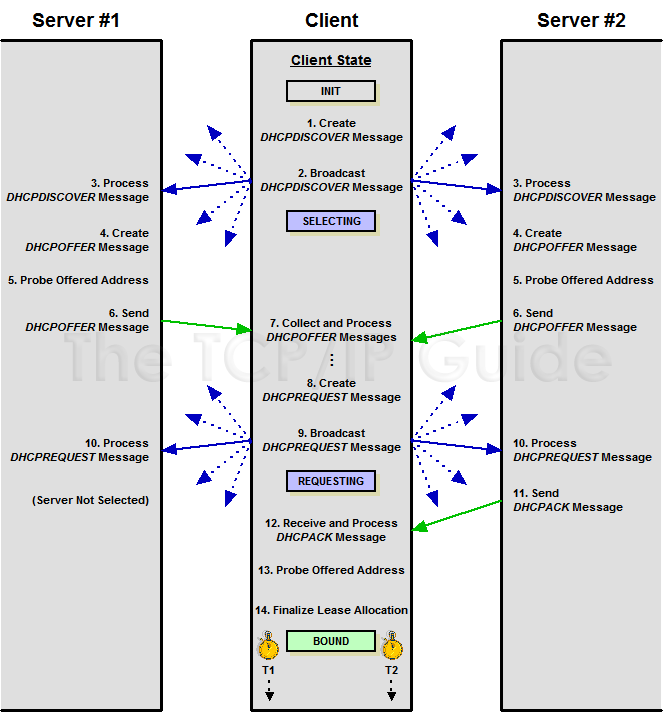
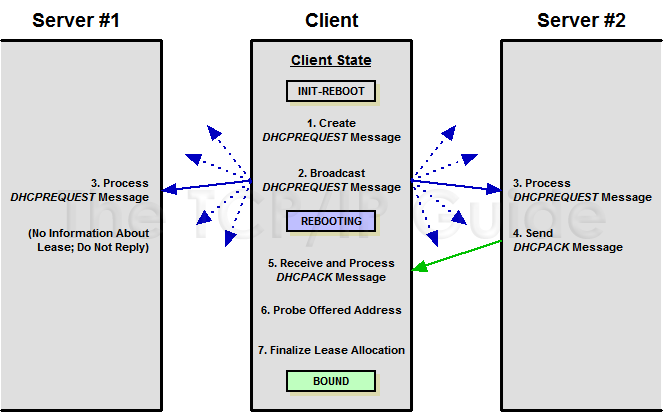
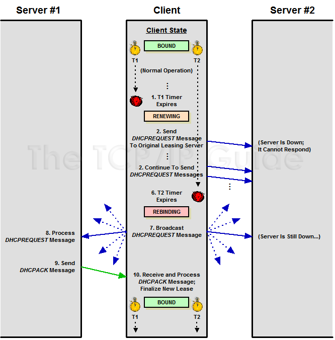

# Các tiến trinh hoạt động của DHCP.

3 tiến trình của DHCP là: Lease Allocation Process (Quá trình cấp phát địa chỉ IP), Lease Reallocation Process (Quá trình xin cấp phát lại IP đã xác định trước) và quá trình Renew and Rebind (Quá trình gia hạn thêm thời gian được phép sử dụng IP)

## 1. Quá trình cấp phát địa chỉ IP
Quá trình xử lý quan trọng nhất trong DHCP là quá trình Lease Allocation, được sử dụng bởi client để yêu cầu một hợp đồng thuê IP. Client gửi broadcast một request tới DHCP server. Mỗi DHCP server sẵn sàng cung cấp cho client một hợp đồng thuê và gửi lại cho nó một bản tin Offer. Client chọn bản hợp đồng mà nó nhận được và gửi lại tới tất cả các server về sự lựa chọn của nó. Server được chọn sẽ gửi lại cho client thông tin và hợp đồng thuê. Các bước được thực hiện như sau:

Bước 1: Client tạo bản tin DHCPDISCOVER

Ban đầu, Client chưa có địa chỉ IP và nó có thể biết hoặc không biết vị trí của DHCP server trong mạng. Để tìm DHCP server, nó tạo bản tin DHCP DISCOVER, bao gồm các thông tin như sau:

Điền địa chỉ MAC vào trường CHAddr để xác nhận nó.

Sinh ra một số định danh transaction ngẫu nhiên và điền vào trường XID.

Client có thể yêu cầu một địa chỉ IP xác định sử dụng trường tùy chọn Request IP Address trong phần DHCP option.

Bước 2: Client gửi bản tin DHCP DISCOVER

Client gửi broadcast bản tin DHCP DISCOVER trên mạng nội bộ. (Broadcast lớp 2 và lớp 3)

Bước 3: Server nhận và xử lý bản tin DHCP DISCOVER

Mỗi DHCP server trên mạng LAN nhận được bản tin DHCP DISCOVER của client và kiểm tra nó. Server tìm kiếm phần địa chỉ MAC của client trong database và chọn cho nó một IP phù hợp đồng thời các thông số liên quan. Nếu client yêu cầu một IP xác định thì server sẽ xử lý yêu cầu nó. Server có thể quyết định việc nó dùng địa chỉ IP chỉ định kia là hợp lệ hay không để gửi reply về.

Bước 4: Server tạo bản tin DHCP OFFER

Mỗi server được chọn trả lời lại cho client tạo bản tin DHCP OFFER bao gồm các thông tin sau:

Địa chỉ IP cấp phát cho client trong trường YIAddr. Nếu trước đó, client đã "thuê" một địa chỉ IP và thời hạn dùng của nó vẫn còn thì sẽ sử dụng địa chỉ cũ đó cho client. Nếu không thì nó sẽ chọn một IP có sẵn bất kì cho client.

Thời hạn được sử dụng IP.

Các thông số cấu hình khác mà client yêu cầu.

Định danh của DHCP server trong phần tùy chọn DHCP Server Identifier option.

Cùng số XID được sử dụng trong bản tin DHCP DISCOVER.

Bước 5: Server dò tìm xem địa chỉ IP mà cấp phát cho client đã được một thiết bị nào khác sử dụng hay chưa.

Trước khi gửi bản tin DHCP OFFER cho client, server nên kiểm tra lại xem địa chỉ IP cấp cho client đã được sử dụng hay chưa bằng cách gửi bản tin ICMP.

Nếu IP đó đã được sử dụng thì nó sẽ chọn lại địa chỉ IP khác cho client.

Nếu IP chưa được sử dụng, server sẽ cấp phát IP cho client.

Bước 6: Các Server gửi bản tin DHCPOFFER

Mỗi server gửi bản tin DHCP OFFER của nó. Chúng có thể được gửi unicast hoặc broadcast tùy thuộc vào client (Nếu client cho phép nhận bản tin unicast khi chưa được cấu hình IP thì nó sẽ set bit B trong bản tin DHCP DISCOVER là 0, còn nếu không thì nó sẽ set bit B là 1 để biểu thị nhận bản tin broadcast)

Bước 7: Client nhận và xử lý bản tin DHCPOFFER

Client nhận bản tin DHCP OFFER và nó sẽ chọn lựa server nào mà nó nhận được bản tin DHCP OFFER đầu tiên. Nếu không nhận được bản tin DHCP OFFER nào sau một thời gian, client sẽ tạo lại bản tin DHCP DISCOVER và gửi lại từ đầu.

Bước 8: Client tạo bản tin DHCP REQUEST

Client tạo bản tin DHCP REQUEST cho server mà nó chọn nhận bản tin OFFER. Bản tin này sẽ gồm 2 mục đích chính là nói với server mà cho phép cấp phát IP cho nó là nó đồng ý dùng IP đó trong trường hợp IP đó vẫn còn dành cho nó và cũng thông báo với các DHCP server còn lại là bản tin OFFER của chúng không được nhận.

Trong bản tin này bao gồm các thông tin:

Định danh của server được chọn trong phần SEerver Identifier option.

Địa chỉ IP mà DHCP server cho phép client trong bản tin DHCP OFFER, client để vào phần Request IP Address DHCP option.

Và một số thông tin cấu hình mà nó muốn trong phần Parameter Request List option.

Bước 9: Client gửi bản tin DHCP REQUEST

Client gửi broadcast bản tin DHCP REQUEST. Sau đó chờ reply từ server.

Bước 10: Các server nhận và xử lý bản tin DHCP REQUEST

Mỗi server nhận được bản tin REQUEST của client. Các server không được chọn sẽ bỏ qua bản tin này.

Bước 11: Server gửi bản tin DHCPACK hoặc DHCPNAK.

Server được chọn sẽ kiểm tra xem địa chỉ IP nó OFFER cho còn sử dụng được hay không. Nếu không còn, nó sẽ gửi lại DHCPNAK (negative acknowledgment). Thông thường, server sẽ vẫn dành địa chỉ IP đó cho client, server sẽ gửi lại bản tin DHCPACK để xác nhận và cấp các thông số mà client yêu cầu.

Bước 12: Client nhận bản tin DHCPACK hoặc DHCPACK

Client sẽ nhận lại bản tin DHCPACK hoặc DHCPNAK từ server.

Nếu là DHCPNAK, client sẽ bắt đầu gửi lại DISCOVER từ bước 1.

Nếu là DHCPACK, client đọc địa chỉ IP trong trường YIAddr, ghi lại các thông số khác trong phần DHCP option.

Nếu không nhận được bản tin nào, client sẽ gửi lại DHCP REQUEST một hoặc vài lần nữa. Sau một khoảng thời gian vẫn không nhận được gì, nó sẽ bắt đầu lại từ Bước 1.

Bước 13: Client kiểm tra xem IP được sử dụng hay chưa.

Client sẽ kiểm tra lần cuối trước khi xác định chắc chắn IP chưa được thiết bị khác sử dụng trước khi sử dụng nó. Bước này sẽ được thực hiện bởi giao thức ARP trên mạng LAN.

Nếu có bất kì thiết bị nào phản hồi lại ARP, client sẽ gửi bản tin DHCP DECLINE lại server để thông báo với server rằng IP đó đã được máy khác sử dụng. Và client trở lại Bước 1.

Nếu không có phản hồi, client sẽ sử dụng IP. Kết thúc quá trình Lease Allocation.

## 2. Quá trình xin cấp phát lại địa chỉ IP
Có 2 trường hợp mà client thực hiện quá trình Reallocation  là:

Power on with Existing Lease.
Reboot
Nếu client khởi động lại và nó đã có sẵn một hợp đồng thuê, nó không cần phải thực hiện lại quá trình full lease allocation, thay vào đó, nó có thể sử dụng quá trình ngắn hơn là Reallocation. Client broadcast một request để tìm server hiện tại đang quản lý thông tin về hợp đồng mà nó đang thuê. Server đó gửi lại để xác nhận xem hợp đồng của client còn hiệu lực hay không.

2.2.3. Quá trình Renew và Rebind
Do thời hạn của mỗi client khi thuê IP thường đều là có hạn (trừ trường hợp Automatication Allocation) nên cần có quá trình gia hạn (renewal) lại với DHCP server quả lý và nếu quá trình renewal không thành công thì sẽ rebind lại (gửi request) tới bất kì DHCP server khác đang hoạt động để gia hạn hợp đồng.

## Tài liệu tham khảo :
https://github.com/hocchudong/thuctap012017/blob/master/TamNT/DHCP/T%C3%ACm%20hi%E1%BB%83u%20giao%20th%E1%BB%A9c%20DHCP.md#1.3