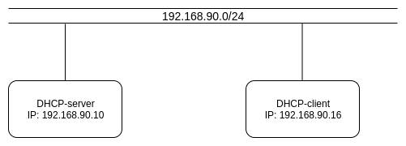
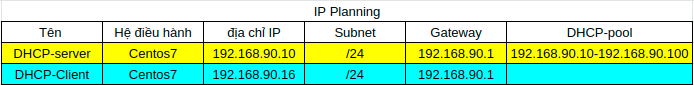
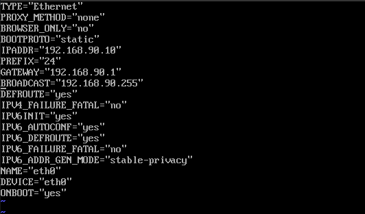
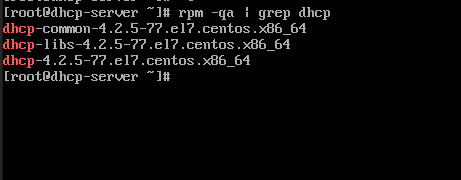
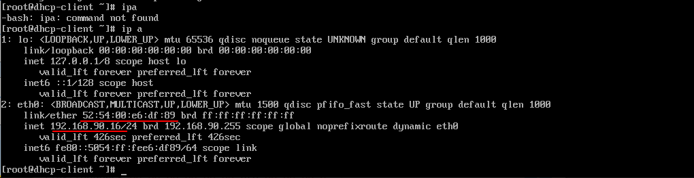
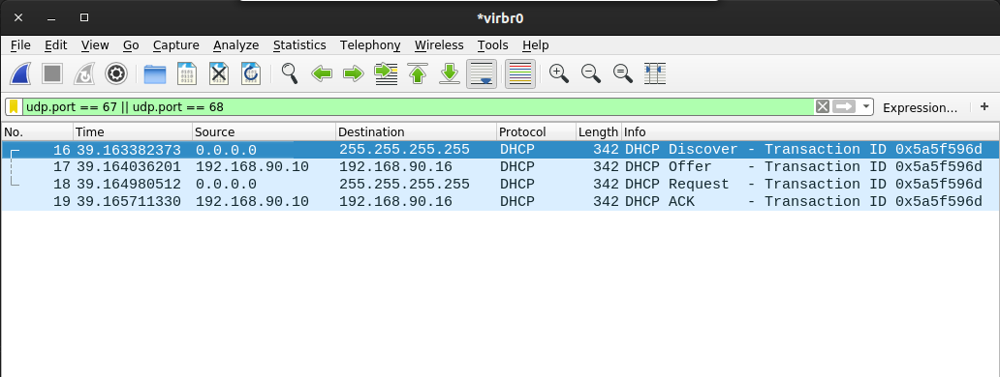

# Cài đặt và sử dụng DHCP.


Mục Lục.

[1. Mô hình và IP planning.](#1)

[2. Cài đặt môi trường.](#2)

[3. Cấu hình trên DHCP-server.](#3)

- [3.1 Đặt địa chỉ IP DHCP-server là địa chỉ IP tĩnh](#3.1)
- [3.2 Cài đặt  DHCP.](#3.2)
- [3.3 Cấu hình dịch vụ DHCP.](#3.3)
- [3.4 Cấp địa chỉ IP cho 1 host cụ thể.](#3.4)

[4. Cấu hình trên DHCP-client.](#4)

---

<a name ="1"></a>
## 1. Mô hình và IP planning.

Mô hình.



IP planning.



<a name ="2"></a>
## 2. Cài đặt môi trường.

Bài viết này tôi lab trên KVM. Trong KVM tạo 2 máy ảo hệ điệù hành centos7. MỘt máy sử dungj làm DHCP-server máy còn lại sử dụng làm DHCP-client đề nhận địa chỉ IP.

### 2.1: Tạo một mạng NAT là 192.168.90.0/24 trên KVM.


Tắt chế độ tự động cấp địa chỉa DHCP.

<a name ="3"></a>
## 3. Cấu hình trên DHCP-server.

<a name ="3.1"></a>
### 3.1 Đặt địa chỉ IP DHCP-server là địa chỉ IP tĩnh.

Sửa file cấu hình network.
```
vim /etc/sysconfig/network-scripts/ifcfg-eth0
```


Một số thông số quan trong cần chú ý trong đó:
- **BOOTPROTO** : Nhận địa chỉ IP. Ở đây là để tĩnh.
- **IPADDR** : Đặt địa chỉ IP cho máy DHCP-server.
- **GATEWAY** : Địa chỉ IP được trỏ đến.
- **BROADCAST** : Địa chỉ broadcast.
- **ONBOOT** : Khởi động cùng hệ thống.

<a name ="3.2"></a>
### 3.2 Cài đặt  DHCP.
Cài đặt gói chương trình DHCP ta sử dụng lệnh.
```
yum install dhcp-server -y
```
Kiểm tra xem đã cài gói tin dhcp server chưa.
```
rpm -qa | grep dhcp
```


Cấu hình cho DHCP khởi động cùng hệ thống.
```
systemctl enable dhcpd
```
Cấu trúc các thư mục của dịch vụ DHCP:
- **/etc/dhcp/dhcpd.conf** : file cấu hình dịch vụ.
- **/var/lib/dhcpd/dhcpd.leases**: Chứa thông tin các IP động đang cấp qua DHCP.
- **/var/log/message**: log mặc định chứa các quá trình DHCP.

<a name ="3.3"></a>
### 3.3 Cấu hình dịch vụ DHCP.

Copy file  cấu hình dhcp config có sẵn đến thư mục **/ect/dhcp/dhcpd.conf**

```
cp -f /user/share/doc/dhcp-*/dhcp.conf.example /etc/dhcp/dhcpd.conf
```
File cấu hình DHCP gồm 2 phần là:
- Phần cấu hình toàn cục: áp dụng chung cho tất cả lớp mạng.
- Phần cấu hình lớp mạng cấp phát IP động DHCP: Các giá trị thông tin cho quá trình cấp phát IP động.

Cấu hình toàn cục DHCP server.

```
option domain-name "congthanh.com"
default-lease-time 600;
max-lease-time 7200;
leases-fle-name "var/libdhcpd/dhcpd.leases";
authoritative;
log-facility local7;
```
Trong đó:
- **option domain-name**: Khai báo tên miền lớp mạng chung.
- **default-lease-time**: thời gian mặc định môt IP cấp cho người dùng tồn tại.
- **max-lease-time**: thời gian tối đa một IP tồn tại cấp phát cho người dùng.
- **leases-fle-name**: File chứa thông tin về địa chỉ Ip đã được cấp phát.
- **authoritative**: xác thực DHCP server tránh giả mạo.

Cấu hình lớp mạng cấp phát địa chỉ IP.
```
subnet 192.168.90.0 netmask 255.255.255.0{
    range 192.168.90/10 192.168.90.100;
    default-lease-time 600;
    max-lease-time 7200; 
    option domain-name-servers 8.8.8.8;
    option domain-name "congthanh.com";
    option routers 192.168.90.1;
    option subnet-mask 255.255.255.0;
    option broadcast-address 192.168.90.255;

}
```
Trong đó:
- **range <ip_1> <ip_2>** : điểm bắt đầu và kết thúc của dải mạng.
- **default-lease-time**: thời gian mặc định môt IP cấp cho người dùng tồn tại.
- **max-lease-time**: thời gian tối đa một IP tồn tại cấp phát cho người dùng.
- **option domain-name-servers**: Thông tin DNS name cho client.
- **option domain-name**: Tên miền lớp mạng.
- **option routers**: Cung cấp trong tin địa chỉ IP của router gateway mà client nhân sử dụng.
- **option subnet-mask**: Thông tin subnet-mask của mạng IP được cấp phát.
- **option broadcast-address**: Thông tin broadcast của lớp mạng IP sẽ nhận sử dụng.


Trong DHCP server có file **/var/lib/dhcpd/dhcpd.leases** lưu trữ thông tin về IP đang được cấp phát cho máy client. Nếu không có file này thì DHCP sẽ không hoạt động.

```
touch /var/lib/dhcp/dhcpd.leases
chown dhcpd:dhcpd /var/lib/dhcpd.leases
chmod 644 /var/lib/dhcp/dhcpd.lease
```

Khởi động dịch vụ DHCP.
```
systemctl start dhcpd
```
Cấu hình firewalld cho DHCP.
```
firewall-cmd --add-service=dhcp --permanent
firewalld-cmd --reload
```

<a name ="3.4"></a>
### 3.4 Cấp địa chỉ IP cho 1 host cụ thể.

Để cấp địa chỉ IP cho 1 host cụ thể ta cần biết địa chỉ MAC của máy tính cần cấp đó.

Trong mô hình này máy DHCP-client xin địa chỉ IP thì DHCP-server dựa vào địa chỉ MAC đã cấu hình sẵn để cấp 1 địa chỉ IP trong giá trị **fixed-address**.
```
subnet 192.168.90.0 netmask 255.255.255.0{
    .....
    .....
    // cấu hình ip cho máy dhcp-client khi biết địa chỉa MAC.
    host host1 {
        hardware ethernet 52:54:00:e6:df:89;
        fixed-address 192.168.90.16;
    }
}
```

<a name ="4"></a>
## 4. Cấu hình trên DHCP-client.

Cấu hình card mạng trên DHCP-client.

```
vim /etc/sysconfig/network-scripts/ifcfg-eth0
```


Khơỉ động lại mạng trên DHCP-client 
```
systemctl restart network
```
Kiểm tra địa chỉ IP trên máy DHCP client.



Ta thấy  máy DHCP-client đã được cấp địa chỉ IP từ máy DHCP-server vì trong phần cài đặt của DHCP-server đã sử dụng địa chỉ MAC của máy DHCP-client.

Sử dụng wireshark bắt các gói tin DHCP trên interface virbr0 (đây là tên interface NAT ta vừa tạo ở bước đầu trong KVM).

Wireshark bắt được rất nhiều gói tin nhưng tôi sử dụng bộ lọc để lọc gói tin udp trên cổng 67 và 68.



Ta thấy có 4 gói tin được hiển thị là Discover, Offer, Request, ACK.
Mô tả quá trình cấp phát địa chỉ IP của DHCP.

Gói tin đầu tiên là DHCP Discorver: đây là gói tin được gửi broadcast từ DHCP-client nhìn vào đia chỉ Source và Destination ta sẽ thấy.

Gói tin thứ 2 là DHCP Offer: đây là gói tin unicast gửi từ DHCP-server đến DHCP-Client ta thấy Source là 192.168.90.10 đây là địa chỉ của DHCP-server và Destination là 192.168.90.16 vì DHCP-server thấy địa chỉ MAC của DHCP-client có trong file cấu hình địa chỉ.

Gói tin thứ 3 là DHCP Request: gói tin này được gửi từ DHCP-client đến DHCP-server.
DHCP-client lúc này chưa được cấp bởi DHCP-server nên source có địa chỉ 0.0.0.0. 

Gói tin thư 4 là DHCP ACK: gửi từ DHCP-server đến DHCP-client gói tin này cung cấp cho DHCP-client địa chỉ IP là đã thành công.

Vậy ta đã cấu hình DHCP thành công cho 1 host cụ thể.