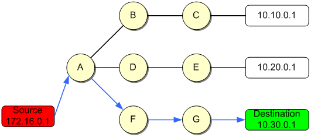
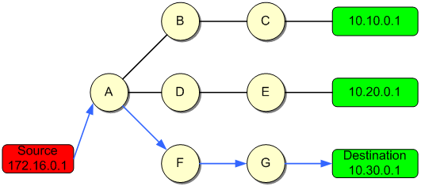
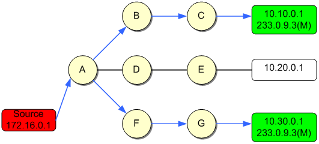
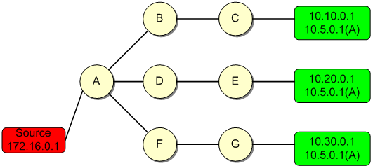
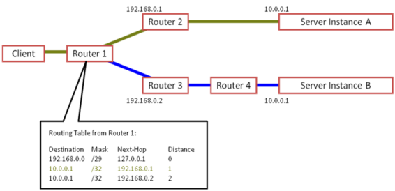

# Tim hiểu công nghệ Unicast, Anycast, Multicast, Broadcast.

## Công nghệ Anycast.
Unicast là một khái niệm thông tin truyền định hướng, chỉ sự trao đổi thông tin trong đó thông tin được gửi từ một điểm này đến một điểm khác, nghĩa là chỉ có một người gửi và một người nhận. Trong mô hình Unicast thì một host sẽ nhận tất cả các dữ liệu truyền từ một host nào đó.

## Công nghệ Broadcast.
Broadcast là một khái niệm để chỉ chế độ trao đổi thông tin được gửi từ một điểm này tới tất cả các điểm khác, có nghĩa là từ một nguồn tới tất cả các đích có kết nối trực tiếp với nó. Trong mô hình tất cả các host sẽ nhận được các dữ liệu truyền từ một host nào đó.

## Công nghệ Multicast.

Multicast là một khái niệm để chỉ chế độ truyền thông tin đa hướng, trong đó thông tin được gửi từ một điểm tới một tập các điểm khác còn lại, tức là một nguồn và nhiều đích (Nhiều không có nghĩa là tất cả  ). Trong mô hình Multicast thì nhiều host đồng thời nhận dữ liệu gửi đến cho nhóm Multicast.

## Công nghệ Anycast.
 
Anycast là một khái niệm để chỉ chế độ truyền thông tin đa hướng, cụ thể là một gói tin được gởi tới một địa chỉ đơn bất kì hướng nào sẽ được chuyển tới một node (hay giao diện) gần nhất (gần nhất là khoảng cách gần nhất xác định qua metric của giao thức định tuyến sử dụng) trong tập hợp node mang địa chỉ anycast đó. Sự khác nhau giữa anycast và multicast là quá trình chuyển gói dữ liệu, thay vì chuyển tới tất cả các thành viên trong nhóm, các gói được gửi đi chỉ được phát cho một điểm là thành viên gần nhất của nhóm anycast.
Được mô tả như sau: trong mô hình các node được cấu hình chung một địa chỉ Anycast.

Cơ chế hoạt động của Anycast.
Anycast sử dụng giao thức định tuyến toàn cầu BGP đẻ quảng bá dải địc chỉ từ nhiều điêm khác nhau trên internet. Khi gói tin đi trên mạng dải địa chỉ của anycast sẽ được định tuyến đến điểm gần nhất trên mạng theo thuật toán lựa chọn đường đi trong giao thức định tuyến mạng. Các máy tính trong mạng được cấu hình cùng một địa chỉ Anycast.

Ví dụ ta có sơ đồ định tuyến sau:

Để định tuyến đến server 10.0.0.1 có 2 cách đẻ định tuyến đến nhưng theo cơ chế của anycast thì sẽ chon đi qua router 2 vì có metrix là nhỏ nhất.

Anycast được áp dụng rộng rãi vào hệ thống DNS được sử dụng cho toàn cậu.