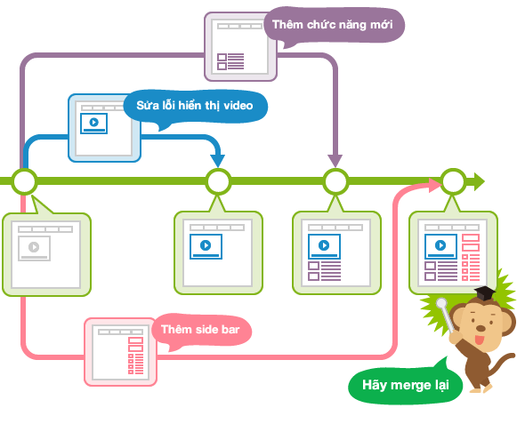
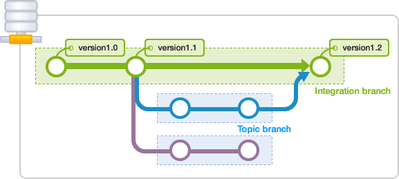
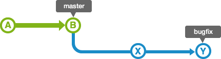
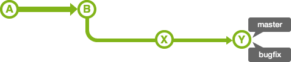
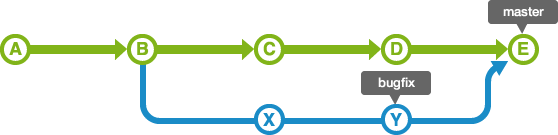
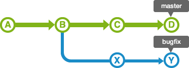
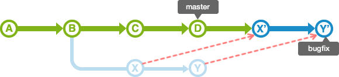
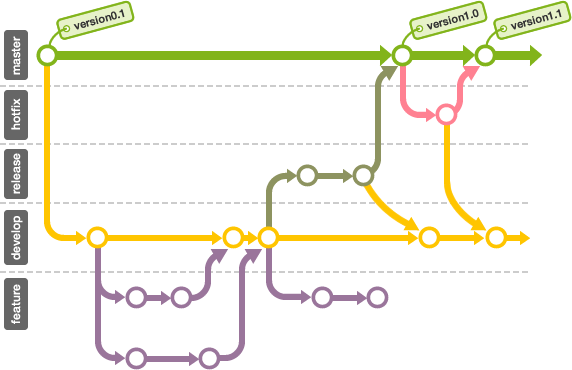

# tìm hiểu Branch 
## branch là gì.
- branch là cái dùng để phân nhánh và ghi lại luồng lịch sử. Branch phân nhánh sẽ không ảnh hưởng đến branch khác và có thể thay đổi trên nhiều branch.
- Branch đã phân nhánh có thể tổng hợp lại thành 1 branch bằng việc hợp merge với branch khac
- Sơ đồ thao tác branch song song.  

## Branch master
- Branch master thực chất cũng là một branch khi được commit lần đầu trong repository.

# Sử dụng branch.
- có 2 loại branch là:
    - Branch chủ đề (topic branch).
    - Branch tích hợp (intergation branch).
- Branch chủ đề (topic branch).
    - Tạo ra nhằm hướng đến chử đề như chỉnh sửa lỗi hoặc thêm chức năng.
    - Branch chủ đề tạo ra bằng cách branch từ branch tích hợp đã ổn định và khi hoàn thành sẽ gộp vào branch tích hợp.
- Branch tích hợp (intergration branch).
    - Là branch có thể tạo ra bản phát hành bất cứ khi nào. Nó cũng có thể sự dụng nguồn phân branch của branch chủ đề
- Đơn giản hóa ta dùng sơ đồ sau:

# Chuyển đổi branches.
- Để thực hiện được việc chuyển đổi ta sử dụng thao tác checkout.
- Khi thực hiện checkout, ta cần đưa nội dung của commit cuối cùng trong branch chuyển đến mở ra trong work tree.
- Khi chekcout xong thì sẽ dược thêm vào branch.
## Head
- Là phần đầu của branch đang sử dụng hiện tại, mặc định là phần đầu của master. 
- Khi di chuyển head thì branch cũng đang được sử dụng.
## Stash 
- Những file được thêm mới nội dung hoặc thau đổi nội dung mà chưa commit vẫn còn lưu lại index và work tree.
- Khi thực hiện checkout  đến branch khác thì nội dung sẽ thay đổi di chuyển từ branch đầu đến branch chuyển tiếp.
- Stash là khu vực lưu lại nội dung tạm thời của file. Những thay đổi chưa được commit có thể lưu lại tạm thời.
- Để đơn giản hóa ta có sơ đồ như sau:

# Tích hợp branch.
- Khi branch chủ để đã hoàn thành, cuối cùng sẽ được tích hợp vào branch tích hợp.
- Có hai phương pháp tich hợp:
    - Phương pháp sử dụng merge.
    - Phương pháp sử dụng rebase.
- Sử dụng merge.
    - Merge có thể tổng hợp từ nhiểu luồng.
    - Merge fast-forward (chuyển tiếp nhanh).
        - Khi merge bugfix branch vào branch master ở đây ta có lịch sử của branch topic bao gồm tất cả lịch sử của branch master nên việc di chuyển đơn giản.
        - ta có 2 hình ảnh biểu diễn quá trình trên:
        
        
        
    - Trong trường hợp lịch sử của branch master vẫn tiến triển sau khi phân topic branch. Khi tổng hợp nội dung ta sử dụng intergration branch để tông hợp thành một.
- Sử dụng rebase.
    - Ta sử dụng trường hợp sau.
    - Khi  rebase branch topic vào branch master, lịch sử sẽ được thay đổi thành một đường, branch master và branch bugfix được gộp intergration brand.

# Ưu và nhược điểm của Merge và rebase.
## Merge 
- Lịch sử nội dung thay đổi nhưng sẽ phức tạp.
- Khi trong trường hợp đưa branch topic vào branch tích hợp thì ta sử dụng rebase rồi merge.  

## Rebase
- Lịch sử đơn giản nhưng nội dung thay đổi từ commit ban đàu sẽ bị thay đổi hoặc có tình trạng commit không hoạt động.  

# Kết hợp sử dụng topic branch  và intergration branch 
- Ta phân chia 4 loại branch lớn là:
    - Branch chính- Main branch:
    - Branch tính năng (feature branch), branch chủ đề (topic branch):
    - Branch phát hành (release branch):
    - Branch sửa lỗi (hotfix branch):
- Ta sử dụng sơ đồ sau để mô tả hoạt động của công việc.

## Branch chính (main branch).
- có hai branch là Master và Develop.
- Master:
    - Chỉ có trạng thái có thể release. và để commit sẽ sử dụng tag rồi ghi mã số release.
- Develop:
    - Là branch sử dụng để phát triển thông thường hướng đến trước khi release, đóng vai trò của branch tích hợp.

## Branch tính năng (feature branch)
- Đóng vai trò của branch chủ đề.
- Phân nhánh từ branch develop khi phát triển chức năng mới hay chính sửa lỗi.
- Branch feature  không sử dụng remote khi công việc hoàn thành công việc sẽ merge vào branch develop.
## Branch phát hành (release branch)
- Tiến hành chuẩn bị release, tạo branch release 
- Khi hoàn thành công việc nó sẽ tiến hành merge vào branch master rồi thêm số release đối với commit đã merge.
## branch sửa lỗi nhanh (hotfix branch)
- Chỉnh sửa gấp đối với sản phẩm đã release. 
- hotfix branch tạo ra từ phân nhánh branch master
- Khi tạo ra branch mới thì quy ước thêm phần hotfix- 