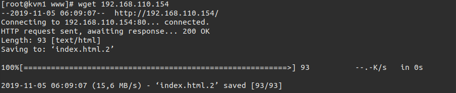
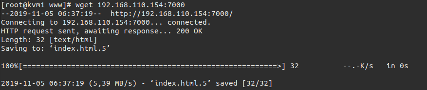
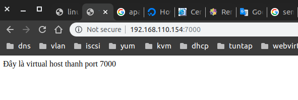
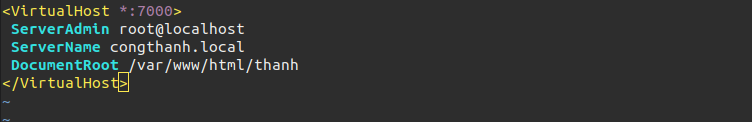
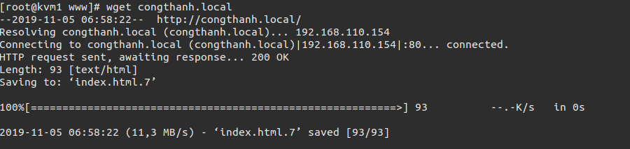

# Cài đặt và sủ dụng Apache trên Centos 7.

Mục Lục.

[1. Apache là gì](#1)

[2. Cài đặt web server](#2)

[3. Cấu hình httpd](#3)

- [3.1 Virtual hosts](#3.1)

- [3.2 DocumentRoot](#3.2)

- [3.3 Name virtual host](#3.3)


---
<a name ="1"></a>
## 1. Apache là gì.

Apache - tên chính thức là Apache HTTP Server - đây là một phần mềm web server miễn phí có mã nguồn mở. Một sản phẩm được phát triển và điều hành bởi hệ thống Apache Software Foundation. Và đây cũng một trong những web server được sử dụng phổ biến nhất hiện nay chiếm khoảng 54%.

Các yêu cầu được gửi tới máy chủ sử dụng dưới phương thức HTTP. Khi bạn sử dụng trình duyệt này, bạn chỉ cần nhập địa chỉ IP hoặc URL và nhấn ENTER. Sau đó, máy sẽ tiếp nhận địa chỉ IP hoặc URL mà bạn đã nhập vào. Chức năng này có được là do cài đặt trên web server.

<a name ="2"></a>
## 2. Cài đặt web server.

Cài đặt apache trên CentOS7
```
yum install httpd -y
```

Kiểm tra lại đã cài thành công chưa.
```
rpm -q httpd
```
Khởi động httpd.
```
systemctl restart httpd
```
Kiểm tra đã khởi động chưa.
```
systemctl status httpd
ps -C httpd
```

Khởi động httpd cùng hệ thống.
```
systemctl enable httpd
```

Có một cách kiểm tra khác là sử dụng gói phần mềm **Wget**. Cài đặt **wget**.
```
yum install wget -y 
```

Truy cập default website.
```
wget 192.168.110.154
```



Lúc này nó sẽ đọc file html trong thư mục **/var/www/html/index.html** và port mặc định là 80.

Ta có thể thay đổi những thứ hiện thị trên web site bằng cách sửả file index.html này.
```
echo 'Welcome to my website' > /var/www/html/index.html
```

<a name ="3"></a>
## 3. Cấu hình httpd.

File cấu hình httpd được lưu tại thư mục **/etc/httpd**.

<a name ="3.1"></a>
### 3.1 Virtual hosts.

Không giống như Debian, CentOS không có tệp cấu hình virtual host cho trang web mặc định của nó. Thay thế cấu hình mặc định sẽ đưa ra một trang lỗi tiêu chuẩn khi không tìm thấy tệp chỉ mục ở vị trí mặc định (/ var / www / html).
Cấu hình virtual hosts tại file **/var/www/html**.

```
vim /etc/httpd/conf.d/thanh.conf
```
Thêm các dòng sau để  mở thêm virtual host.
```
<VirtualHost *:7000>
 ServerAdmin root@localhost
 DocumentRoot /var/www/html/thanh
</VirtualHost>
```

Cấu hình file **/etc/httpd/conf/httpd.conf** đê mở port 7000.
```
echo 'Listen 7000' >> /etc/httpd/conf/httpd.conf
```

Cấu hình SElinux bảo vệ thông qua ports.
```
semanage port -a -t ftp_port_t -p tcp 7000
```
Nếu trả về kết quả lỗi
```
-bash: semanage: command not found
```
như sau thì tiếp tục làm các bước nếu không bị lỗi thì thôi.
```
yum provides /usr/sbin/semanage
yum whatprovides /usr/sbin/semanage
yum install policycoreutils-python -y
```
<a name ="3.2"></a>
### 3.2 DocumentRoot.

Tạo DocumentRoot cho virtualhost 7000 có tên **thanh** mà ta đã vừa tạo ở trên.
```
mkdir /var/www/html/thanh
```
Thêm file index cho virtual host **thanh**.
```
echo 'Đây là virtual host thanh port 7000' > /var/www/html/thanh/index.html
```
Kiểm tra thư mục **/etc/httpd/conf.d** xem có file **thanh.conf** nếu có thì tiên hành khởi động lại httpd.
```
systemctl restart httpd
```

Kiêm tra lại website vửa tạo.

```
wget 192.168.110.154:7000
```


Cấu hình firewall để bên ngoài có thể truy cập được vào trang web.
```
firewall-cmd --zone=public --add-port=7000/tcp
firewall-cmd --reload
```
Kiểm tra xem đã thành công chưa.



<a name ="3.3"></a>
### 3.3 Name virtual host.

Tạo tên cho virtual host băng cách thêm vào trong file **/etc/httpd/conf/httpd.conf**
```
echo 'NameVirtualHost *:7000' >> /etc/httpd/conf/httpd.conf
```
Thêm tên của servername vào file **/etc/httpd/conf.d/thanh.conf**
```
vim /etc/httpd/conf.d/thanh.conf
```


Chỉnh sửa tên miền trong file **/etc/hosts**
```
echo '192.168.110.154 congthanh.loacal' >> /etc/hosts
```
Khởi động lại và kiểm tra xem đã thành công chưa.
```
systemctl restart httpd
```
Kiểm tra 
```
wget congthanh.local
```


Như vậy ta đã thành công trong việc đổi tên.


