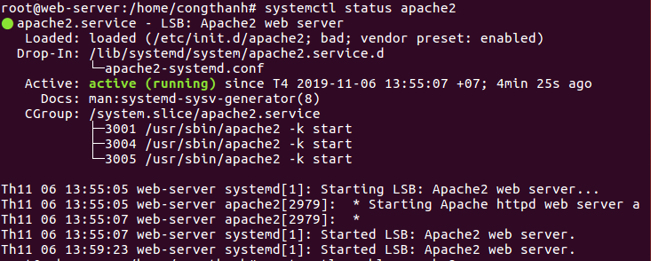

# Cài đặt và sử dụng apache trên debian.


## 1. Apache là gì.

Apache - tên chính thức là Apache HTTP Server - đây là một phần mềm web server miễn phí có mã nguồn mở. Một sản phẩm được phát triển và điều hành bởi hệ thống Apache Software Foundation. Và đây cũng một trong những web server được sử dụng phổ biến nhất hiện nay chiếm khoảng 54%.

Các yêu cầu được gửi tới máy chủ sử dụng dưới phương thức HTTP. Khi bạn sử dụng trình duyệt này, bạn chỉ cần nhập địa chỉ IP hoặc URL và nhấn ENTER. Sau đó, máy sẽ tiếp nhận địa chỉ IP hoặc URL mà bạn đã nhập vào. Chức năng này có được là do cài đặt trên web server.


## 2. Cài đặt Apache trên Debian.
Cài đặt và sử dụng apache trên ubuntu 16.04.
```
sudo apt-get install apache2
```

Khởi động apache.
```
systemctl start apache2
```
Kiểm tra trạng thái.
```
systemctl status apache2
```

Đặt apache khởi động cùng hệ thống.
```
systemctl enable apache
```
## 3. Cấu hình sử dụng apache.
### 3.1 Default website.

Lưu tại thư mục. **/etc/apache2/site-available**.

DocumentRoot được dẫn tới thư mục **/var/www**.
 Tất cả các file chứ trong file này sẽ được hiện thị trên trang web.

Trang default website mặc định là sử dụng port 80. Ta có thể thay đổi port và dẫn đến 1 trang web mới.
### 3.2 Virtual host.
