# Hướng dẫn sử dụng và cài đăt iSCSI.
# Mục lục.


[1 .Chuẩn bị và mô hình lab.](#1)
- [1.1 Chuẩn bị](#1.1)
- [1.2 Mô hình.](#1.2)

[2 Hướng dẫn cấu hình và cài đặt.](#2)
- [2.1 Cấu hình trên iSCSI target.](#2.1)
- [2.2 Cấu hình trên iSCSI initiator 1.](#2.2)
- [2.3 Cấu hình trên iSCSI initiator 2.](#2.3)
----


<a name="1"></a>
## 1 .Chuẩn bị và mô hình lab.

<a name="1.1"></a>
### 1.1 Chuẩn bị 

Môi trường VMware sử dụng 3 máy ảo.

Đặt kiểu mạng trong các máy ảo là NAT.

Phân hoạch IP và phần cứng như sau.

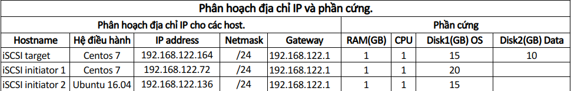

<a name="1.2"></a>
### 1.2 Mô hình.

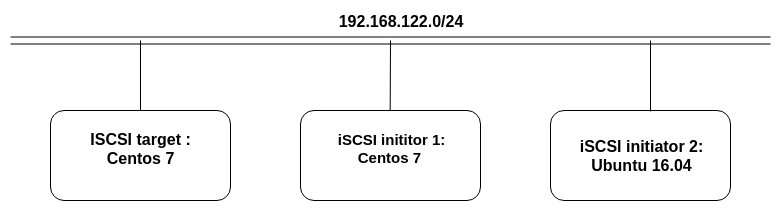

<a name="2"></a>
# 2 Hướng dẫn cấu hình và cài đặt.

<a name="2.1"></a>
## 2.1 Cấu hình trên iSCSI target.

Kiểm tra ổ cứng của máy iSCSI target.

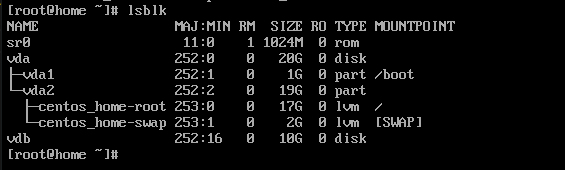

Thấy có 2 ổ cứng vda: 20GB chứa OS và vdb: 10GB chứa data.

Cài gói tin targetcli.
```
yum install targetcli
```

Vào chế độ cấu hình targetcli.

```
targetcli
```


Tạo block và định địa chỉ cho ổ cứng lưu trữ.
```
cd /backstores/block
create scsi_server /dev/vdb
```


Tạo target. Tên miền ở đây là *.thanh.vn* nhưng trong quy định phải đặt tên ngược lại thành *vn.thanh*.
```
cd /iscsi
create iqn.2019-06.vn.thanh:lun1
```
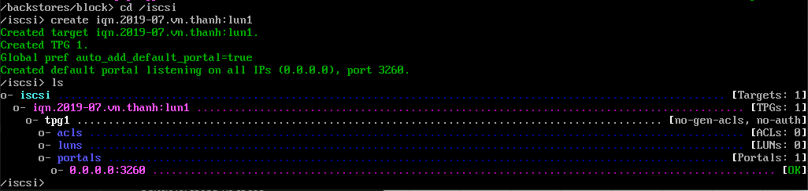

Tạo ACL trong mục **acls** để client có thể kết nối đến bằng tên này. 
```
cd /iscsi/iqn.2019-07.vn.thanh:lun1/tpg1/acls
create iqn/2019-07.vn.thanh:ini1ini2
```
- ACL chia làm 2 phần:
    - Phần 1 trước dấu *hai chấm* là phần tên máy cố định.
    - Phần 2 sau dấu *hai chấm* là phần mật khẩu riêng cho từng client muốn truy cập vào.


Tạo LUN sử dụng ổ lưu trữ đã được khai báo trước trong scsi_server.
```
cd /iscsi/iqn.2019-06.vn.thanh:lun1/tpg1/luns
create backstores/block/scsi_server
```
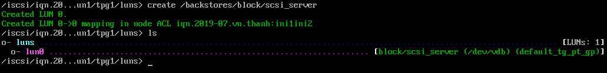

Lưu lại cấu hình và thoát.
```
saveconfig
exit
```
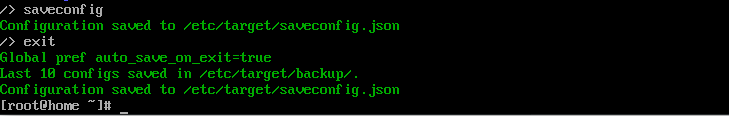

Khởi động lại dịch vụ iSCSI target.
```
systemctl restart target.service
systemctl enable target.service
```

Cấu hình tường lửa để cho phép iSCSI target có lưu lượng đến iSCSI initiator.
```
firewall-cmd --permanent --add-port=3260/tcp
firewall-cmd --reload
```


Vậy là đã cấu hình xong iSCSI target.

<a name="2.2"></a>
## 2.2 Cấu hình trên iSCSI initiator 1.

Cài đặt gói tin để tạo node sử dụng iSCSI initiator.
```
yum install iscsi-initiator-utils -y
```

Chỉnh sửa tệp i**nitiatorname.iscsi** để  khai báo tên iSCSI target dùng để kết nối.

```
echo "InitiatorName=iqn.2019-07.vn.thanh:ini1ini2" >> /etc/iscsi/initiatorname.iscsi
```
Kiểm tra kết nối đến target.
```
iscsiadm -m discovery -t st -p 192.168.122.164
```


Khởi động lại và kích hoạt dịch vụ cùng hệ thống.
```
systemctl restart iscsid.service
systemctl enable iscsid.service
```

Kiểm tra các ổ cứng trước khi kết nối.
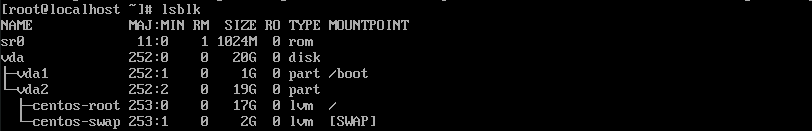
Đăng nhập đến iSCSI target
```
iscsiadm -m node -T iqn.2019-07.vn.thanh:lun1 -p 192.168.122.164 -l
```
Kiểm tra các ô cứng sau khi hết nối.
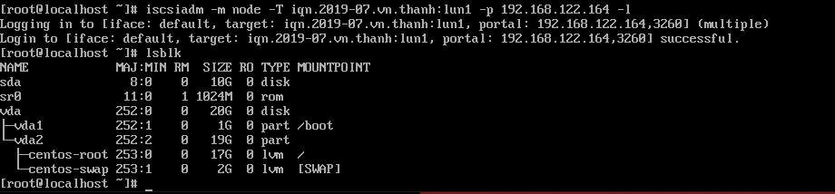

Ta thấy có 1 phân vùng mới là sda có dung lượng là 10GB.

Định dạng đĩa mới rồi mount để sử dụng
```
mkfs.ext4 /dev/sda
mount /dev/sdb /mount
```


Lưu trữ iSCSI tự động trước khi cập nhật /etc/fstab, lấy UUID của đĩa iSCSI bằng lệnh.
```
blkid /dev/sdb
```

Ngắt kết nối đến iSCSI target và xóa bộ nhớ iSCSI 
```
umount /dev/sda
iscsiadm -m node -T iqn.2019-07.vn.thanh:lun1 -p 192.168.122.164 -u
```
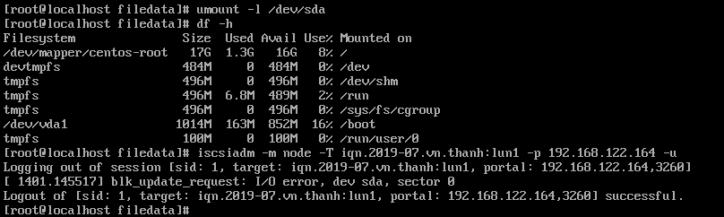

Vậy là ta đã cấu hình xong iSCSI initiator 1 trên Centos 7.

<a name="2.3"></a>
## 2.3 Cấu hình iSCSI initiator 2.
Cài iSCSI initiator cho ubuntu.
```
sudo apt-get install open-iscsi -y
```
Chỉnh sửa tệp initiatorname.iscsi để  khai báo tên iSCSI target dùng để kết nối.

```
sudo vim /etc/iscsi/initiatorname.iscsi
```

Thêm dòng lệnh.
```
InitiatorName=iqn.2019-07.vn.thanh:ini1ini2
```

Sửa file /etc/iscsi/iscsid.conf.
```
sudo vim /etc/iscsi/iscsid.conf
```
- Thay đổi node.startup thành automatic.

Khởi động lại dịch vụ iscsi initiator:
```
service open-iscsi restart
```
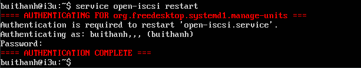

Kiểm tra xem kết nối iSCSI target và iSCSI initiator và login  vào iSCSI target.
```
sudo iscsiadm -m discovery -t st -p 192.168.122.164
sudo iscsiadm -m node --login
```

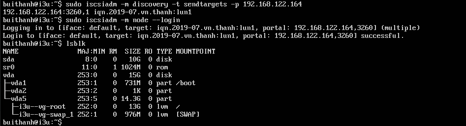

Định dang ổ cứng và mout vào cây thư mục để sử dụng.

```
sudo mkfs.ext4 /dev/sda
sudo mount /dev/sda /mount/
```
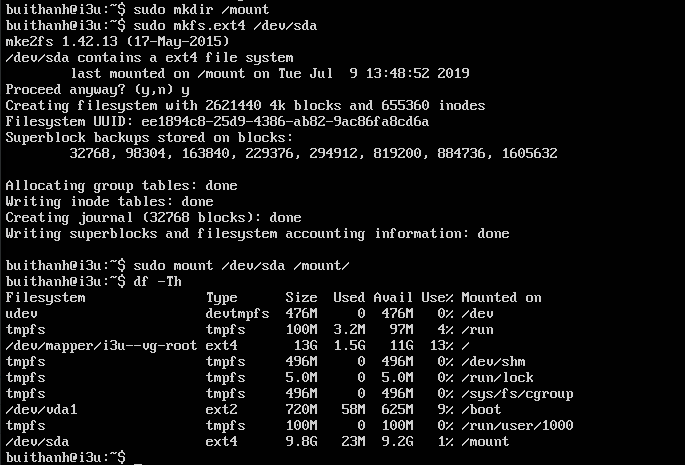

Ngắt kết nối đến iSCSI target và xóa bộ nhớ iSCSI.
```
umount /dev/sda
iscsiadm -m node -T iqn.2019-07.vn.thanh:lun1 -p 192.168.122.164 -u
```
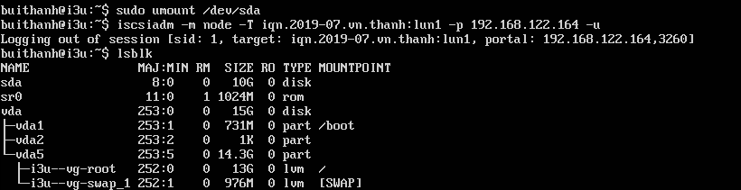

Vậy ta đã cấu hình xong trên iSCSI initiator 2.
