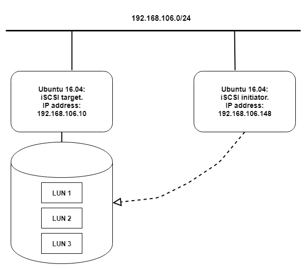
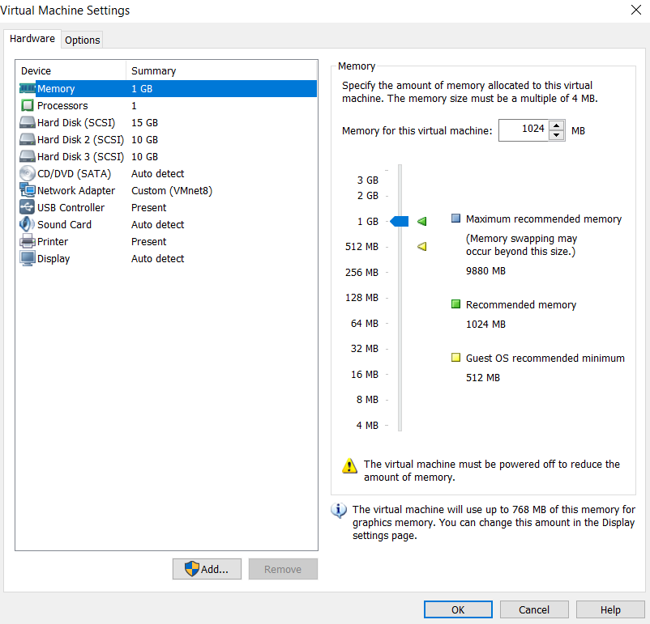
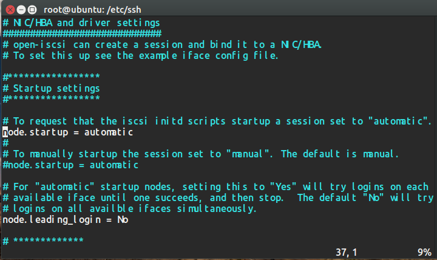
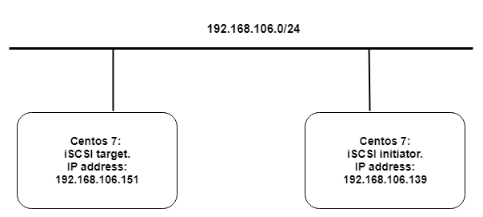
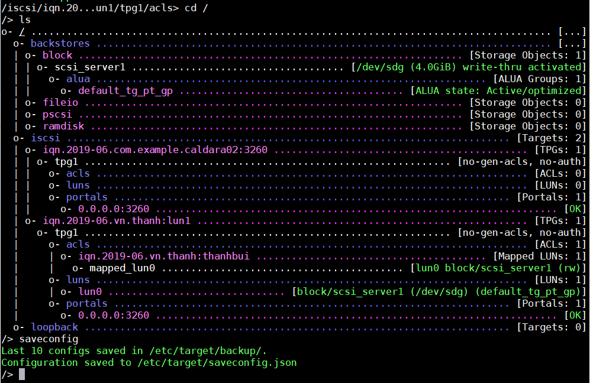
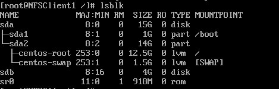
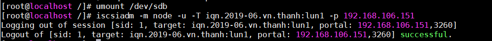

# Hướng dẫn cài đặt và sử dụng iSSCI.

# Mục lục.
[1. Hướng dẫn cài đặt iSCSI trên Ubuntu.](#1)
- [1.1 Chuẩn bị và mô hình lab.](#1.1)
- [1.2 Cài gói tin và cấu hình iSCSI trên Ubuntu.](#1.2)
  - [1.2.1 Cấu hình trên iSCSI target.](#1.2.1)
  - [1.2.2 Cấu hình trên iSCSI initiator.](#1.2.2)

[2. Cấu hình iSCSI trên centos 7.](#2)
- [2.1 Chuẩn bị và mô hình lab.](#2.1)
- [2.2  Cài gói tin và cấu hình iSCSI trên Centos 7.](#2.2)
  - [2.2.1 Cấu hình trên iSCSI target.](#2.2.1)
  - [2.2.2 Cấu hình trên iSCSI initiator.](#2.2.2)

----
<a name="1"></a>
# 1 Hướng dẫn cài đặt iSCSI trên ubuntu.
<a name="1.1"></a>
## 1.1 Chuẩn bị và mô hình lab.
### 1.1.1 Chuẩn bị. 
Môi trường ảo hóa VMware 
- 2 máy ảo Ubuntu 16.04.
- Kiểu kết nối mạng NAT.

|  Tên máy ảo  | Hệ điều hành    |IP address | Netmask |Gateway|
|------|------|-------|-----|-------|
| iSCSI target | Ubuntu 16.04| 192.168.106.10 | /24| 192.168.106.1|
|iSCSI initiator | Ubuntu 16.04|192.168.106.148 | /24 |192.168.106.1|

iSCSI-target yêu cầu lưu trữ LVM:
- Tạo 1 volume group: san-vg.
- Tạo 3 logical: lun1, lun2, lun3.

###  1.1.2 Mô hình.


### 1.1.3 Chuẩn bị.
Thêm 2 hard disk hard disk 2 và hard disk 3 cả hai có dung lượng là 10GB.



<a name="1.2"></a>
## 1.2 Cài gói tin và cấu hình iSCSI trên Ubuntu.

<a name="1.2.1"></a>
### 1.2.1 Cấu hình trên iSCSI target.
Cài đặt gói phần mềm.
```
sudo apt-get update -y
sudo apt-get install iscsitarget -y
```

Tạo thư mục **/san** là nơi chứa các LUN, image chia sẻ với máy iSCSI initiator.

``` 
sudo mkdir /san
```
Tạo logical volume đặt tên là lun1, lun2, lun3 trong group **san-vg**.
```
vgcreate san-vg /dev/sdb1 /dev/sdc1
lvcreate -L 5G -n lun1 san-vg
lvcreate -L 5G -n lun2 san-vg
lvcreate -L 5G -n lun3 san-vg
```
Kích hoạt dịch vụ iSCSI target.
```
sed -e "s/false/true/g" /etc/default/iscsitarget
```
Khai báo iSCSI target vừa tạo trong file **ietd.conf**.
```
vim /etc/iet/ietd.conf
```
- Thêm các dòng vào cuối file.
    ```
        Target iqn.2019-06.com.example:san.lun1
                IncomingUser client 123
                OutgoingUser
                Lun 0 Path=/dev/san-vg/lun1,Type=fileio
                Alias LUN1
                initiator-address 192.168.106.148
                #MaxConnections 6
        Target iqn.2019-06.com.example:san.lun2
                IncomingUser client 456
                OutgoingUser
                Lun 1 path=/dev/san-vg/lun2,Type=fileio
                Alias LUN2
                Initiator-address 192.168.106.148
        Target iqn.2019-06.com.example:san.lun3
                IncomingUser client 789
                OutgoingUser
                Lun 2 path=/dev/san-vg/lun3,Type=fileio
                Initiator-address 192.168.106.148
                Alias LUN3
    ```
Giải thích option:
- Target name: phải là tên duy nhất, theo tiêu chuẩn đặt tên iSCSI như sau:
    - iqn.*yyyy-mm*. domain name : [identifier]
- *yyyy-mm* là thời điểm mà reversed domain name còn hoạt động. Thường thì phần này cấu hình tùy ý. vd:2019-06
- Incominguser: thông tin về username và password của nó trên máy client để login và sử dụng thiết bị storage.
- Lun: Xác định đường dẫn tới LUN để iSCSI target chia sẻ với iSCSI initiator.
- Initiator-address: Địa chỉ IP của máy initiator cho phép truy cập vào target iSCSI.

Lưu lại file cấu hình và khởi động lại dịch vụ.
```
service iscsitarget restart
```
Kiểm tra cổng 3260 của iSCSI có hoạt động không.
```
ss -atnp | grep 3260
```


Như vậy iSCSI target đã hoạt động.

<a name="1.2.2"></a>
### 1.2.2 Cấu hình trên iSCSI initiator. 
Cài đặt gói phần mềm dùng cho máy iSCSI initiator.
```
sudo apt-get install open-iscsi -y
```

Sửa file /etc/iscsi/iscsid.conf.
```
vim /etc/iscsi/iscsid.conf
```
- Thay đổi node.startup thành automatic.


Khởi động lại dịch vụ iscsi initiator:
```
service open-iscsi restart
```
Kiểm tra xem kết nối iSCSI target và iSCSI initiator.
```
iscsiadm -m discovery -t st -p 192.168.106.10
```


Như vậy là ta đã cấu hình thành công iSCSI trên ubuntu.

<a name="2"></a>
# 2 Cấu hình iSCSI trên centos 7.

<a name="2.1"></a>
## 2.1 Chuẩn bị và mô hình lab.

### 2.1.1 Chuẩn bị môi trường.
Môi trường ảo hóa VMware.
- 2 máy ảo Centos 7.
- Kiểu kết nối mạng NAT.

IP Planning.

|  Tên máy ảo  | Hệ điều hành    |IP address | Netmask |Gateway|
|------|------|-------|-----|-------|
| iSCSI target |  Centos 7| 192.168.106.151 | /24| 192.168.106.1|
|iSCSI initiator |  Centos 7|192.168.106.139 | /24 |192.168.106.1|

iSCSI target yêu cầu lưu trữ LVM:
- Thêm hard disk sdg.
- Tạo logical volume LUN1.


### 2.1.2 Mô hình.


<a name="2.2"></a>
##  2.2  Cài gói tin và cấu hình iSCSI trên Centos 7.

<a name="2.2.1"></a>
### 2.2.1 Cấu hình trên iSCSI target.
Kiểm tra ổ cứng sẽ được sử dụng trong iSCSI target 
```
lsblk
```
Ở đây tôi có vùng nhớ sdg có dung lượng 4GB để sự dụng cho iSCSI target.

Cài đặt gói tin target trên server.
```
yum install targetcli
```
Sử dụng lệnh **targetcli** để vào chế độ cấu hình targetcil iSCSI.
```
targetcli
```
 

Tạo một block và định địa chỉ cho nó sử dụng thiết bị lưu trữ nào.
```
create scsi_server1 /dev/sdg
```
- scsi_server1: tên block
- /dev/sdg : gán ổ lưu trữ

Tạo target. Tên miền ở đây là *.thanh.vn* nhưng trong quy định phải đặt tên ngược lại thành *vn.thanh*.
```
cd /iscsi
create iqn.2019-06.vn.thanh:lun1
```

Tạo LUN dưới target. LUN sử dụng ổ lưu trữ đã được khai báo trước trong scsi_server1 hoặc ta cũng có thể chỉ ra các đường dẫn tới các thiết bị khác.
```
cd /iscsi/iqn.2019-06.vn.thanh:lun1/tpg1/luns
create blackstores/block/scsi_server1
```
Tạo ACL trong mục **acls** để client có thể kết nối đến bằng tên này. 
```
cd /iscsi/iqn.2019-06.vn.thanh:lun1/tpg1/acls
create iqn/2019-06.vn.thanh:thanhbui
```
- ACL chia làm 2 phần:
    - Phần 1 trước dấu *hai chấm* là phần tên máy cố định.
    - Phần 2 sau dấu *hai chấm* là phần mật khẩu riêng cho từng client muốn truy cập vào.

Kiểm tra LUN vừa tạo đã được thêm vào ALC.



Sau đó lưu lại file cấu hình iSCSI target trên server.
```
saveconfig
```
Sau đó phải bật và khởi động lại dịch vụ iSCSI target
```
systemctl enable target.service
systemctl restart target.service
```
Tắt firewall đê iSCSI initiator để có thể truy cập.
```
firewall-cmd --permanent --add-port=3260/tcp
firewall-cmd --reload
```


<a name="2.2.2"></a>
###  2.2.2 Cấu hình trên iSCSI initiator.
Cài gói tin initiator trên máy client.
```
yum install iscsi-initiator-utlis
```
Chỉnh sửa file **/etc/iscsi/initiatorname.iscsi** để iSCSI initiator có thể xác thực ACL trên iSCSI target.
```
echo "create iqn/2019-06.vn.thanh:thanhbui" >> /etc/iscsi/initiatorname.iscsi
```
Tìm kiếm các iSCSI target.
```
iscsiadm -m discovery -t st -p 192.168.106.151
```


Kiểm tra iSCSI initiator đã nhận ổ cứng từ iSCSI target chưa.



Ta thấy có thêm ổ sdb mới được thêm vào đây là ổ sdg ở bên iSCSI target trỏ đến.

Sau đó ta phân vùng format và mount nó vào cây thư mục để sử dụng.
```
mkfs.ext4 /dev/sdb
mount /dev/sdb /iscsi/
```

Để logout khỏi iSCSI Target ta có 2 cách:
- Cách 1: sử dụng câu lệnh **iscsiadm -m node -u** để đăng xuất ra khỏi tất cả thiết bị iSCSI target ta đang đăng nhập.
    ``` 
    iscsiadm -m node -u
    ```
- Cách 2: sử dụng câu lệnh **iscsiadm -m node -u -T tên_target -p IP_target** để đăng xuất ta một thiết bị ta chỉ ra.
    ```
    umount /dev/sdb
    iscsiadm -m node -u -T iqn.2019-06.vn.thanh:lun1 -p 192.168.106.151
    ```
    

Vậy là ta đã cấu hình xong iSCSI trên môi trường Centos.