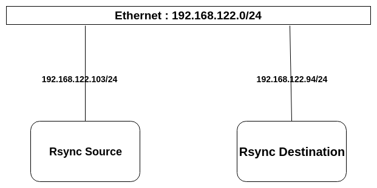
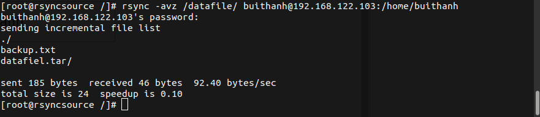
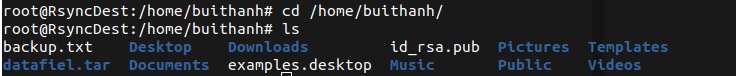
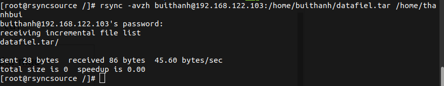
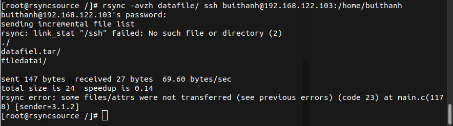
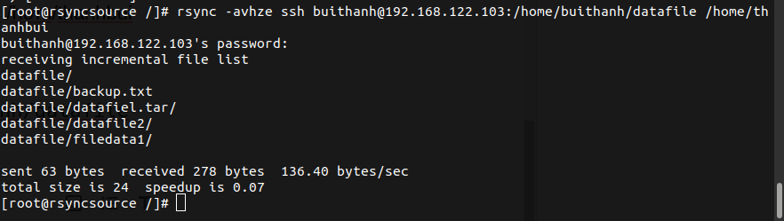
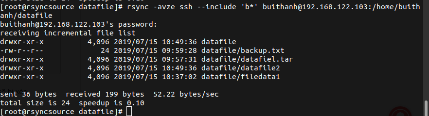

# Rsync là gì ?

## 1.Rsync (Remote Sync) là một công cụ hữu hiệu để sao lưu và đồng bộ dữ liệu trên Linux.

Rsync hỗ trợ copy giữ nguyên thông số của files/folder như Symbolic links, Permissions, TimeStamp, Owner và Group.

Rsync nhanh hơn scp vì Rsync sử dụng giao thức remote-update, khi đồng bộ lần đầu sẽ chuyển toàn bộ dữ liệu nhưng từ lần 2 trở đi thì chỉ transfer những dữ liệu thay đổi mà thôi.

Rsync sử dụng thuật toán khi copy dữ liệu sao cho dữ liệu phải copy là nhỏ nhất (chỉ copy những gì thay đổi giữa nguồn và gốc)

Rsync tiết kiệm băng thông do sử dụng phương pháp nén và giải nén khi transfer.

Rsync không yêu cầu quyền super-user.


## 2. Khởi tạo môi trường lab và cách sử dụng..

### 2.1 Khởi tạo môi trường.

#### a. Môi trường và sơ đồ.


Môi trường lab trên 2 máy áo Centos 7 và Ubuntu 16.04 trên nền tảng KVM và đặt cấu hình kiểu kết nôi mangj là NAT.


- Sơ đồ.

    

- Phân hoạch địa chỉ IP.

    

### 2.2. Sử dụng Rsync.


Hầu hết các bản phân phối Linux hiện đại đều cung cấp cài đặt rsync từ kho phần mềm , tuy nhiên nếu không có t có thể sử dụng câu lệnh đề cài đặt.

```
yum install rsync
```


Câu lệnh căn bản của Rsync.
```
rsync {option} {source} {destination}
```

Trong đó:
- source: dữ liệu đi từ nguồn.
- Destination: dữ liệu đến đích.
- Opotion: các tùy chọn thêm.

Các tham số opotion cần biết trước khi sử dụng rsync.


- -v: hiển thị trạng thái kết quả.
- -r: copy dữ liệu recursively, nhưng không đảm bảo thông số của file và thư mục.
- -a: cho phép copy dữ liệu recursively, đồng thời giữ nguyên được tất cả các thông số của thư mục và file.
- -z: nén dữ liệu khi transfer, tiết kiệm băng thông tuy nhiên tốn thêm một chút thời gian.
- -h: human-readable, output kết quả dễ đọc.
- --delete: xóa dữ liệu ở destination nếu source không tồn tại dữ liệu đó.
- --exclude: loại trừ ra những dữ liệu không muốn truyền đi, nếu bạn cần loại ra nhiều file hoặc folder ở nhiều đường dẫn khác nhau thì mỗi cái bạn phải thêm -exclude tương ứng.

### 2.3. Rsync giữa 2 máy Rsync source và Rsync destination.


Rsync file /datafel từ Rsync source đến Rsync destination ta dùng câu lệnh.

```
mkdir /datafile

rsync -avz /datafile/ root@192.168.122.103:/home/buithanh
```


Lệnh trên ta copy dữ liệu ở thư mục /datafile trên Rsync đến thư mục /home/buithanh trên máy Rsync destination.


Kiểm tra trên máy Rsync Destination.

```
cd /home/buithanh 
ls
```



Ta thấy có thêm file datafile.tar đây là thư mục đã đươc nén và đồng bộ từ máy Rsync source.


Copy thư mục từ Rsync destination đến Rsycn source ta dùng lệnh.

```
rsync -avzh buithanh@192.168.122.103:/home/datafile.tar 
```

Lệnh trên là ta copy thư mục /home/datafile.tar từ Rsync destination đến thư mục /home/thanhbui trên máy Rsycn source.




### 2.4 Rsync qua SSH giữa các máy Rsync source và Rsync destination.


Copy thư mục /datafile từ Rsync source đến thư mục /home/buithanh trên máy Rsync destination qua SSH ta sử dụng lệnh.

```
rsync -avzh datafile/ ssh buithanh@192.168.122.103:/home/buithanh 
```



Thêm 1 thư mục datafile2 trong thư mục datafile để kiểm tra tình đồng bộ sau khi đồng bộ.


Copy thư mục /home/buithanh/datafile trên Rsync destination đến thư mục /home/thanhbui  trên máy Rsync source.

```
rsync -avhze ssh buithanh@192.168.122.103:/home/buithanh/datafile /home/thanhbui 
```



### 2.5. Sử dụng tùy chọn -include và -exclude.


Hai tùy chọn này là ta có thể thêm file hoặc bỏ file trong quá trình đồng bộ.


Ta sử dụng lệnh:
```
rsync -avze ssh --include 'b*' buithanh@192.168.122.103:/home/buithanh/datafile
```

Câu lệnh trên ta thêm file có ký tự là "b*" thì sẽ đồng bộ còn không thi giữ nguyền.



### 2.6. Tùy chọn --delele.


Nếu muốn xóa một file hoặc thư mục không có ở thư mục nguồn, mà lại xuất hiện ở thư mục đích trong quá trình transfer.
```
rsync -avhz --delete buithanh@192.168.122.103:/home/buithanh/datafile
```
Vậy là ta đã hoàn thành bài tim hiểu Rsync và cách sử dụng nó.

