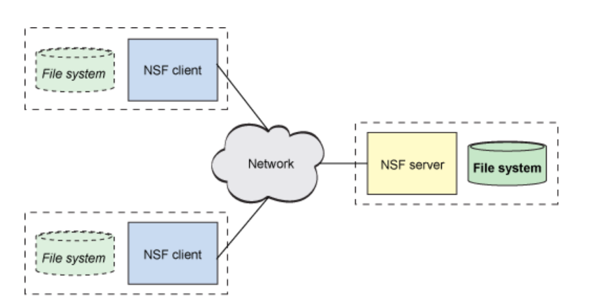
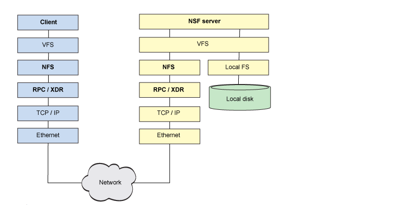
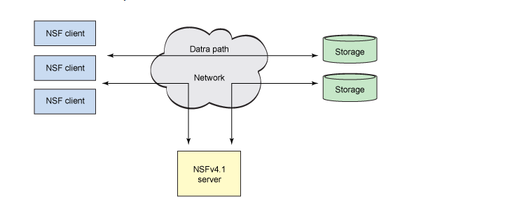

# Tìm hiểu về NFS.
## 1.
NFS (network file system) là dịch vụ hỗ trợ cơ chế chia sẻ tài nguyên giữa các hệ thống. NFS được phát triển để cho phép hệ thống nội bộ có thể truy xuất một thư mục trên hệ thống máy khác bằng cách mount nó vào hệ thống tập tin cục bộ, người quản trị trên NFS Server chỉ cần xuất (exports) các thư mục để cung cấp cho NFS Client sử dụng.

NFS cho phép chia sẻ một hệ thống tệp chung giữa nhiều người dùng và cung cấp lợi ích của việc tập trung dữ liệu để giảm thiểu lưu trữ cần thiết.

## 2. Điểm qua lịch sử về NFS.
NFS là hệ thống chia sẻ tệp tin qua mạng đầu tiên và được xây dựng trên nền giao thức IP. NFS được phát triển phiên bản đầu tiên vào năm 1980 tại Sun microsystems.

Nhờ sự phổ biến của phương pháp này nên đã được phát triển tiếp lên phiên bản NFSv2 vào tháng 3 năm 1989. Phiên bản này có thể sử dụng cả 2 giao thức TCP và UDP, có khả năng tương tác cao giữa máy khách và máy chủ khác.

Phiên bản NFSv3 được quy định bởi RFC 1813 phát triển vào tháng 6 năm 1995, phiên bản này có khả năng mở rộng hơn so với phiên bản trước, hỗ trợ tệp lớn, ghi không đồng bộ và có thể triển khai trên mạng diện rộng.

Phiên bản NFSv4.1 được giới thiệu vào tháng 3 năm 2003, phiên bản này có bảo mật mạnh mẽ với giao thức trạng thái (các phiên bản trước không có trạng thái), bổ sung hỗ trợ giao thức đê truy cập song song trên các máy chủ phân tán ( tiện ích mở rộng pNFS).

Phiên bản NFSv4.2 được giới thiệu vòa tháng 11 năm 2016, nó giống các phiên bản trước nhưng chỉ sử dụng 1 cổng để chạy giúp đơn giản hóa việc kiểm soát trên tường lửa.

## 3. Kiến trúc NFS.

NFS theo mô hình client - server . Máy chủ thực hiện hệ thống tệp chia sẻ và lưu trữ mà khách hàng đính kèm. Các máy khách thực hiện giao diện người dùng với hệ thống tệp được chia sẻ, được gắn trong không gian tệp cục bộ của máy khách.

NFS sử dụng bộ chuyển đổi tệp ảo (VFS) cung cấp phương tiên để hỗ trợ đồng thời nhiều hệ thống tệp tin. VFS xác định yêu cầu nào được lưu trữ và hệ thống nào được sử dụng để đáp ứng yêu cầu, vì lý do đó NFS có thê giao tiếp được các hệ thống tệp tin khác nhau.

Khi một yêu cầu được gửi đến cho NFS, VFS sẽ chuyển nó đến NFS trong kernel. NFS diễn giải I/O yêu cầu và chuyển nó thành các thủ tục NFS như OPEN, ACCESS, CREATE, READ, CLOSE,... Các quy trình này được ghi lại trong RFC cụ thể.

RPC bao gồm một lớp khả năng tương tác quan trọng được gọi là biểu diễn dữ liệu ngoài (XDR), đảm bảo rằng tất cả những người tham gia NFS nói cùng một ngôn ngữ khi nói đến các loại dữ liệu. XDR đảm nhiệm việc chuyển đổi các loại thành biểu diễn chung (XDR) để tất cả các kiến ​​trúc có thể tương tác và chia sẻ các hệ thống tệp.

Như vậy RPC/XDR dùng để dịch cac kiểu dữ liệu sang kiến trúc của máy chủ.

Máy chủ NFS chịu trách nhiệm đáp ứng yêu cầu. Yêu cầu được chuyển đến tiến trình nền NFS, xác định cây hệ thống tệp đích cần thiết cho yêu cầu và VFS lại được sử dụng để truy cập hệ thống tệp đó trong bộ nhớ cục bộ. 

## 4. Giao thức NFS.

Tại máy client  hoạt động đầu tiên trong NFS la mount. Mount là gắn hệ thống tệp từ xa vào không gian hệ thống tệp cục bộ. Quá trình này bắt đầu lời gọ hệ thống đến mount  rồi chuyển qua VFS đến thành phần NFS. Sau khi thiết lập số công cho mount thông qua lời gọi RPC get-port đến máy chủ. Máy khách thực hiện yêu cầu mount, mount là một tiến trính chạy ngầm kiểm tra yêu cầu của máy khác đối với danh sách các hệ thống tệp được truy xuất vào máy chủ, nếu hệ thống tệp yêu cầu tồn tại thì máy khách có quyền truy cập, RPC mount trả lời thiết lập xử lý tập tin cho hệ thống. Phía client lưu trữ thông tin gắn kết từ xa đến gắn kết cụ bộ và thiết lập khả năng thực hiện yêu cầu trao đổi lưu trữ dữ liệu.

## 5. Giới thiệu pNFS.

pNFS là một khái niệm trong phiên bản NFSv4.1, sử dụng để mở rộng và có hiệu suất cao hơn.

NFSv4.1 thục hiện chia data/metadata thành các cụm tệp tin trên hệ thống. pNFS chia thành 3 thành phần: client, server, storage.

Có 2 đường dẫn: một đường dẫn cho dữ liệu và một đường dẫn cho kiểm soát.

pNFS phân chia dữ liệu từ dữ liệu chính, cho phép tạo đường dẫn kép. Khi client muốn truy cập  đến 1 tệp, máy chủ sẽ phản hồi tới layout, layout sẽ ánh xạ tới storage, máy client lưu lại layout này sau đó nó co thể truy cập trực tiếp vào bộ lưu trữ storage mà không cần thông qua server dẫn đến có thể mở rộng quy mô và hiệu suất cao hơn.

## 6. Các lựa chọn khác thay thế cho nfs
<<<<<<< HEAD
Mặc dù NFS là hệ thống chia sẻ tệp qua mạng phổ biến nhất trên hệ thống linux và unix, nhưng đây không phải là lựa chọn duy nhất ta có thể sử dụng: ceph, samba, iscsi, SAN, NAS, DAS, ...

Một trong những hệ thống tệp phân tán mới nhất, cũng được hỗ trợ trong Linux, là Ceph. Ceph được thiết kế từ đầu như một hệ thống tệp phân tán chịu lỗi, chịu tải cao với khả năng tương thích với Hệ điều hành di động UNIX (POSIX).
=======
Mặc dù NFS là hệ thống chia sẻ tệp qua mạng phổ biến nhất trên hệ thống linux và unix, nhưng đây không phải là lựa chịn duy nhất ta có thể sử dụng samba, iscsi, SAN, NAS, DAS, ...

Một trong những hệ thống tệp phân tán mới nhất, cũng được hỗ trợ trong Linux, là Ceph. Ceph được thiết kế từ đầu như một hệ thống tệp phân tán chịu lỗi với khả năng tương thích với Hệ điều hành di động UNIX (POSIX).
>>>>>>> 0ac0c329b9a2595b9a879ff1a65382a18a0b4cca

