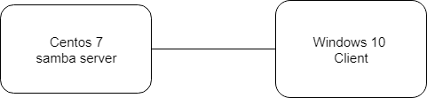
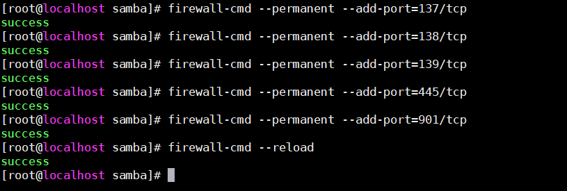
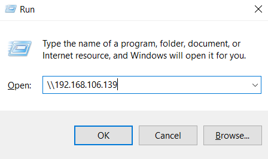
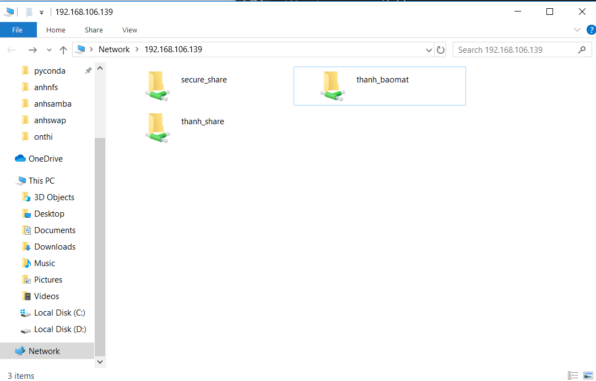

# Tìm hiểu về samba.
## 1.Lời mở đầu.
Để chia sẻ file giữa 2 hệ điều hành không cùng môi trường như unix và windows chúng ta sẽ sử dụng samba.
## 2. Giới thiệu về samba.
Samba là một ứng ụng chạy trên Unix và nó mô phỏng một hệ thống Windows. Samba cho phép một hệ thống Unix gia nhập vào "Network neighborhood" và người dùng Windows có thể truy cập tài nguyên trên Unix.

Samba thực hiện được nhờ vào sự mô phỏng giao thức CIFS hay" Common Internet File System" và giao thức truyền tin SMB hay "Server Message Block"

Nói gọn lại samba là một phần mệ  miễn phí chủ yếu sử dụng để chia sẻ file giữa các nền tảng khác nhau như Windows và Linux bằng cách sử dụng giao thức SMB/CIFS.

Samba bao gồm 2 chương trính chính và  một số công cụ hỗ trợ. Hai chương trình chính là.
- smbd : dịch vụ tệp và máy in, xác thực phân quyền truy cập tài nguyên.
- nmdb : Phân giải tên và thông báo cá dịch vụ ra bên ngoài

Một sô công cụ hỗ trợ samba là.
- smbclient: có chức năng tương tự NFS, kết nối từ hệ thống unix tới smb share của một hệ thống windows để truyền tệp, gửi tệp.
- nmblookup: Phân giải tên NetBIOS. để tìm địa chỉ IP tương ứng và các thông tin của máy chạy Windows
- swat : cho phép cấu hình samba qua giao diện web.
# 3. Hướng dẫn cấu hình samba
## 3.1 Môi trường , mô hình và kế hoạch IP.
### 3.1.1Môi trường.
- Sử dụng 2 máy ảo trên phần mềm VMware.
- Cấu hình card mạng : NAT
### 3.1.2 Mô hình

### 3.1.3 Quy hoạch IP
|Tên máy|Hệ điều hành| IP address| Subnet mask| Default gateway|
|-------|-----------|---------|-------|----------|
|Samba Server| Centos 7|  192.168.106.139| /24| 192.168.106.1|
|Samba client| Windows 10| 192.168.106.200| /24| 192.168.106.1|

## 3.2 Cấu hình Samba server.

### 3.2.1 Cấu hình trên Centos 7.
- Tiến hành cài đặt các gói Samba:
```
Rpm -qa | grep samba
Yum list installed | grep samba      
Yum install samba* -y.
```

Vậy là đã cài xong các gói tin cần thiết cho SAMBA.

Tiếp đến tạo thư mục chia sẻ và phân quyền cho nó.
``` 
mkdir -p /samba/thanh_share
chmod -R  0777 /samba/thanh_share
```
Ta phải edit file cấu hình samba.
```
cd /etc/samba
vim /etc/samba/smb.conf
```
- Viết thêm các dòng sau nếu không có.
- Tại mục [global].
    - Thêm dòng: unix charset = UTF-8
    - Thêm dòng: dos charset = CP932
    - Thay đổi: workgroup = WORKGROUP
    - Thay đổi:host allow=  127. 192.168.106. (127.  là địa chỉ loopback, 192.168.106.  là địa chỉ host)
    - Thêm dòng: max protocol = SMB2
    - Thêm dòng: map to guest = Bad User
- Viết thêm mục [thanh_share]. Đây là thư mục chứa các file và phân quyền để chia sẻ qua samba.
    - Viết thêm các dòng sau:
        - path = /samba/thanh_share
        - writable = yes
        - browsable = yes
        - guest ok = yes
        - guest only = yes
        - create mode = 0777
        - directory mode = 0777
    - Sau đó lưu file lại.

Tiến hành khởi động dịch vụ samba và để samba khỏi động lại sau mỗi lần khởi động lại máy tính.
```
systemctl start smb
systemctl start nmb
systemctl enable smb
systemctl enable nmb
```

Kiểm tra lại cấu hình samba.

```
[root@localhost samba]# testparm
Load smb config files from /etc/samba/smb.conf
rlimit_max: increasing rlimit_max (8192) to minimum Windows limit (16384)
Unknown parameter encountered: "host allow"
Ignoring unknown parameter "host allow"
Processing section "[homes]"
Processing section "[printers]"
Processing section "[print$]"
Processing section "[thanh_share]"
Loaded services file OK.
Server role: ROLE_STANDALONE
```

Tiếp đến cấu hình firewall là điều rất cần thiết để các máy client có thể truy cập được các file share trên samba server.
```
firewall-cmd --permanent --add-port=137/tcp
firewall-cmd --permanent --add-port=138/tcp
firewall-cmd --permanent --add-port=139/tcp
firewall-cmd --permanent --add-port=445/tcp
firewall-cmd --permanent --add-port=901/tcp
firewall-cmd --reload
```


Cấu hình SELinux.

Ta có thể disable SELinux.
```
vim /etc/sysconfig/selinux 
```
Đặt giá trị **SELINUX = disabled**.

Reset máy để thay đổi có hiệu lực.
## 3.3 Test file *thanh_samba* vừa cấu hình.
Chuyển sang máy windows 10.
- Nhấn tổ hợp phím windows+ r .
- Rồi điền vào "\\\192.168.106.139" đây là địa chỉ IP của máy samba server( centos 7).

   
- Sau đó ta sẽ truy cập được vào thư mục thanh_share trên samba server.
- Vì lúc nãy ta cấu hình full quyền (0777) cho thư mục này nên ta có thể làm mọi việc như xóa, chỉnh sửa, thêm file.

## 3.4. Để bảo mật hơn ta sẽ tạo thư mục share có chứng thực
Tạo user tên "thanh_baomat" và group "thanh_group".
```
useradd -s /home thanh_baomat
groupadd thanh_group
```
Gán user vào group và đặt samba password cho user.
```
usermod -a -G thanh_group thanh_baomat
smbpasswd -a buicongthanh
```


Tạo thư mục "/samba/secure_share" và gán quyền.
```
mkdir /samba/secure_share
chmod -R -0755 /samba/secure_share
chown -R thanh_baomat:thanh_group /samba/secure_share
```

Cấu hình file samba config smb.conf
```
vim /etc/samba/smb.conf
```
- Thêm mục [secure_share]
    - path = /samba/secure_share
    - writable = yes 
    - browsable = yes
    - quest ok = yes
    - valid user = @thanh_group
```
    [root@localhost samba]# vim /etc/samba/smb.conf
        dos charset= CP932
        host allow = 127. 192.168.106.
        max protocol= SMB2
        map to guest = Bad User
[homes]
        comment = Home Directories
        valid users = %S, %D%w%S
        browseable = No
        read only = No
        inherit acls = Yes

       .........

[thanh_share]
        comment = This is description
        path = /samba/thanh_share
        writable = yes
        browsable = yes
        guest ok = yes
        guest only = yes
        create mode = 0777
        directory mode = 0777
[secure_share]
        path = /samba/secure_share
        writable = yes
        browsable = yes
        guest ok = yes
        valid user = @thanh_group
```
Khởi động lại máy để toàn bộ thay đổi được cập nhật.

## 3.5 Kiểm tra trên máy Windows 10 đã kết nối được với samba hay chưa.


Tại máy Windows 10. Nhấn tổ hợp phím **windows + r** nhập "\\\192.168.106.139"
Ta có 2 thứ mục là thanh_share và secure_share.
- thanh_share là thư mục sự dụng samba không có chứng thực còn secure_share là samba có sử dụng chứng thực
- Khi ta click vào secure_share sẽ bắt nhập username và password mà ta đã setup ở bước trước.
    - username: thanh_baomat   
    - password: buicongthanh
- Khi xác thực thành công nó sẽ tạo ra 1 foder mới là thanh_baomat, đây là file chứa dữ liệu.


Vậy là đã cấu hình thanh công samba trên 2 máy là Windows 10 và Centos 7.