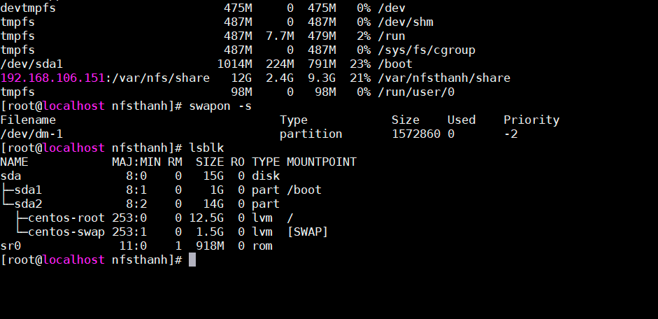
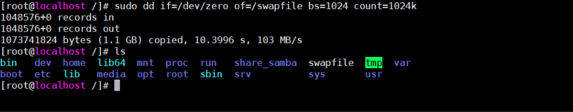
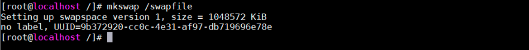
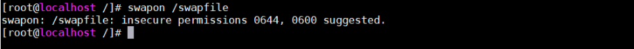
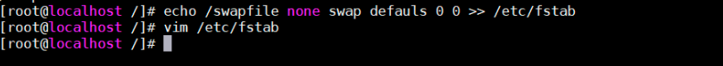
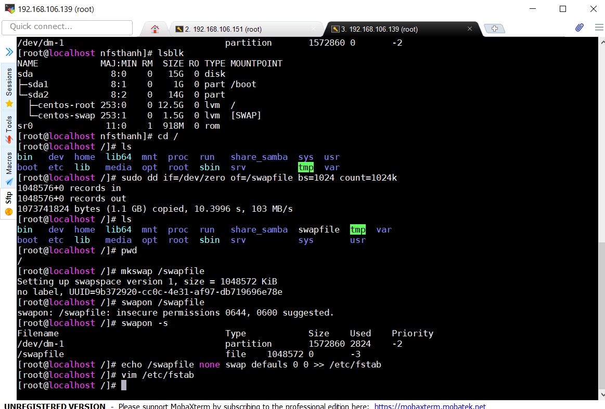
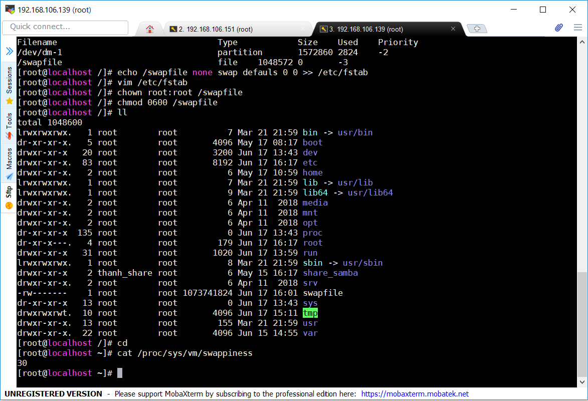
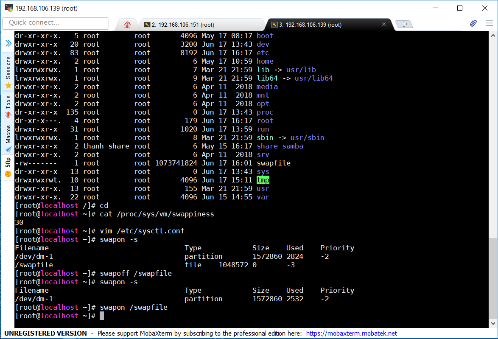

# Swap memory
## Swap là gì?
- Swap là một vùng trên ổ đĩa mà nó có thể được sử dụng để lưu trữ các dự liêu mà không được sử dụng tren bô nhớ vất lý (RAM) là nơi chứa tạm thời các tài nguyên đang không hoạt động trong bộ nhớ.
- Swap được sử dụng khi hệ thông của bạn thiếu RAM để sử dụng, khi đó  các tài nguyên và dữ liệu tạm thời không hoạt động trên bộ nhớ RAM sẽ lưu trữ vào không gian swap  để giải phóng bộ nhớ  RAM và sử dụng cho việc khác.
- Thời gian truy cập vào vùng swap là bằng tốc độ của ổ đĩa còn RAM lại có một tốc độ khác nhanh hơn.
- Swap thường được ưu tiên sử dungj cho các hệ điều hành như unix và linux.
- Khi cài đặt swap thì dung lượng trên ổ đĩa được sử dụng để lưu sex bị trừ đi.
##  Cấu hình và sự dụng swap.
- Thực hiện trên môi trường ảo hóa VMware. Sử dụng hệ điều hành Centos 7.
- Kiểm tra ổ nhớ đĩa cứng trên máy bằng các câu lệnh.
    - **df -h** : Kiểm tra dung lương đĩa.
    - **lsblk**: Kiểm tra dung lượng đĩa theo cây.
    - **swapon -s**: Kiểm tra xem có phân vùng swap nào chưa. 

- Ở đây đã có một phân vùng swap rồi vì khi cài máy ảo nó đã cài đặt rồi nó sử dụng kiêu LVM và có dung lượng 1.5GB, chế độ priority là -2.
- Ta có thể tiếp tục thêm một  swap nữa sử dung lệnh.
    - sudo dd if=/dev/zero of=/swapfile bs=1024 count=1024k

- Như hình ảnh dưới đây là thành công.
    - of=/swapfile :nơi tạo file ta có thể thay đổi thư mục này.
    - count=1024k : dung lượng của vùng swap ở đây là 1GB.
    - Khi tạo xong vùng swap ta thấy xuất hiện swapfile.

 
- Tiếp theo ta tạo phân vùng cho swap.
    - Sử dụng câu lệnh: mkswap /swapfile

- Tiếp theo ta sẽ kích hoạt vùng swap này.
    - Sử dụng câu lệnh: swapon /swapfile

- Tại đây sẽ có thể xuất hiện lỗi như trên nhưng không sao ta bỏ qua vì lát nữa còn phân quyền cho file này.

- Kiểm tra xem tình trạng swap có hoạt động chưa.
    - Sử dụng câu lệnh: swapon -s

- Vậy là swap đã có.
- Thiết lần swap tự động kích hoạt sau mỗi lần reboot.
    - Có 2 cách là sử dụng echo và dùng vim để viết trực tiếp vào file fstab.
        - echo /swapfile none swap defauls 0 0 >> /etc/fstab
        - vim /etc/fstab
            -  /swapfile none swap defauls 0 0
        

- Tiếp theo ta cần phân quyền cho file để tăng tính bảo mật
    - chown root:root /swapfile
    - chmod 0600 /swapfile

- Tiếp theo ta cấu hình swappiness 
    - Swappiness là mực độ ưu tiên sử dụng swap, khi lượng RAM còn lại bằng giá trị cài đặt thì sẽ tự động sử dụng swap.
    - Swappiness được tính theo tỷ lệ phần trăm (vd: 0 ; 10 ; 60)
    - Kiểm tra mức độ sử dụng file swap: cat /proc/sys/vm/swappiness

- Ở đây giá trị swappiness = 30 tức còn 30% RAM thí sẽ sử dụng swap.
- Ta có thể thay đổi giá trị swappiness này băng câu lệnh.
    - sysctl vm.swappiness=10
    - Kiểm tra băng câu lệnh trên thì sẽ thấy thông số thay đổi.
- Nếu muốn thông số này không thay đổi mỗi lần khởi động lại vps thì ta chỉnh thông số này trong file /etc/sysctl.conf.
- Ta có thế tắt swap này bằng lệnh: swapoff /swapfile và bật lên lại băng lệnh swapon /swapfile.

- Xóa file swap sư dụng lênh: rm -f /swapfile