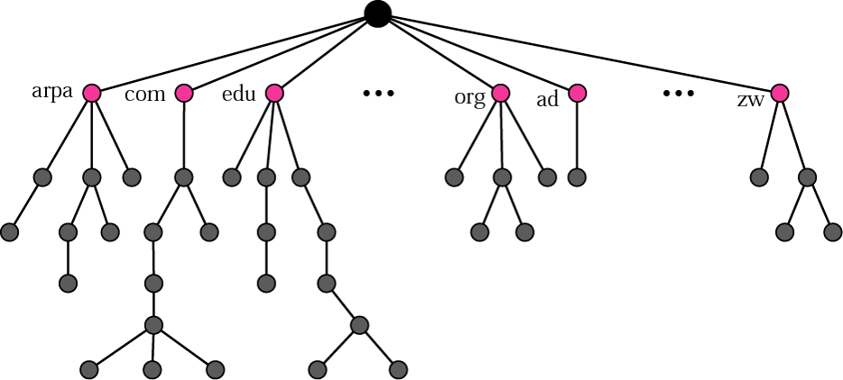
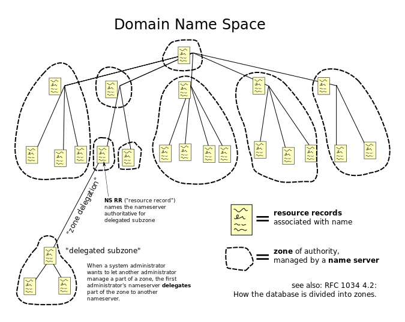
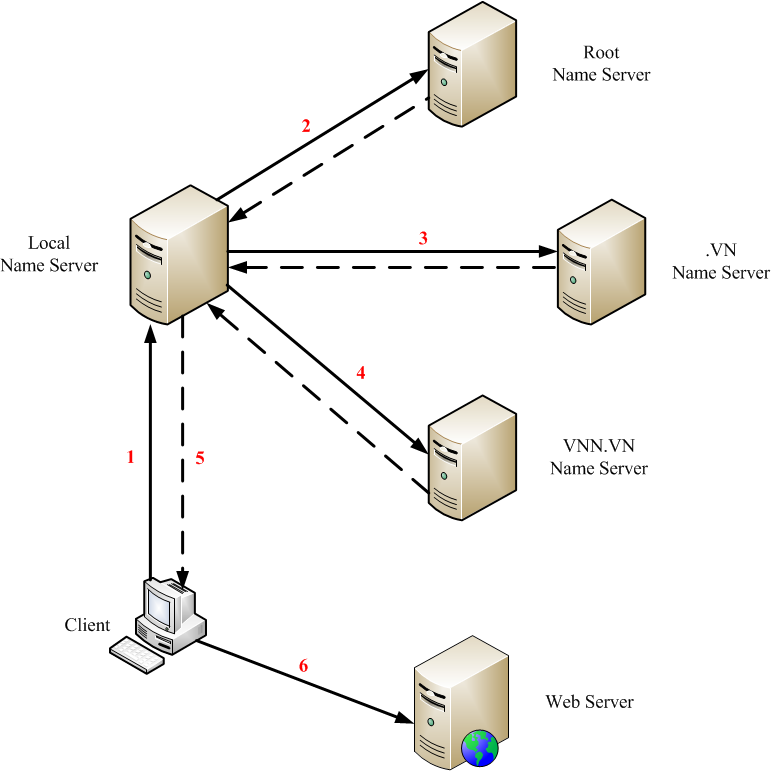

## Tìm hiểu DNS. 
DNS là từ viết tắt 3 chữ cái đầu trong tiếng Anh của cụm từ Domain Name System dịch sang tiếng Việt là hệ thống phân giải tên miền. DNS được ra đời vào nằm 1984. Bất kỳ thiết bị nào tham gia truy cập vào một địa chỉ trang web để được dẫn gián tiếp qua DNS để gửi thông tin cho Server.

Hệ thống phân giải tên miền DNS cho phép thiết lập kết nối tương ứng giữa địa chỉ IP và tên miền trên Internet có nghĩa là dùng để định danh cho địa chỉ IP, do nó quá dài dòng và khó nhớ nên người ta sử dụng DNS để thay thế

2. Chức năng của DNS.
Mỗi website có một tên (là tên miền hay đường dẫn URL: Uniform Resource Locator) và một địa chỉ IP. Địa chỉ IP gồm 4 nhóm số cách nhau bằng dấu chấm(IPv4). Khi mở một trình duyệt Web và nhập tên website, trình duyệt sẽ đến thẳng website mà không cần phải thông qua việc nhập địa chỉ IP của trang web. Quá trình "dịch" tên miền thành địa chỉ IP để cho trình duyệt hiểu và truy cập được vào website là công việc của một DNS server. Các DNS trợ giúp qua lại với nhau để dịch địa chỉ "IP" thành "tên" và ngược lại.

Kiến trúc DNS.

Name Space: Tên được gán cho máy phải là duy nhất vì địa chỉ là duy nhất. Một không gian tên mà mapping với mỗi địa chỉ phải là một tên duy nhất và có thể được tổ chức theo hai cách: cùng cấp hoặc theo cấp bậc.
Domain Name Space có thứ bậc trong thiết kế. Tên được định nghĩa trong một cấu trúc cây ngược với gốc ở trên cùng. Cây có thể có 128 cấp độ: cấp 0 (gốc) đến cấp 127

Truy vấn tương tác và truy vấn đệ quy.

Các kiểu  truy vấn của DNS.
- Truy vấn vòng lặp (Iterative).
    - Trả về  giá trị, phản hồi của máy DNS server có bản ghi phù hợp hoặc đã được lưu trong cache.
    - Thường là truy vấn từ local name server đến root name server vì root namme server thương phải xử lý dữ liệu rất lớn.
- Truy vấn đệ quy (Recursive).
    - Tiếp tục truy vấn đến các mức cao hơn trong hệ thống DNS để  tìm ra kết quả đúng.
    - Các truy vấn thông thường là các truy vân đệ quy.
Có 13 root name server trên toàn thế giới (chứ top-level dommain.)

DNS Record, một số loại record phổ biến?

Có hai loại bản ghi được sử dụng trong DNS. Các bản ghi question được sử dụng trong phần question của truy vấn và response message. Các bản ghi tài nguyên được sử dụng trong phần response, có thẩm quyền, và bổ sung thông tin của response message.

- Bản ghi loại A
    - Address Mapping records: Sử dụng để chuyển đổi một domain name thành một địa chỉ IPv4.
- Bản ghi loại AAAA
    - IP Version 6 Address records: Sử dụng để chuyển đổi một domain name thành một địa chỉ IPv6.
- Bản ghi loại NS
    - Name Server records: Lưu thông tin về Name Server. Nó định danh cho một máy chủ có thẩm quyền về một zone nào đó.
- Bản ghi loại CNAME
    - Canonical Name records: Bản ghi CNAME chỉ định một tên miền cần phải được truy vấn để giải quyết truy vấn DNS ban đầu. Vì vậy các bản ghi CNAME được sử dụng để tạo các bí danh tên miền. Bản ghi CNAME thực sự hữu ích khi chúng ta muốn bí danh tên miền của chúng ta tới miền bên ngoài. Trong các trường hợp khác, chúng ta có thể xóa các bản ghi CNAME và thay thế chúng bằng các bản ghi A.
- Bản ghi loại HINFO
    - Host Information records: Hồ sơ HINFO được sử dụng để thu thập thông tin tổng quát về máy chủ. Hồ sơ ghi rõ loại CPU và hệ điều hành. Dữ liệu bản ghi HINFO cung cấp khả năng sử dụng các giao thức cụ thể của hệ điều hành khi hai máy chủ muốn liên lạc. Vì lý do an toàn, hồ sơ HINFO thường không được sử dụng trên các máy chủ công cộng.
- Bản ghi loại SOA
    - Start of Authority records: Hồ sơ ghi rõ thông tin cốt lõi về vùng DNS, bao gồm name server chính, email của quản trị viên tên miền, số sê-ri miền và một số bộ đếm hiện thời liên quan đến refresh lại zone.
- Bản ghi loại PTR
    - Reverse-lookup Pointer records: bản ghi PTR được sử dụng để tra cứu tên miền dựa trên địa chỉ IP.
- Bản ghi loại MX
    - Mail exchanger record: MX chỉ định một máy chủ trao đổi thư cho một tên miền DNS. Thông tin được sử dụng bởi Giao thức truyền thư đơn giản (SMTP) để định tuyến email đến máy chủ thích hợp. Thông thường, có nhiều hơn một máy chủ trao đổi thư cho một miền DNS và mỗi DNS trong số chúng đã đặt ưu tiên.