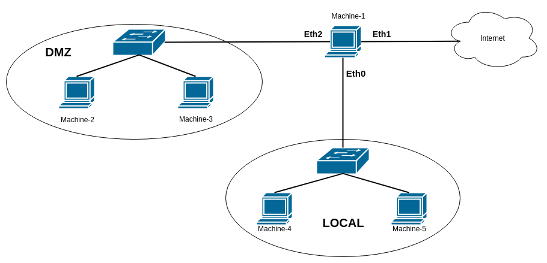
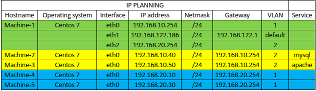
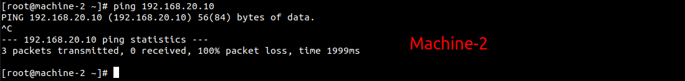
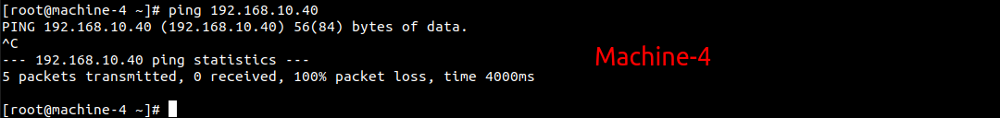
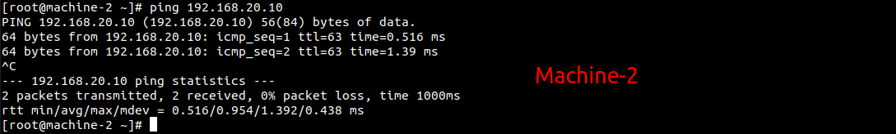
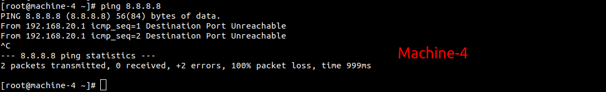
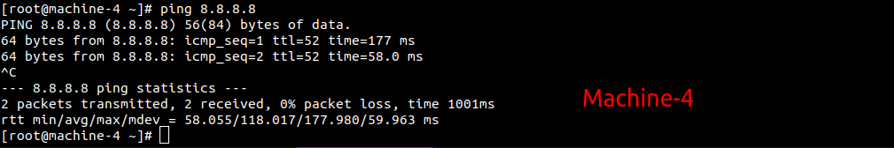
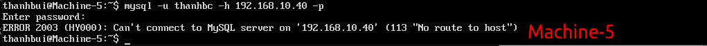

# Sử dụng các rules cơ bản trong iptables.
## 1. Mô hình.



Khởi tạo môi trường trên máy ảo KVM.
- Tạo 3 dải mạng sử dụng NAT eth0, eth1, eth2 để sử dụng cho các vlan tương ứng là VLAN1, default, VLAN2.
- Vùng DMZ sử dụng dải mạng VLAN2. Trỏ tới địa chi gateway 192.168.10.245 trên Machine-1.
- Vùng LOCAL sử dụng dải mạng VLAN1. Trỏ tới địa chỉ gateway 192.168.20.154 trên Machine-1.

Chia 2 phân vùng DMZ VÀ LOCAL:
- DMZ (Demilitarized Zone):
    - Vùng DMZ sử dụng dải mạng VLAN2. Trỏ tới địa chi gateway 192.168.10.245 trên Machine-1.
    - DMZ là vùng mà các máy trong đó bị kiểm soát ra vào chặt chẽ chị có 1 số cổng hay đường truyền được đi ra ngoài còn lại sẽ bị loại bỏ hết.
    
- LOCAL:    
    - Vùng LOCAL sử dụng dải mạng VLAN1. Trỏ tới địa chỉ gateway 192.168.20.154 trên Machine-1.
    - LOCAL: là vùng cấp phát địa chỉ cho người sử dụng có thẻ ra ngoài internet và không để các đường internet nào truy cập vào.


Machine-1 là máy kiểm soát là nơi cấu hình iptables vì đây là cửa ngõ cũng như lối vào của mạng nên khi kiểm soát sẽ kiểm soát tại đây.

Machine-2 là máy chủ lưu trữ và hoạt động dịch vụ mysql nắm trong vùng DMZ.

Machine-3 là máy chủ được cài đặt vào hoạt động dịch vụ web ở đây là apache. Nằm trong phần vùng DMZ.

Machine-4và Machine-5: là may tính cục bộ cho người sủ dụng như một máy tính bình thường. Nằm trong phần vùng LOCAL.

## 2. IP planning.




## Kịch bản 1 : Kết nối 2 vùng DMZ và LOCAL.

Trước khi tiến hành cài đắt cấu hình trên Machine-1 thì ta cần tắt iptables hoặc tường lửa trên các Machine-2, Machine-3, Machine-4, để chứng minh gói tin đi đúng hướng.
```
systemctl stop iptables
systemctl stop firewalld
```
Trước khi cấu hình thi 2 vùng DMZ và LOCAL không thể giao tiếp được với nhau.




Để vùng  DMZ và LOCAL kết nối được với nhau thì ta thực hiện các lệnh sau.
```
/sbin/sysctl -w net.ipv4.ip_forward=1
/sbin/sysctl -p
iptables -D FORWARD 1
iptables -I FORWARD -s 192.168.10.0/24 -d 192.168.20.0/24 -j ACCEPT
iptables -I FORWARD -s 192.168.20.0/24 -d 192.168.10.0/24 -j ACCEPT 
```
Khi gõ lệnh xong thì 2 vùng có thể giao tiếp với nhau.




Cách trên thì sau mõi lần reboot lại máy sẽ bị mất còn 1 cách khác nữa là ghi  vào trong file thì sau mỗi lần reboot sẽ không bị mất.
```
echo "net.ipv4.ip_forward = 1" >> /etc/sysctl.conf
```

##  Kịch bản 2: cho phép LOCAL và DMZ truy cập ra internet.
Trước khi cấu hình thì máy trong LOCAL không ping được ra  internet.



```
iptables -t nat -I POSTROUTING -s 192.168.20.0/24 -o eth1 -j SNAT --to-source 192.192.122.186
iptables -t nat -I POSTROUTING -s 192.168.10.0/24 -o eth1 -j SNAT --to-source 192.192.122.186
```


## Kịch bản 3 : Cho phép các truy cập đến Machine-1 từ vùng DMZ qua cổng 22 và hủy bỏ toàn bộ kết nối khác đến.
```
iptables -I INPUT -p tcp -s 192.168.10.0/24 --dport 22 -j ACCEPT
iptables -A INPUT -p tcp --dport 22 - DROP
```
Có tác dụng ở bảng FILTER , chain INPUT cho phép các gói tin đi từ địa chỉ nguồn 192.168.10.0/24 truy cập ssh vào máy cấu hình và hủy bỏ toàn bộ truy cập ssh từ nguồn khác vào máy.

## Kich ban 4 : chặn không cho Machine-5 không truy cập được nhưng Machine-4 vẫn truy cập được mysql trong Machine-2.

mysql : Machine-2 --> Machine-4  , drop all.

```
iptables -t nat -I POSTROUTING -s 192.168.20.10 -d 192.168.10.40 -p tcp --dport 3306 -j SNAT --to-source 192.168.10.254
iptables -I FORWARD -i eth2 -o eth0 -s 192.168.20.10  -d 192.168.10.40 -p tcp --dport 3306 -j ACCEPT
iptables -A FORWARD -i eth2 -o eth0 -s 192.168.20.0/24 -d 192.168.10.40 -p tcp --dport 3306 -j DROP
```
Có tác dụng ở bảng FILTER, chain FORWARD dùng để chuyển tiếp gói tin từ địa chỉ 192.168.20.10 đến 192.168.10.40 qua công 3306 và không cho các gói tin từ dải mạng 192.168.20.0/24 đi đến 192.168.10.40 qua công 3306.




## Kịch bản 5 : chặn mọi kết nối ssh từ vung LOCAL đến Machine-2
```
iptables -t nat -I POSTROUTING -s 192.168.20.0/24 -d 192.168.10.40 -p tcp --dport 22 -j SNAT --to-source 192.168.10.254
iptables -A FORWARD -s 192.168.20.0/24 -d 192.168.10.40 -p tcp --dport 22 -j DROP
```
## Kịch bản 6 : chặn moi kết nối vào vùng LOCAL.
```
iptables -A INPUT -i eth2 -j DROP
```