# Tìm hiểu logical volume manager (phần 2).


# Mục lục.
[1. Tính năng LVM migration.](#1)

[2. Tính năng pvremove mirroring.](#2)

[3. Snap shot và restore trong LVM](#3)
- [3.1 Tạo một snapshot.](#3.1)
- [3.2 Tăng dung lượng của snapshot.](#3.2)
- [3.3 Restore lại dữ liệu tại thời điểm snapshot.](#3.3)

[4. Thin provisioning và thick provisioning.](#4)
- [4.1 Thick provisioning.](#4.1)
- [4.2 Tạo thin provisioning.](#4.2)
  - [4.2.1 Tạo thin provisioning.](#4.2.1)
  - [4.2.2 Tạo thư mục, format và mount để sử dụng.](#4.2.2)

[5. Backup và restore](#5)
- [5.1. Backup ](#5.1)
- [5.2. Restore ](#5.2)

---- 
 
Ta tiếp tục sử dụng bài lab từ bài 1.

Cấu hình phần cứng như sau:

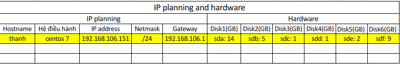
Bài trước ta đã tìm hiểu LVM, cách hoạt động và hướng dẫn sử dụng LVM.

Trong bài này ta sẽ tìm hiểu tiếp về backup, restore, cách sử dụng thin provisioning và tạo snapshot.

<a name="1"></a>
## 1. Tính năng LVM migration.
Ta sử dụng tính năng LVM migration, với tính năng này ta có thể di chuyển dữ liệu sang disk mới mà không mất dự liều và thời gian timedown.

Để thực hiện tính năng này ta thực hiện thêm disk mới (các bước giống bài 1).
- Thêm hardisk 5 có dung lượng 2GB có tên sde.

- Sau khi thêm hard disk mới ta cần khởi động lại máy ảo.

Khi máy ảo khỏi động xong sử dụng câu lệnh **lsblk** để kiểm tra hard disk.

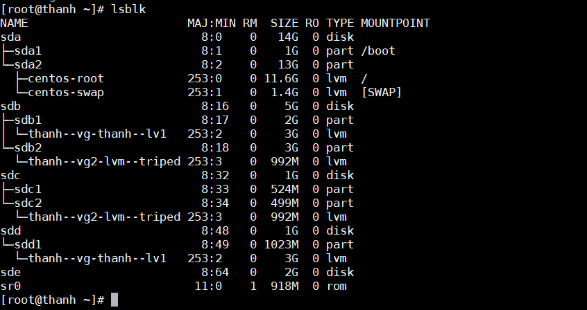
- Vậy là đã thêm thành công sde.

Tạo physical volume cho hard disk vừa thêm.
- Tạo partition cho hard disk đó
    ```
    fdisk /dev/sde
    ```
- Tăng dung lượng volume group.
    ```
    vgextend thanh-vg /dev/sde1
    ```
Thay sdd1 (1GB) bằng sde1 (2GB) mà sẽ không làm mất dữ liệu hay downtime.

Ta dùng 'lvconvert' command để migration dữ liệu sang ổ mới.
```
lvconvert -m 1 /dev/thanh-vg/thanh-lv1 /dev/sde1
```
- Cấu trúc lệnh: *lvconvert [option] [số ổ tạo mirror] [link logical volume di chuyển đến] [link logical volume cần di chuyển]*
    - -m :mirror ( Tạo ổ migration) : tạo 1 mirror.

Khi tạo xong 1 mirror mới ta có thể bỏ /dev/sdb1.
```
lvconver -m 0 /dev/thanh-vg/thanh-lv1 /dev/sdb1
```
- Kiểm tra sdb1 đã được bỏ khỏi volume group thanh-vg1 chưa.
```
lsblk
```
Kiểm tra lại thông tin lvconvert.
```
lvs -o+devices
```
<a name="2"></a>
## 2. Tính năng pvremove mirroring.
Chức năng này tương tự LVM migration cũng đi chuyển dữ liệu giữa các phân vùng nhớ mà ko lại timeout và mất dữ liệu.

Chuyển dữ liệu ta sử dụng lệnh
``` 
pvmove -n /dev/thanh-vg/thanh-lv1 /dev/sdd1 /dev/sde1
```

So sánh logical volume trước và sau khi **pvremove**.
- Pvs trước khi chuyển dữ liệu.
    -   ```
        [root@thanh ~]# pvs
        PV         VG        Fmt  Attr PSize    PFree
        /dev/sda2  centos    lvm2 a--   <13.00g      0
        /dev/sdb1  thanh-vg  lvm2 a--    <2.00g      0
        /dev/sdb2  thanh-vg2 lvm2 a--    <3.00g   2.51g
        /dev/sdc1  thanh-vg  lvm2 a--   520.00m 520.00m
        /dev/sdc2  thanh-vg2 lvm2 a--   496.00m      0
        /dev/sdd1  thanh-vg  lvm2 a--  1020.00m   4.00m
        /dev/sde1            lvm2 ---    <2.00g  <2.00g
        ```
- Pvs sau khi chuyển dữ liệu.

    -   ```
        [root@thanh thanh-vg]# pvs
        PV         VG        Fmt  Attr PSize    PFree
        /dev/sda2  centos    lvm2 a--   <13.00g       0
        /dev/sdb1  thanh-vg  lvm2 a--    <2.00g       0
        /dev/sdb2  thanh-vg2 lvm2 a--    <3.00g    2.51g
        /dev/sdc1  thanh-vg  lvm2 a--   520.00m  520.00m
        /dev/sdc2  thanh-vg2 lvm2 a--   496.00m       0
        /dev/sdd1  thanh-vg  lvm2 a--  1020.00m 1020.00m
        /dev/sde1  thanh-vg  lvm2 a--    <2.00g    1.00g
        ```
- Ta thấy  trường PFree của /dev/sde1 đã giảm từ 2G xuống còn 1G và PFree của /dev/sdd1 tăng từ 4M lên 1020M. Vậy dữ liễu đã được di chuyển sang sde1

<a name="3"></a>
## 3. Snapshot và restore snapshowt trong LVM.
Snapshot là một tính năng dùng để lưu lại dữ liệu tại một thơi điểm xác định khi lưu snapshot.

<a name="3.1"></a>
### 3.1. Tạo một snapshot.

Thư mục lvm trước khi tạo snapshot.
```
[root@thanh lvm]# ls
lvm  lvm-linear  lvm-triped
```
Tạo một snapshot bằng lệnh.
```
lvcreate -L 2GB -s -n snap-lv /dev/thanh-vg/thanh-lv
```
- -s: option tạo snapshot
- -n: tên của snapshot
```
[root@thanh lvm]# lvcreate -L 2GB -s -n snap-lv /dev/thanh-vg/thanh-lv1
Logical volume "snap-lv" created.
```
- Như vậy là đã tạo thành công snapshot.

Xem thông tin của snapshot:
```
lvdisplay /dev/thanh-vg/snap-lv
```
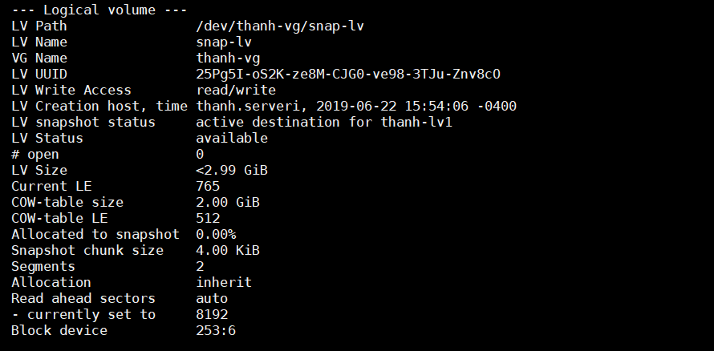

<a name="3.2"></a>
### 3.2. Tăng dung lượng của snapshot.
Ở một mức nào đó, ổ cứng của chúng ta đầy lên và vượt quá dung lượng của snapshot mà chúng ta đã tạo ở bên trên.

Tăng thêm dung lượng của snapshot ta sẽ thực hiện:
``` 
lvextend -L +1G /dev/thanh-vg/snap-vl
```
Muốn hệ thống tự động co dãn Logical volume snapshot cho chúng ta thì phải cấu hình như sau.

Mở file cấu hình LVM
```
vim /etc/lvm/lvm.conf
```

Tìm và sửa dòng có keywords :
```
snapshot_autoextend_threshold = 70
snapshot_autoextend_percent = 20
```
- Giải thích: Khi dung lượng của snapshot đạt tới 70% tổng dung lượng mà chúng ta tạo ở trên, thì tự động hệ thống sẽ tăng thêm cho nó 20% dung lượng.

<a name="3.3"></a>
### 3.3. Restore lại dữ liệu tại thời điểm snapshot.

Trước đó ta phải umount thư mục.
```
umount /dev/thanh-vg/snap-lv
```
Restore bằng lệnh.
```
lvconvert --merge /dev/thanh-vg/snap-vl
```
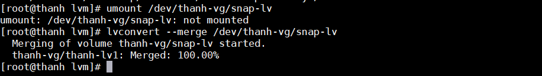

Đã restore thành công.
<a name="4"></a>
## 4. Thin provisioning và thick provisioning.

<a name="4.1"></a>
### 4.1. Thick provisioning.
Chức năng này cho phép ta cấp phát tổng dung lượng vùng nhớ cho mỗi người dùng bằng dung lượng volume group.

Ví dụ ta có 2 ổ cứng 1 ổ 1GB và 1 ổ 9GB, cấp phát cho 2 người sử dụng mỗi người sử dụng 5GB. Như vậy là chúng ta đã sử dụng hết dung lượng disk.

<a name="4.2"></a>
### 4.2. Thin provisioning.
Mô hình.

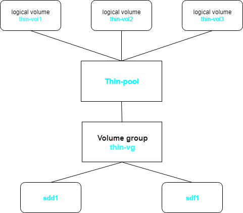

Chức năng này cho phép chúng ta cấp phát vùng lưu trữ dữ liệu động cho mỗi người dùng.

Cũng với ví dụ trên ta có 10GB cung cấp cho 2 người sử dụng mà 2 người này không sử dụng hết thì ta có thể tận dụng khoảng không gian trống này để cấp cho người thứ 3 mà không cần gắn thêm ổ cứng mới. Tuy nhiên đây chỉ là cách tạm thời khi chúng ta chưa có khả năng mở rộng dung lượng ổ cứng vật lý tạm thời. Chúng ta phải mở rộng dung lượng vật lý càng sớm càng tốt, tránh rủi ro dữ liệu ghi đè, hoặc mất mát khi xung đột.

Trong thực tế việc sử dụng thin rất phổ biến nhưng dung lượng nhớ được cấp phát cho mỗi người dùng phải được tính toán cẩn thận để không xảy ra trường hợp ghi đè và xung đột dữ liệu. Để cho dễ hiểu dùng với ví dụ trên nếu cấp phát cho 3 người thì ta cấp cho mỗi người được 3GB dung lượng bộ nhớ để tránh trường hợp 3 ba cùng lưu đầy.

<a name="4.2.1"></a>
### 4.2.1. Tạo thin provisioning.
Để thực hiện bài lab này ta thêm 2 hard disk sde và sdf có dung lượng lần lượt là 2GB và 9GB. Các bước thực hiện như tạo với sdb và sdc.

Tiến hành **fdisk** trên sde và sdf.

Kiểm tra **lsblk** xem dung lượng ổ đĩa.

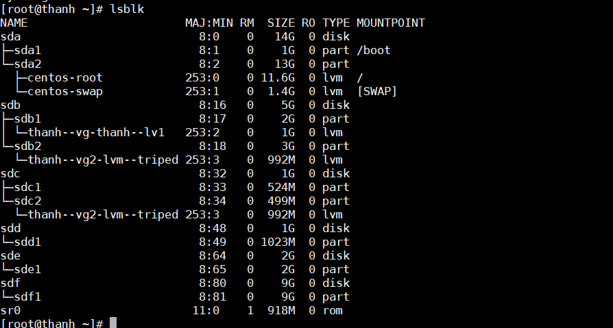

Sử dụng sdd1 và sdf1 để tạo volume group có tên là thin-vg.
```
vgcreate -s 32M thin-vg /dev/sdd1 /dev/sdf1
```
- -s : tùy chọn với kích cỡ mặc định là 32M.
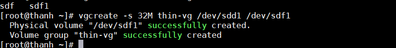

Kiểm tra dung lượng của volume group.
```
vgs
```
Tạo logical volume Thin-pool từ volume group thin-vg vừa tạo.
```
lvcreate -L 10G --thinpool thin-pool thin-vg
```

Xem thông tin của logical volume thin.

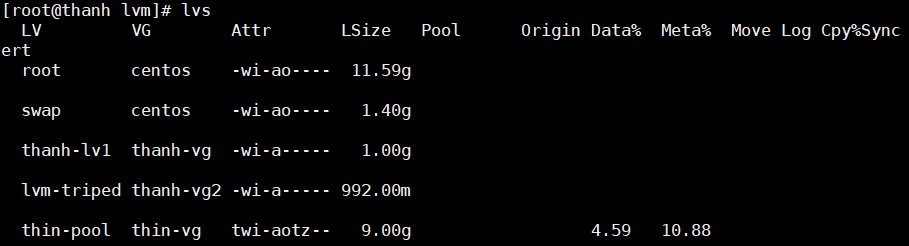

Tạo các Thin volume có tên thin-vol1 và thin-vol2 từ thin-pool vừa tạo.
```
lvcreate -V 5G --thin -n thin-vol1 thin-vg/thin-pool
lvcreate -V 5G --thin -n thin-vol2 thin-vg/thin-pool
```
  
Kiểm tra các logical volume vừa tạo.

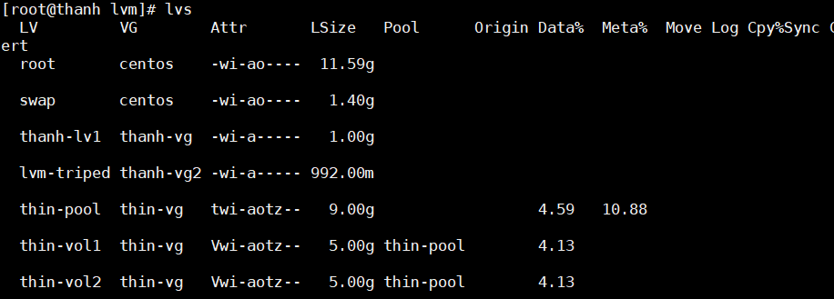

<a name="4.2.2"></a>
### 4.2.2. Tạo thư mục, format và mount để sử dụng.

Tạo thư mục, ở đây tôi sẽ tạo ở trong /lvm.
```
mkdir /lvm/vol{1..2}
```
Format các logical volume:
``` 
mkfs.ext4 /dev/thin-vg/thin-vol1
mkfs.ext4 /dev/thin-vg/thin-vol2
```
Mount các thư mục vừa tạo.
```
mount /dev/thin-vg/thin-vol1 /lvm/vol1
mount /dev/thin-vg/thin-vol2 /lvm/vol2
```

Kiểm tra các các thư mục mount.
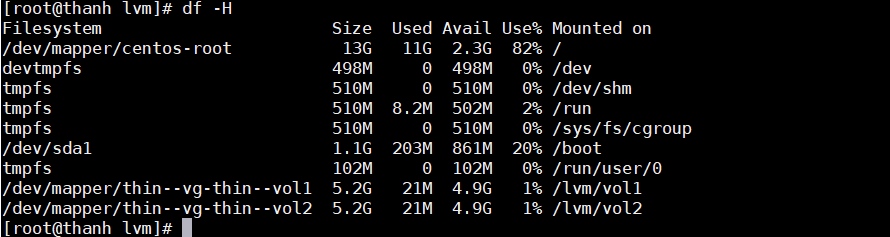

<a name="5"></a>
## 5. Backup và restore.

<a name="5.1"></a>
###  5.1. Backup.
Backup LVM là sao lưu dữ liệu ra một vùng volume group mới được ghi riêng để phòng khi trường hợp logical volume bị hỏng thì dự liệu không bị mất đi và có thể khôi phục lại được. Loại  dữ liệu là metadata.

Thực hiện backup dữ liệu.

Cú pháp câu lệnh: *vgcfgbackup [-f path_newfilename] [vg_name]*.
- -f path_newfilename: lưu đướng dẫn volume group backup
- vg_name: là đường dẫn của volume group


Đầu tiên ta thực tạo volume group để backup.
```
vgcreate vg-backup /dev/thanh-vg1
```
Lưu backup vào volume group đó.
```
vgcfgbackup /dev/thanh-vg1
``` 

Tiếp đến tạo group volume đê lưu dữ liệu backup của thanh-vg
```
vgcfgbackup -f thanh-vg1-backup /dev/thanh-vg1
```
Kiểm tra lại bằng việc xem file thanh-vg-backup đã được ghi hay chưa
```
ll /ect/lvm/backup
```
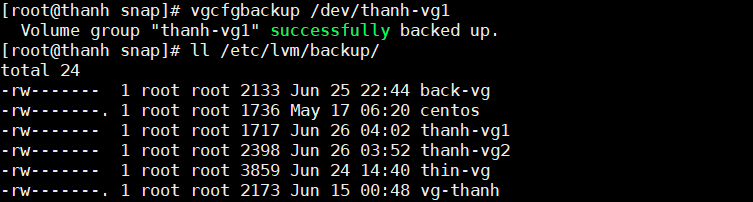

Cuối cùng sao lưu dữ liệu giữa 2 vùng vừa cài đặt
```
vgcfgbackup -f /etc/lvm/backup/thanh-vg1-backup /dev/thanh-vg1
```
Kiểm tra lại bằng lệnh 
```
ll /etc/lvm/backup
```
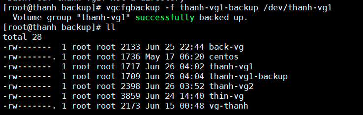

Ta thấy có file thanh-vg1-backup là file backup của thanh-vg1, vậy ta đã backup thành công.

<a name="5.2"></a>
### 5.2. Restore.
Khôi phục cấu hình các volume group từ các kho lưu trữ backup được lưu từ trước.

Xem dữ liệu trong file trước khi xóa để so sánh file sau khi restore lại có giống nhau không.
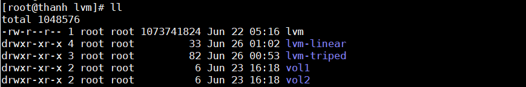

Để khôi phục  lại dữ liệu ta cần.

Bước 1: Xóa logical volume.

Trước khi xóa logical volume thì ta cần umount volume group đó
```
umount /dev/thanh-vg1/thanh-lv1
```
Xóa logical volume.
```
lvremove /dev/thanh-vg1/thanh-lv1
```


Bước 2: Xem file /etc/lvm/archive/vgname_(xxxxxx).vg đây là các file log ghi thời gian mà bạn thao tác trên các logical volume.
```
ll /etc/lvm/archive/
```
Tìm file có thời gian gần nhất là file mới được ghi và restore lại được.
```
-rw-------  1 root root 1966 Jun 26 04:14 thanh-vg1_00017-1980275261.vg
```
Đây là file ghi mới nhất của volume group thanh-vg1.

Bước 3: Đọc chi tiết xem ngày và giờ khi muốn restore đọc một file nào đó.
```
head /etc/lvm/archive/thanh-vg1_00017-1980275261.vg
```
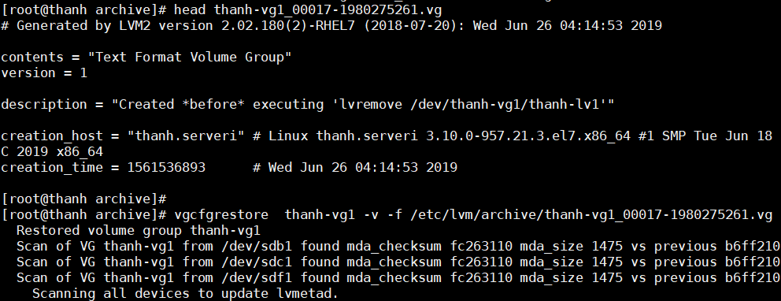

Bước 4: tiến hành restore dữ liệu 
```
vgcfgrestore thanh-vg -v -f /etc/lvm/archive/thanh-vg1_00017-1980275261.vg
```
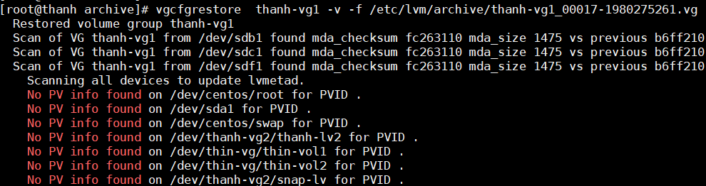

Bước 5: kiểm tra lại bằng lệnh 
```
lvscan
```
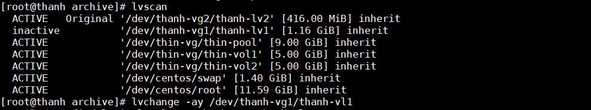

Bước cuối cùng active lại vùng nhớ đê nhận restore.
```
lvchange -ay /dev/thanh-vg1/thanh-vl1
```

Kiểm tra kết quả dữ liệu sau khi backup vẫn còn nguyên
```
ll /ect/lvm/backup
```
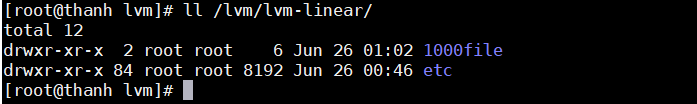
Vậy là đã restore thành công lại dũ liệu khi xóa.
