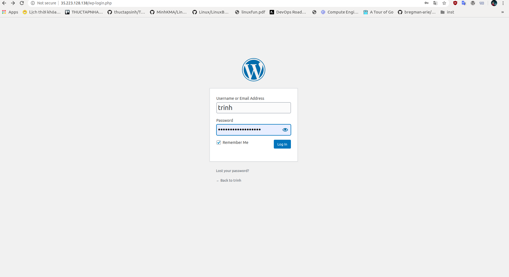
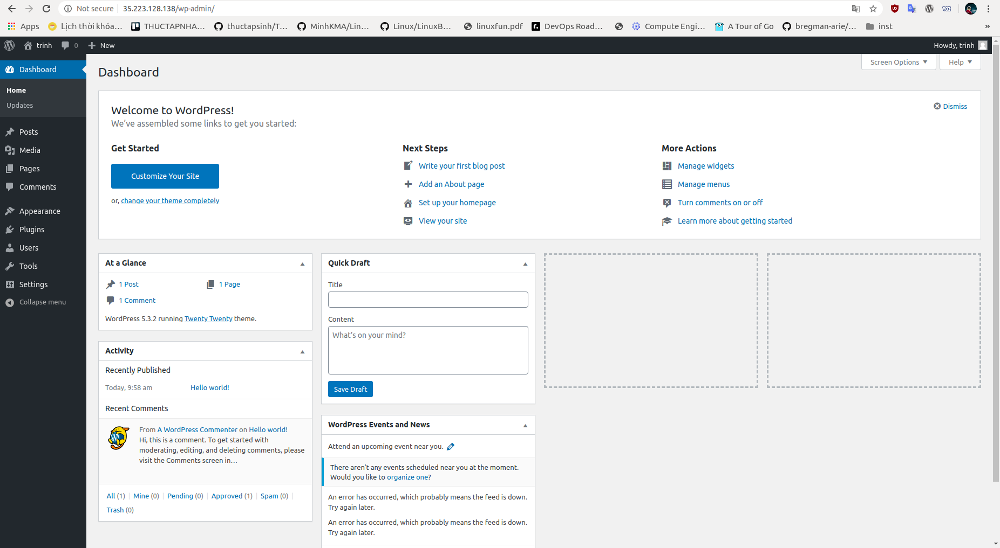

**WordPress.org là gì?**

WordPress.org là trang chủ chính thức của mã nguồn WordPress mà trang WordPress.com kia đang sử dụng để tạo Blog cho các thành viên. Tại đây, bạn có thể tải bản chính thức của mã nguồn WordPress về máy để tự cài đặt trên chính máy chủ riêng/hosting của mình và mình tự vận hành nó.

Với một mã nguồn đầy đủ như vậy bạn có thể tuỳ chỉnh và sử dụng  toàn bộ sức mạnh của WordPress với các Theme và Plugin được WordPress hỗ trợ cho phép tải lên. Và đây chính là WordPress mà chúng ta đang tìm hiểu để sử dụng.  

## Cài đặt Wordpress  

### Mô hình  


- Máy ảo CentOS 7 có cài LAMP
- Có kết nối Internet  

### Các bước cài đặt  

**Bước 1: Tạo cơ sở dữ liệu và tài khoản cho WordPress**  

- Đăng nhập vào CSDL bằng root user  

  ```sh
  mysql -u root -p
  ```

- Tạo cơ sở dữ liệu, ở đây mình tạo CSDL có tên là wordpress  

  ```sh
  create database wordpress;
  ```  

- Tạo 2 tài khoản để quản lý CSDL wordpress  

  ```sh
  create user 'wordpress'@'localhost' identified by 'abc@123';
  ```
  và   

  ```sh
  create user 'wordpress'@'%' identified by 'abc@123';
  ```  

- Cấp quyền quản lý CSDL wordpress cho 2 user mới tạo  

  ```sh
  grant all on wordpress.* to 'wordpress'@'localhost' identified by 'abc@123';
  ```  

  ```sh
  grant all on wordpress.* to 'wordpress'@'%' identified by 'abc@123';
  ```  

- Xác thực lại những thay đổi về quyền  

  ```sh
  flush privileges;
  ```  

- Log out MariaDB  
  
  ```sh
  exit
  ```  

**Bước 2: Tải và cài đặt Wordpress**  

- Cài đặt gói hỗ trợ `php-dg`  

  ```sh
  yum install php-gd
  ``` 

- Cài đặt wget  

  ```sh
  yum install wget
  ``` 

- Tiến hành tải xuống WordPress với phiên bản mới nhất  

  ```sh
  wget http://wordpress.org/latest.tar.gz
  ```  

- Giải nén file `latest.tar.gz`  

  ```sh
  tar xvfz latest.tar.gz
  ```  

- Copy các file trong thư mục WordPress tới đường dẫn /var/www/html  

  ```sh
  cp -Rvf /root/wordpress/* /var/www/html
  ```  

**Bước 3: Cấu hình Wordpress**  
 
- Truy cập vào các file cài đặt của Wordpress  

  ```sh
  cd /var/www/html
  ```

- File cấu hình wordpress là wp-config.php. Tuy nhiên tại đây chỉ có file wp-config-sample.php. Tiến hành sửa lại tên file cấu hình như sau:

  ```sh
  mv wp-config-sample.php wp-config.php
  ```  

- Mở file config với vi để sửa:  

  ```sh
  nano wp-config.php
  ```  

  Sửa những nội dung ở ô đỏ theo thông tin bạn đặt ở bước 1  

 

- Lưu file cấu hình và thoát.  

**Bước 4: Hoàn tất cài đặt giao diện**  

- Trên trình duyệt, gõ địa chỉ ip server trên thanh url, trình duyệt sẽ xuất hiện như hình dưới, bạn điền các thông tin vào khung đỏ rồi ấn `Install Wordpress`  

 

- Thiết lập thành công, bạn có thể đăng nhập vào Wordpress  

 

 
- Màn hình sau khi bạn đăng nhập thành công vào Wordpress  

 
