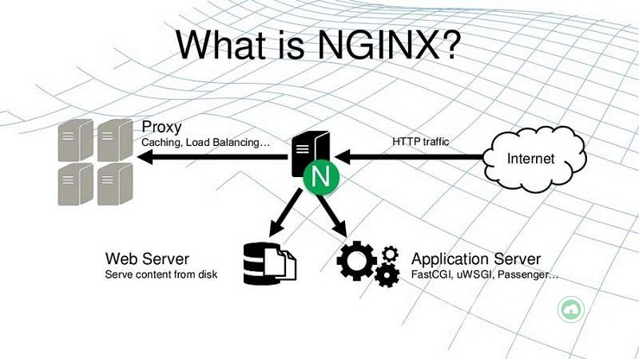
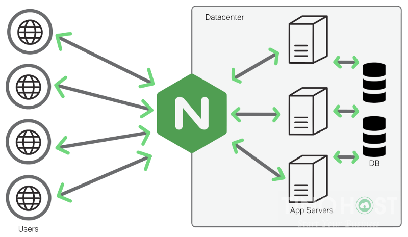

## Nginx là gì?
Nginx là một máy chủ proxy ngược mã nguồn mở (open source reverse proxy server) sử dụng phổ biến giao thức HTTP, HTTPS, SMTP, POP3 và IMAP.

Nginx thường được chọn để cân bằng tải (load balancer), HTTP cache và máy chủ web (web server). NGINX là một web server mạnh mẽ và sử dụng kiến trúc đơn luồng, hướng sự kiện vì thế nó hiệu quả hơn Apache server nếu được cấu hình chính xác.

Ngày càng được ưa chuộng và có mặt trên khắp các máy chủ Linux, Nginx hiện nay được sử dụng bởi 1- 4% tổng số lượng tên miền toàn thế giới, điển hình là Facebook, Microsoft, Google, Apple,…

Nginx ra đời và phát triển như thế nào?
Năm 2002, Igor Sysoev phát triển Nginx ban đầu và công bố lần đầu vào năm 2004. Tháng 7 năm 2011, công ty Nginx Inc được thành lập với trụ sở đầu tiên tại San Francisco, California, USA.

Nguyên lí hoạt động của Nginx
Không giống như các chương trình máy chủ khác, Nginx không dựa vào luồng (threads) để xử lý các truy vấn (request) mà theo kiến trúc hướng sự kiện (event-driven) không đồng bộ (asynchronous) và có khả năng mở rộng.

## Nginx có tính năng gì?
## Những tính năng của máy chủ HTTP Nginx
- Có khả năng xử lý hơn 10.000 kết nối cùng lúc với bộ nhớ thấp.
- Phục vụ tập tin tĩnh (static files) và lập chỉ mục tập tin.
- Tăng tốc reverse proxy bằng bộ nhớ đệm (cache), cân bằng tải đơn giản và khả năng chịu lỗi.
- Hỗ trợ tăng tốc với bộ nhớ đệm của FastCGI, uwsgi, SCGI, và các máy chủ memcached.
- Kiến trúc modular, tăng tốc độ nạp trang bằng nén gzip tự động.
- Hỗ trợ mã hoá SSL và TLS.
- Cấu hình linh hoạt; lưu lại nhật ký truy vấn
- Chuyển hướng lỗi 3XX-5XX
- Rewrite URL (URL rewriting) dùng regular expressions
- Hạn chế tỷ lệ đáp ứng truy vấn
- Giới hạn số kết nối đồng thời hoặc truy vấn từ 1 địa chỉ
- Khả năng nhúng mã PERL
- Hỗ trợ và tương thích với IPv6
- Hỗ trợ WebSockets
- Hỗ trợ truyền tải file FLV và MP4
## Những tính năng máy chủ mail proxy của Nginx
## Các phương pháp xác thực :

- POP3: USER/PASS, APOP, AUTH LOGIN/PLAIN/CRAM-MD5;

- IMAP: LOGIN, AUTH LOGIN/PLAIN/CRAM-MD5;

- SMTP: AUTH LOGIN/PLAIN/CRAM-MD5;
    Hỗ trợ SSL, STARTTLS và STLS

## Hạn chế của Nginx
Không support .htaccess
