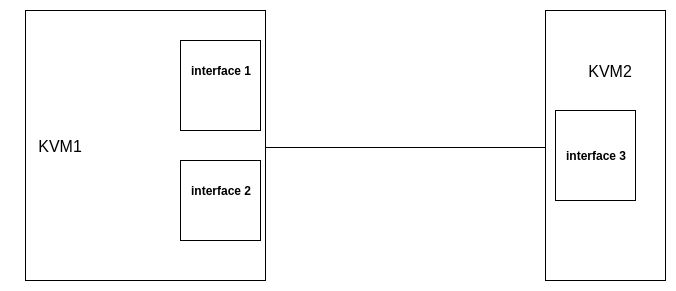
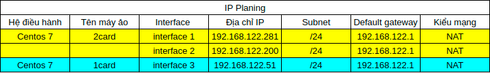
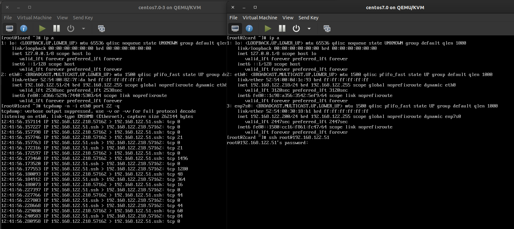
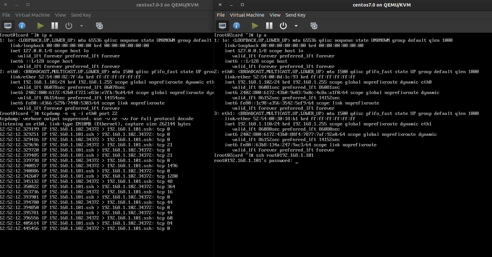
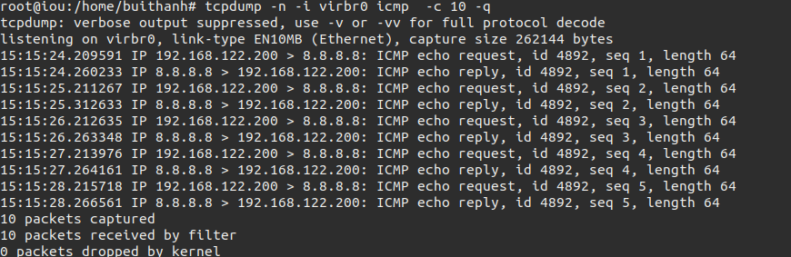
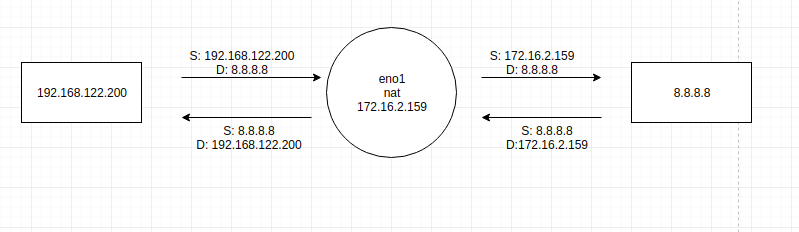
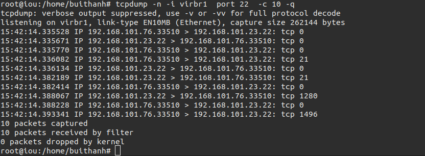
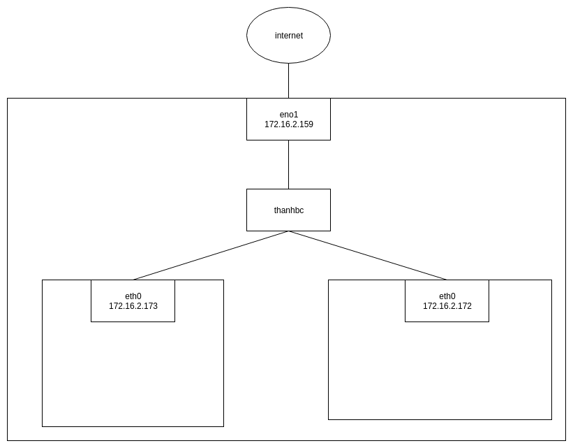
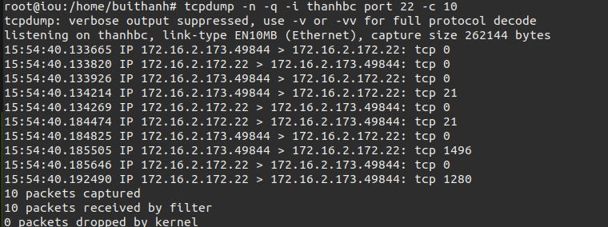

Bài 1: Bắt gói tin khi 2 máy sử dụng 1 kiểu mạng NAT.
Sơ đồ.



ip planning.



Kết quả.

sử dụng card mạng có địa chỉ 192.168.122.218 không sử dung địa chỉ 192.168.122.200.




Bài 2: Bắt gói tin khi 2 máy sử dụng 1 kiểu mạng bridge.

ip planning


kết quả 



Bài 3: bắt gói tin khi máy tính thật có 2 card mạng NAT khác nhau,


bắt gói tin trên interface virbr0 là sử dụng interface nat default.
```
tcpdump -n -q -i virbr0 icmp -c 10
```


bắt gó tin  trên interface eno1 là interface ra ngoài internet.
```
tcpdump -n -q -i eno1 icmp -c 10
```


như vậy ta thấy từ đia chỉ 192.168.122.200 khi qua cơ chế nat thì địa chỉ trên mạng là 172.16.2.159




bắt gó tin ssh trên interface virbr1 
```
tcpdump -n -i virbr1  port 22  -c 10 -q
```




Bài 4: Bắt gói tin khi 2 máy ảo sử dụng kiểu bridge 



bắt gói tin ssh khi thực hiện ssh từ 2 máy ảo.
```
tcpdump -n -q -i thanhbc port 22 -c 10
```



Bắt gói tin trên interface eno1 khi ra mạng.

```
tcpdump -n -q -i eno1 icmp  -c 10
```


