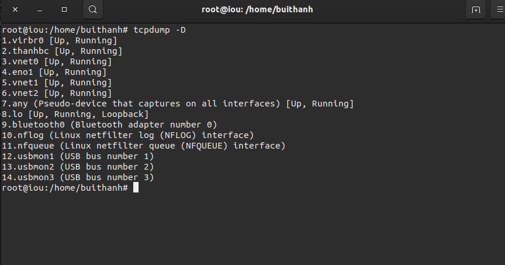
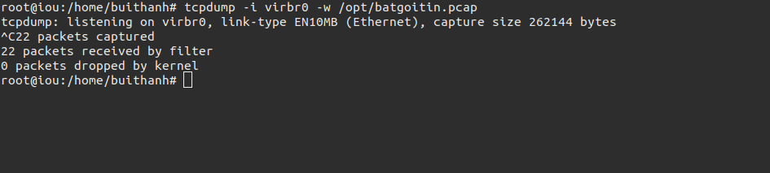
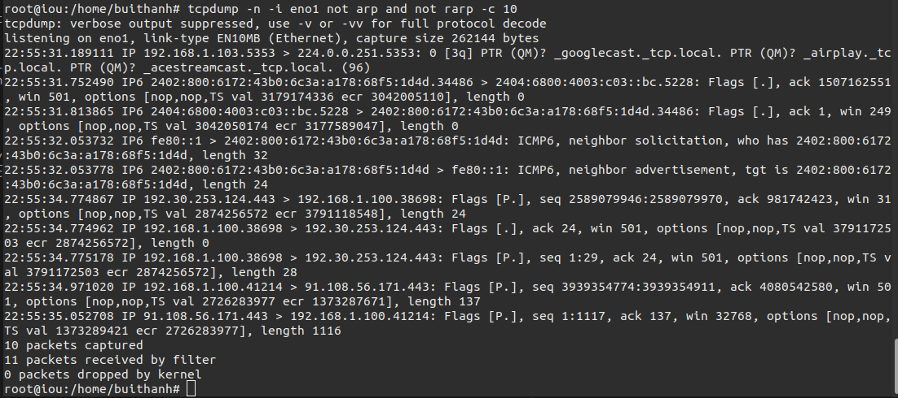

# Tìm hiểu lệnh tcpdump trên Linux
## MỤC LỤC.

[1. Tcpdump là gì? ](#1)

[2. Sử dụng tcpdump.](#2)

[2.1 Cài đặt.](#2.1)


[2.2 Một vài lệnh cơ bản](#2.2)

----- 

<a name="1"></a>
## 1. Tcpdump là gì? 

`Tcpdump`: là công cụ được phát triển nhằm mục đích phân tích các gói dữ liệu mạng theo dòng lệnh.
Nó cho phép ta đọc và hiển thị các gói tin được truyền đi hoặc được nhận trên một card mạng máy tính đó giám sát.
- Có thể lưu ra file có định dạng là **.pcap** và đọc bằng option -r.

<a name="2"></a>
## 2. Sử dụng tcpdump.
Các tùy chọn thường dùng trong `tcpdump`;
- -D : Liệt kê các giao diện mạng có sẵn.
- -t : Cung cấp đầu ra dấu thời gian có thể đọc được của con người.
- -q : Hiện thị một cách ngắn gọn các thông số cơ bản.
- -i : Bắt lưu lượng của một giao diện interface cụ thể.
- s : Xác định kích thước của gói tin theo byte.
- -w : ghi kết quả ghi vào file .pcap.
- -r : đọc file .pcap.
- -n : hiện thi kết quả ngắn gọn và có thêm hostname.

<a name="2.1"></a>
### 2.1 Cài đặt.

Để sử dụng được lệnh `tcpdump` trên Linux, chúng ta phải cài một gói cài đặt.

Với CentOS, ta dùng lệnh


```
yum install tcpdump -y
```
Ở Ubuntu
```
sudo apt-get install tcpdump -y
```

<a name="2.2"></a>
### 2.2 Một vài lệnh cơ bản

#### a. Xem các Interface đang hoạt động

```
tcpdump -D
```

#### b. Bắt gói tin trên Interface

```
tcpdump -i <INTERFACE>
```

Ví dụ, bắt gói tin trên card `eno1`


Bấm tổ hợp phím `Ctrl` + `C` để dừng.

Sau khi ta dừng, sẽ hiện ra một bảng với các thông số:

- **Packet capture**: số lượng gói tin bắt được và xử lý.
- **Packet received by filter**: số lượng gói tin được nhận bởi bộ lọc.
- **Packet dropped by kernel**: số lượng packet đã bị dropped bởi cơ chế bắt gói tin của hệ điều hành.

#### Định dạng chung của một dòng giao thức tcpdump là:

```
time-stamp src > dst:  flags  data-seqno  ack  window urgent options
```

Tên trường | Mô tả |
--- | --- |
Time-stamp | hiển thị thời gian gói tin được capture. |
Src và dst | hiển thị địa IP của người gửi và người nhận. |
Cờ Flag| S(SYN):  Được sử dụng trong quá trình bắt tay của giao thức TCP.</br>.(ACK):  Được sử dụng để thông báo cho bên gửi biết là gói tin đã nhận được dữ liệu thành công.</br>F(FIN): Được sử dụng để đóng kết nối TCP.</br>P(PUSH): Thường được đặt ở cuối để đánh dấu việc truyền dữ liệu.</br>R(RST): Được sử dụng khi muốn thiết lập lại đường truyền. |
Data-sqeno | Số sequence number của gói dữ liệu hiện tại. |
ACK | Mô tả số sequence number tiếp theo của gói tin do bên gửi truyền (số sequence number mong muốn nhận được). |
Window | Vùng nhớ đệm có sẵn theo hướng khác trên kết nối này. |
Urgent | Cho biết có dữ liệu khẩn cấp trong gói tin. |

#### c. Bắt `n` gói tin với tùy chọn `-c`

Mặc định, `tcpdump` sẽ bắt liên tiếp các gói tin. Để dừng quá trình này, chúng ta phải thao tác tổ hợp phím `Ctrl` + `C`.
Nhưng với tùy chọn `-c`, chúng ta có thể chỉ cho `tcpdump` b bắt n gói tin. Cú pháp như sau:

```
tcpdump -c n -i eno1
```

*Với n là số gói tin cần bắt.*


#### d. Lưu file .pcap 

khi chạy câu lệnh này khi nào muốn kết thúc phải ân tổ hợp phím `Ctrl` + `C`. Hoặc thêm option -c vào câu lệnh để có thể tự kết thúc
```
tcpdump -i virbr0 -w /opt/batgoitin.pcap
```



#### d. Đọc file .pcap

Để đọc file có định dạng **.pcap** ta sử dụng option -r trong câu lệnh tcpdump.
```
tcpdump -i virbr0 -r /opt/batgoitin.pcap
```


#### e. Chỉ bắt các gói có giao thức cụ thể như TCP, ICMP, ARP ....
Ở đây t bắt gói tin ARP và ICMP

```
tcpdump -i eno1 arp -c 5
tcpdump -i eno1 icmp -c 5
```


#### f. Bắt các gói theo `port`


```
tcpdump -i virbr0 -c 10 port 22  -n
```

- `-n`: Hiển thị số port thay cho tên giao thức, IP thay cho Hostname


#### g. Bắt theo địa chỉ nguồn hoặc đích

Địa chỉ nguồn: 

```
 tcpdump -i eno1 src 192.168.122.51
```

Địa chỉ đích: 

```
 tcpdump -i eno1 dst 192.168.122.1
```

#### h.Gói bộ lọc(filter) tcpdump.
Trong lệnh tcpdump, chúng ta có thể đưa ra các điều kiện “and”, “or” và “not” để lọc các gói cho phù hợp.


## 3. THAM KHẢO

- https://blogd.net/linux/vi-du-ve-su-dung-lenh-tcpdump/
- https://vinahost.vn/ac/knowledgebase/248/TCPDUMP-va-cac-th-thut-s-dng.html
- http://www.tecmint.com/12-tcpdump-commands-a-network-sniffer-tool/