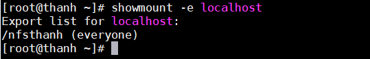
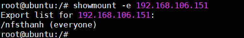
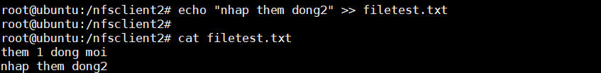

# **Tìm hiều về NFS và cấu hình.**

## Mục lục:

[1 Giới thiệu về NFS.](#1)

[2 Môi trường và mô hình.](#2)
- [2.1 Môi trường](#2.1)
- [2.2 IP planning](#2.2)
- [2.3 Mô hình](#2.3)

[3 Hướng dẫn thực hiện.](#3)
- [3.1 Cài đặt trên máy NFS server.](#3.1)
- [3.2 Cấu hình máy NFS Client 1.](#3.2)
- [3.3 Cấu hình máy NFS Client 2.](#3.3)

----

<a name="1"></a>
## 1. Giới thiệu về NFS.

- NFS -( Network file system ) đơn giản là dịch vụ chia sẻ tài nguyên 
- NFS là một giao thức cho phép một máy tính nào đó truy cấp một đĩa hoặc một máy tính khác trong cùng một mạng ở chế độ trong suốt. 
- NFS cho phép chia sẻ tập tin cho nhiều người  dùng trên cùng mạng và người dùng có thể thao tác  như với tập tin trên chính đĩa cứng của mình.
- Hiện tại có 3 phiên bản NFS là NFSv2, NFSv3 và NFSv4.
- Trên máy server sẽ  sinh ra một vùng nhớ máy client có thể mount trực tiếp đến vùng nhớ đó để sử dụng.

<a name="2"></a>
## 2. Môi trường và mô hình.

<a name="2.1"></a>
### 2.1. Môi trường.
Môi trường trên VMware sử dụng 3 máy ảo gồm: 2 máy ảo Centos 7 và 1 máy ảo Ubuntu. Đặt card mạng NAT.

<a name ="2.2"></a>
### 2.2. IP Planning.
|  Tên máy ảo  | Hệ điều hành    |IP address | Subnet mask |Default gateway|
|------|------|-------|-----|-------|
| NFS Server |  Centos 7| 192.168.106.151 | /24| 192.168.106.1|
| NFS Client1 |  Centos 7|192.168.106.139 | /24 |192.168.106.1|
| NFS Client2 |Ubuntu Server 16.04| 192.168.106.10 | /24 | 192.168.106.1|
<a name="2.3"></a>
### 2.3. Mô hình.


<a name="3"></a>
## 3. Hướng dẫn thực hiện.
<a name="3.1"></a>
### 3.1 Cài đặt trên máy NFS server.
Cài NFS trên server ta cài packet nfs-until.
 ```
yum install nfs-utils -y
 ```
Tạo thư mục chia sẻ tài nguyên trên server.
```
mkdir /nfsthanh
```
Sửa file /etc/exports để tạo mountpoint export.
```
echo "/nfsthanh 192.168.106.0/24(rw,no_root_squash)" >> /etc/exports
```
Giải thích các option. 
- **/nfsthanh**: là thư mục chia sẻ file vừa tạo ở trên.
- **192.168.106.0/24**: là địa chỉ net của 2 máy server và client.
- **(rw,no_root_squash)**: một số quyền của lệnh.
- rw : đọc và ghi file .
- no_root_squash : cho phép remote root user.
- Có thể thêm một số option:
    - ro: chỉ có quyền đọc.
    - sync: đồng bộ hóa thư mục dùng chung.
    - root_squash: ngăn remote root user.

Khởi động NFS server.
```
sudo systemctl start rpcbind nfs-server
```

Khởi động NFS cùng server khi bật máy.
```
sudo  systemctl enable rpcbind nfs-server
```

Kiểm tra các port sử dụng bởi NFS.
```
rpcbinfo -p
```
Tiếp đến ta cấu hình firewall để NFS client được phép truy cập.
```
sudo firewall-cmd --permanent --add-service=nfs
sudo firewall-cmd --permanent --add-service=mountd
sudo firewall-cmd --permanent --add-service=rpc-bind
sudo firewall-cmd --permanent --add-port=2049/tcp
sudo firewall-cmd --permanent --add-port=2049/udp
sudo firewall-cmd --reload
```


Kiểm tra mountpoint trên server. 
```
showmount -e localhost
```


Vậy là đã vài thành công NFS trên server.

<a name="3.2"></a>
### 3.2. Cấu hình máy NFS Client 1.
Cài 2 packet nfs-utils và nfs-utils-lib.
```
sudo yum install nfs-utils nfs-utils-lib
```

Kiểm tra mountpoint trên server từ client.
```
showmount -e 192.168.106.151
```
Tạo thư mục để mount point trên NFS server từ client.
```
mkdir -p /nfsclient
```
Mount thư mục với thư mục NFS trên server.
- Có 2 kiểu mount là mount cứng và mount mềm:
    - mount mềm: có thể mất sau mỗi lần reboot. 
    ``` 
    mount -t nfs 192.168.106.151:/nfsthanh /nfsclient
    ```
    - mount cứng không bị mất hoặc thay đổi sau mỗi lần reboot.
    ```
    echo "192.168.106.151:/nfsthanh /nfsclient nfs rw,sync,hard,intr 0 0" >> /etc/fstab
    ```
Sau đó ta khỏi động lại NFS.
 ```
    systemctl restart NFS
```
Kiểm tra NFS có hoạt động hay không.
- Vào NFS Server tạo 1 file *filetest.txt* trong thư mục **/nfsthanh** và ghi dữ liệu vào file đó.


- Chuyển sang máy client vào file **/nfsclient** xem có file *filetest.txt* không và đọc file đó.


<a name ="3.3"></a>
### 3.3 Cấu hình máy NFS Client 2.
cài đăt  nfs trên Ubuntu Server 16.04. ta cài 2 gói nfs-common và nfs-kernel-server
```
sudo apt-get install nfs-common -y
sudo apt-get install nfs-kernel-server
```
Mountpoint từ client đến server.
```
showmount -e 192.168.106.151
```


Tạo thư mục mountpoint từ NFS client tới NFS Server.
```
mkdir -p /nfsclient2
```
Mount thư mục để thư mục NFS Server.
```
echo "192.168.196.151:/nfsthanh /nfsthanh2 nfs rw,sync,hard,intr 0 0" >> /etc/fstab
```
Kiểm tra NFS Server và NFS Client 2 có hoạt động hay không.
Ghi thêm data vào filetext.txt
```
echo "nhap them dong 2" >> filetest.txt
``` 
Sau đó đọc file trên từ NFS Server.
```
cat filetext.txe
```


Như vậy NFS đã hoạt động, ta đã cài đặt NFS thành công.
