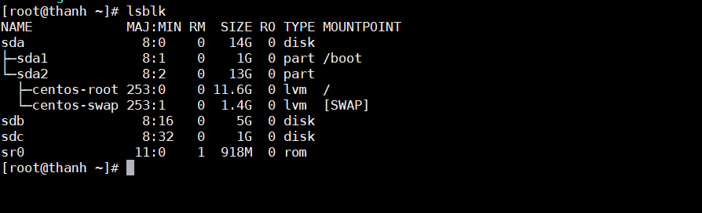
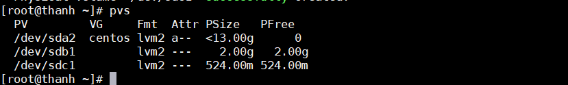
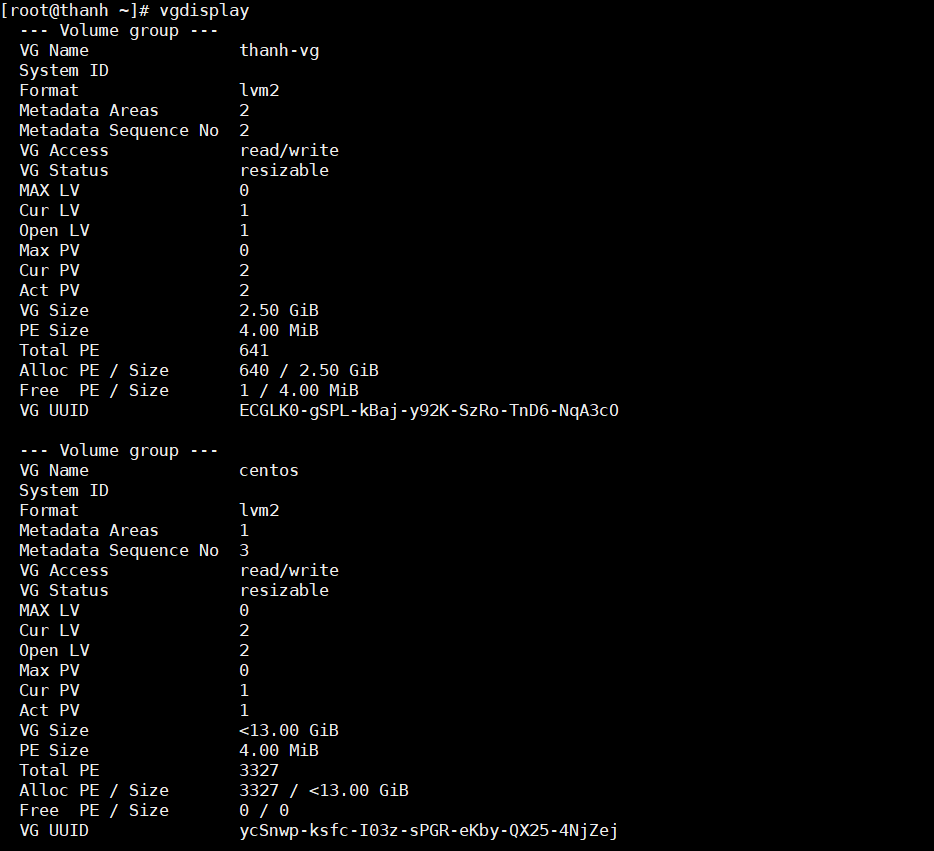

# Tìm hiểu về Logical Volume Manager.
# Mục lục.
[1. Giới thiệu về LVM.](#1)

[2. Khởi tạo môi trường trên VMware.](#2)
- [2.1 Thêm các ổ cứng vào máy ảo.](#2.1)

[3 Tạo và quản lý Logical Volume Manager.](#3)
- [3.1 Định dạng Physical Volume.](#3.1)
- [3.2 Tạo Physical volume.](#3.2)
- [3.3 Tạo Volume group.](#3.3)
- [3.4 Tạo Logical volume.](#3.4)

[4 Thay đổi dung lượng trên LVM.](#4)
- [4.1 Thay đổi dung lượng trên Logical volume.](#4.1)
  - [4.1.1 Tăng dung lượng Logical Volume.](#4.1.1)
  - [4.1.2 Giảm dung lượng logical volume.](#4.1.2)
- [4.2 Thay đổi dung lượng volume group.](#4.2)
  - [4.2.1 tăng dung lượng Volume Group.](#4.2.1)
  - [4.2.2 Giảm dung lượng volume group.](#4.2.2)
- [4.3 Xóa logical volume, volume group và physical volume.](#4.3)

---- 
<a name="1"></a>
## 1. Giới thiệu về LVM.

Logical Volume Manager(LVM): là một công cụ quản lý các ổ đĩa vật lý (physical volume) dưới dạng logic, có thể dễ dàng tạo mới, thay đổi kích thước hoặc xóa phân vùng đã tạo.

Chức năng và mục đích của LVM.
- Tạo nhiều phân vùng logic với toàn bộ đĩa cứng và cho phép thay đổi kích thước logical volume.
- Quản lý trạng thái đĩa cứng bằng cách cho thêm và thay thế đĩa mà không bị ngừng hoạt động hoặc gián đoạn dịch vụ, kết hợp với trao đổi nóng( hot swapping)
- Thực hiện sao lưu nhất quán bắng cách tạo snapshot các khối hợp lý.
- Mã hóa nhiều phân vùng vật lý bằng một mật khẩu.


Mô hình Logical Volume Manager.


- Physical volume: một ổ đĩa vật lý có thể phân chia thành nhiều phân vùng vật lý
- Volume Group: là một nhóm gộp nhiều Physical volume trên 1 hoặc nhiều ổ đĩa khác nhau kết nối lại với nhau qua logic
- Logical Volume: một logical volume được chia nhỏ từ volume group và được mount đến hệ thống tập tin và có các định dạng khác nhau  như ext3, ext4.
- File systems : hệ thống tập tin quản lý các file và thư mục trên ổ đĩa và được mount tới các Logical Volume.

Cấu hình phần cứng cho bài lab.


<a name="2"></a>
# 2. Khởi tạo môi trường trên VMware.

<a name="2.1"></a>
## 2.1. Thêm các ổ cứng vào máy ảo.
Trong máy ảo vào VM trên thanh công cụ chọn setting.


Thêm 2 ổ Hard disk 2 và Hard disk 3 lần lượt có dung lượng là 5GB và 1GB.


<a name="3"></a>
## 3. Tạo và quản lý Logical Volume Manager.
Kiểm tra các hard disk đã được thêm vào chưa.
```
lsblk
```  


<a name="3.1"></a>
### 3.1. Định dạng Physical Volume.
Từ các Hard Driver ta sẽ tạo ra các partition. Sử dụng lệnh fdisk.
```
fdisk /dev/sdb
```


Chọn các option. 
- Chọn n để bắt đầu tạo partition hoặc chọn m để thêm các option khác.
- Chọn p để tạo partition primary hoặc chọn e để tạo partition exetended.
- Chọn 1 để tạo partition primary 1.
    - Trong kiểu ghi linear thì ghi hết partition primary 1 này sẽ chuyển sang partition primary 2.
    - Trong kiể ghi striped thì ghi song song 2 partition primary 1 và 2.
- Tại First sector: Để mặc định là bắt đầu từ sector đầu của hard driver.
- Tại Last sector: Để tạo ra partition có dung lượng 2GB thì ghi +2G. 
- Chọn w để lưu lại hoặc chọn m để thêm trợ giúp.

Thay đổi định dạng của các partition mới tạo ra kiểu LVM.
```
fdisk /dev/sdb
```

- Chọn t để thay đổi định dạng partition.
- Chon 8e để chọn LVM hoặc chọn L để xem tất cả các định dạng khác.
- Chọn w để lưu lại.

Làm tương tự với **sdc** và kiểm tra lại.
```
lsblk
```


<a name="3.2"></a>
### 3.2. Tạo Physical volume.
```
pvcreate /dev/sdb1
pvcreate /dev/sdc1
```
- Cú pháp lệnh: pvcreate /dev/(ten phan vung).

Sau đó kiểm tra bằng câu lệnh pvs hoặc pvdisplay.



Làm tương tự với sdb2 và sdc2.

<a name="3.3"></a>
### 3.3 Tạo Volume group.
```
vgcreate thanh-vg /dev/sdb1 /dev/sdc1
```
- Cú pháp lệnh: vgcreate (ten group) /dev/(tên phân vùng).

Ở đây tôi nhóm 2 phân vùng sdb1 và sdc1 vào một group.

Kiểm tra volume group bằng lệnh: vgs hoặc vgdisplay.


Vậy là đã tạo thành công volume group: thanh_vg.

<a name="3.4"></a>
### 3.4. Tạo Logical volume.
```
lvcreate -L 2.5G -n thanh-lv1 thanh-vg
```
- Cú pháp lệnh: lvcreate [option] [số liệu] [option] [tên logical volume] [tên volume group]
- -L dung lượng của logical volume cần tạo.
- -n tên của logical volume tạo.
- thanh-vg là tên volume group tạo.

Kiểm tra bằng lệnh **lvs** hoặc **lvdisplay**.


Định dạng logical volume.
```
mkfs -t ext4 /dev/thanh-vg/thanh-lv1
```


Mount vào cây thư mục và sử dụng.

- Tạo ra một thư mục để mount Logical Volume vào thư mục đó.

    ```
    mkdir lvm
    cd lvm
    mkdir lvm-linear
    ```
- Tiến hành mount mềm logical volume thanh-vl1 vào thư mục lvm-linear.
    ```
    mount /dev/thanh-vg/thanh-lv1 /lvm/lvm-linear
    ```
- Hoặc mount cứng bằng cách sửa file /fstab.
    ``` 
    echo "/dev/thanh-vg/thanh-lv1 /lvm/lvm-linear ext4 defaults 0 0" >> /etc/fstab
    ```
- Kiểm tra lại dung lượng của thư mục đã được mount.
    - Sử dụng lệnh : df -h
    ```
    [root@thanh /]# df -h
    Filesystem                        Size  Used Avail Use% Mounted on
    /dev/mapper/centos-root            12G  3.5G  8.2G  30% /
    devtmpfs                          475M     0  475M   0% /dev
    tmpfs                             487M     0  487M   0% /dev/shm
    tmpfs                             487M  7.7M  479M   2% /run
    tmpfs                             487M     0  487M   0% /sys/fs/cgroup
    /dev/sda1                        1014M  194M  821M  20% /boot
    tmpfs                              98M     0   98M   0% /run/user/0
    /dev/mapper/thanh--vg-thanh--lv1  2.4G  7.5M  2.3G   1% /lvm/lvm-linear
    ```
- Ta thấy có thêm dòng **/dev/mapper/thanh--vg-thanh--lv1  2.4G  7.5M  2.3G   1% /lvm/lvm-linear** đây là phân vùng logical volume vừa mount.

Vậy là ta đã tạo thành công logical volume.

<a name="4"></a>
## 4. Thay đổi dung lượng trên LVM.

<a name="4.1"></a>
### 4.1. Thay đổi dung lượng trên Logical volume.

<a name="4.1.1"></a>
#### 4.1.1. Tăng dung lượng Logical Volume.

Trước hết ta cần kiểm tra các thông tin hiện có.


Trước khi muốn tăng kich thước logical volume thì ta phải kiểm tra volume group có dung lượng trống hay không nếu có thì mới tăng dung lượng được, để kiểm tra ta dùng câu lệnh **vgdisplay**.



Xem trên ảnh dòng. 
```
Free  PE / Size       1 / 4.00 MiB
```
Ở đây Free của tôi có dung lượng trống là 1*4 = 4 MB, nếu tăng thì sẽ chỉ tăng thêm dưới 4MB và tôi tăng thêm 2MB.

Tăng kích thước logical volume.
```
lvextend -L +2M /dev/thanh-vg/thanh-lv1
```
- Cấu trúc lệnh: *lvextend -L [dung lượng] [link logical volume]*
    - -L là tùy chọn tăng kích thước.
```
[root@thanh ~]# lvextend -L +2M /dev/thanh-vg/thanh-lv1
Rounding size to boundary between physical extents: 4.00 MiB.
Size of logical volume thanh-vg/thanh-lv1 changed from 2.50 GiB (640 extents)to 2.50 GiB (641 extents).
Logical volume thanh-vg/thanh-lv1 successfully resized.
```
Vậy là đã tăng thành công thêm 2MB vào logical volume thanh-lv1.

 <a name="4.1.2"></a>
## 4.1.2. Giảm dung lượng logical volume.
Ta cần umount Logical volume trước khi giảm dung lượng.
```
umount /dev/thanh-vg/thanh-vl1
```
Giảm kích thước của logical volume.

Cấu trúc lệnh: *lvreduce -L [kích thước] [đường dẫn tới logical volume cần giảm].*
```
lvreduce -L 20M /dev/thanh-vg/thanh-lv1
```


Sau đó format lại logical volume.
```   
mkfs.ext4 /dev/thanh-vg/thanh-vl1
```
Cuối cùng là mount lại logical volume.
```
mount /dev/thanh-vg/thanh-vl1 /lvm/lvm-linear
```


<a name="4.2"></a>
## 4.2. Thay đổi dung lượng volume group.

<a name="4.2.1"></a>
### 4.2.1. Tăng dung lượng volume group.
Như ví dụ trước ta đã thấy nếu khi volume group đã đầy thì ta sẽ không tăng dung lượng logical volume mà phải mở rộng kích thước của volume group. Thay đổi kich thước của volume group là việc nhóm thêm physical volume vào volume group.

Trong máy ảo chọn VM vào setting trên thanh công cụ, thêm hard disk4 có dung lượng 2GB.

KIểm tra các partition 
```
lsblk
```


Tiếp theo thêm 1 partition giống như ta làm lúc đầu với sdb và sdc.
```
fdisk /dev/sdd
```
Tăng dung lượng volume group.

Thực chất là mở rộng vùng nhớ volume group.

Cấu trúc lệnh: *vgextend /dev/[volume group] /dev/[physical volume]*
```
vgextend /dev/thanh-vg /dev/sdd1
```
 

Kiểm tra lại bằng câu lệnh vgs thì thấy dung lượng volume group đã đăng tên từ 2,5GB lên thành 3,5GB

<a name="4.2.2"></a>
### 4.2.2. Giảm dung lượng volume group.

Thao tác này là gỡ bỏ một physical volume ra khỏi volume group.

Kiểm tra xem physical volume muốn xóa trong volume group.


Xóa bỏ physical volume /dev/sdd1 ra khỏi volume group thanh-vg.
```
vgreduce thanh-vg /dev/sdd1
```
Tiếp theo cần nhập lệnh resize để dung lượng của volume group được thay đổi.
```
rezise2fs /dev/thanh-v/thanh/lv1
```


Kiểm tra lại bằng pvs.


<a name="4.3"></a>
## 4.3. Xóa logical volume, volume group và physical volume.
Xóa logical volume.
- Trước khi xóa logical volume ta phải umount logical volume đó.
    ```   
    umount /dev/thanh-vg/thanh-lv1
    ```
- Sau đó tiến hành xóa logical volume
    ```
    lvremove /dev/thanh-vg/thanh-lv1
    ```
Xóa volume group 
```
vgremove /dev/thanh-vg
```

Xóa physical volume   
```
pvremove /dev/sdd1 
```